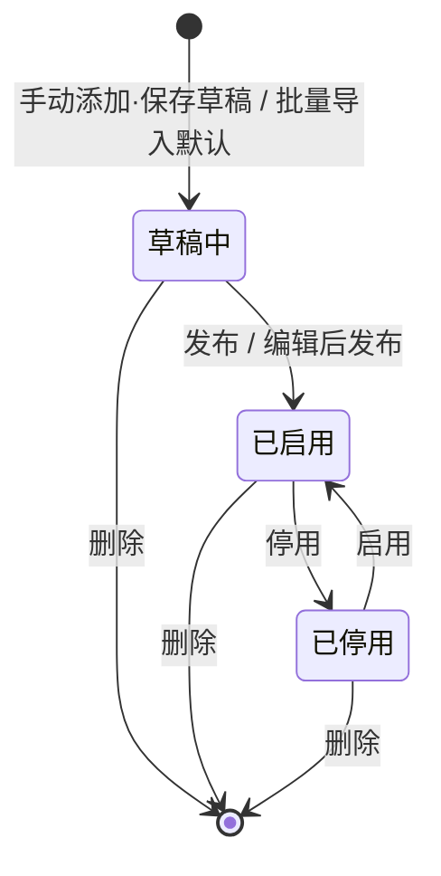

# 万象视界管理平台 — 需求文档

## 1. 文档信息


| 项目    | 内容                                                                                      |
| ----- | --------------------------------------------------------------------------------------- |
| 文档名称  | 万象视界管理平台需求文档                                                                            |
| 文档版本  | v3.19                                                                                   |
| 创建日期  | 2026-06-05                                                                              |
| 修订日期  | 2026-08-07                                                                              |
| 文档状态  | 评审中（已纳入产品确认结论）                                                                          |
| 所属项目  | AI学伴管理后台 · 万象视界管理模块                                                                     |
| 关联文档  | [设备管理需求文档.md](./设备管理需求文档.md)（**同期交付**，独立维护）                                             |
| 原型入口  | `prototype/index.html`（`npm run dev` → [http://localhost:8080）](http://localhost:8080）) |
| 数据持久化 | 浏览器本地存储（原型演示数据） |

---

## 2. 文档范围

### 2.1 本文档覆盖范围

本文档说明万象视界管理模块的业务规则和页面交互，作为产品、设计、研发和测试的共同依据。

设备管理使用独立文档，见 [设备管理需求文档.md](./设备管理需求文档.md)。

### 2.2 不在本文档范围

- **设备管理**（独立文档）
- 以下占位菜单**不做**：首页、学校信息管理、用户管理、金币商城管理、系统配置、操作审计日志

### 2.3 读者与用途


| 读者      | 用途                                       |
| ------- | ---------------------------------------- |
| 产品 / 设计 | 验收原型、对齐正式版需求                             |
| 研发      | 接口设计、学生端展示引擎、选取与排版算法实现                   |
| 测试 | 按第 5 章编写业务用例，按第 7 章验收页面，并参考第 9 章了解原型边界 |


---

## 3. 项目背景与目标

### 3.1 背景

「万象视界」学生端首页由多个内容板块纵向组成，学生可浏览图文、视频等内容，并通过频道、内容类型等维度组织内容。后台需为运营提供**内容池、频道、标签、首页板块、每日一词**的完整管理能力，保证配置结果**稳定、准确**映射到学生端展示。

### 3.2 建设目标

1. 支持运营配置学生端首页板块：新增、编辑、排序、启停、删除、发布。
2. 支持板块通过「**自动取数**」或「**手动选取**」关联内容（手动上限 5 条）。
3. 支持内容按频道、类型、标签组织，满足首页与频道页展示闭环。
4. 支持内容批量导入、查看、编辑、启停、删除及标签维护。
5. 支持频道、标签增删改查，并联动内容管理与首页/频道配置。
6. 支持**草稿与发布分离**，避免未完成配置直接影响学生端。

### 3.3 设计原则


| 原则    | 规则说明                                       |
| ----- | ------------------------------------------ |
| 学生端闭环 | 板块、频道、内容状态、排版、发布时间须可明确推导学生端展示结果            |
| 草稿隔离  | 板块/频道新增、编辑默认进草稿；**保存并发布**且满足展示条件后才影响学生端    |
| 已启用可见 | 学生端仅展示已发布、已启用且有内容的板块和频道 |
| 可追溯   | 重要内容和配置保留更新时间 |
| 可运营   | 筛选、空态、批量导入、关联选取、确认二次校验须符合运营习惯              |


### 3.4 模块职责与学生端关系


| 模块   | 后台职责                | 与学生端关系                      |
| ---- | ------------------- | --------------------------- |
| 首页配置 | 板块结构、排序、来源、排版、发布    | 决定首页板块组成与展示内容               |
| 热门推荐 | 首页热门轮播内容：自动/手动选取、发布 | 决定学生端首页热门轮播内容池              |
| 内容管理 | 内容新增、编辑、导入和标签维护 | 为板块、频道和推荐提供内容 |
| 频道管理 | 父子频道、关联内容、排版、发布     | 决定频道页结构与内容列表                |
| 标签管理 | 标签新增、编辑和启停 | 本期学生端不展示标签入口，仅用于后台筛选和兴趣推荐 |
| 每日一词 | 按年级维护词表、导入          | 决定学生端每日一词展示（独立链路）           |


---

## 4. 术语与状态定义


| 术语  | 说明                               |
| --- | -------------------------------- |
| 板块  | 学生端首页上的一个展示区域，可自动或手动拉取内容         |
| 频道  | 内容的分类归属，支持父子级                    |
| 内容  | 图文或视频条目，含标题、正文摘要、出处、标签等          |
| 词表  | 某年级下的单词集合，用于「每日一词」               |
| 草稿中 | 仅后台可见，不参与学生端展示                   |
| 已启用 | 可被板块和频道选取，并按发布规则展示               |
| 已停用 | 不再参与展示和选取                        |
| 选取  | 内容进入某板块/频道关联列表的过程（自动计算或手动勾选）     |
| 发布  | 板块/频道配置到达生效时间后，对学生端可见            |
| 展示  | 学生端实际渲染；须同时满足「有内容 + 已发布 + 排版可匹配」 |


**数量规则：** 板块手动关联最多 5 条；频道关联数量不设上限。子频道首页展示数量由运营单独配置，规则见 §5.6.2。

---

## 5. 核心业务逻辑与规则

本章说明各模块的主要业务规则；具体字段和按钮见第 7 章。

### 5.1 实体关系与数据流向

```
内容 ──归属──▶ 频道
      │
      ├──打标签──▶ 标签 ──用于──▶ 兴趣推荐
      │
      ├──被选取──▶ 板块 / 频道
      │
板块 ──组成──▶ 学生端首页
频道 ──组成──▶ 学生端频道页
词表 ──按年级──▶ 学生端「每日一词」
```

**关键约束：**

- 内容分为图文和视频，关联频道时类型必须一致。
- 内容归属在频道管理中维护；标签不影响内容排序和排版。
- 内容启用后仍需被板块或频道选中并发布，学生端才会展示。

### 5.2 内容生命周期




| 状态  | 后台列表 | 可被自动选取 | 可被手动关联弹窗选取 | 列表操作列（概要） |
| --- | ---- | ------ | ---------- | --------- |
| 草稿中 | 可见   | ❌      | ❌          | 仅「编辑」     |
| 已启用 | 可见   | ✅      | ✅          | 见 §5.2.1  |
| 已停用 | 可见   | ❌      | ❌          | 查看、启用、编辑  |


### 5.2.1 内容启停、编辑与关联校验

**内容已被使用时，先解除关联再停用。** 内容只要仍被频道或首页板块使用，就不能停用；系统会提示关联位置。解除全部关联后才可停用。


| 内容状态      | 可执行操作    |
| --------- | -------- |
| 草稿中       | 编辑       |
| 已启用且已归属频道 | 查看、停用    |
| 已启用但未归属频道 | 查看、编辑、停用 |
| 已停用       | 查看、编辑、启用 |


启用无需额外校验。手动添加内容时，含视频的内容自动归为视频，否则归为图文；阅读量用于自动选取时的排序。

### 5.3 学生端展示判定（三层逻辑）

学生端展示前需同时满足以下条件：

1. 板块或频道已启用，且已到发布时间；
2. 已关联至少一条已启用内容；
3. 已选择与内容数量匹配的排版。

内容启用只是“可以被选用”，不代表立即展示；还需被板块或频道选中并发布。没有可展示内容时，学生端不显示该板块或频道。

子频道首页展示运营配置的前 N 条内容；点击「更多」后展示该子频道全部可展示内容。

### 5.4 板块：内容选取与发布

### 5.4.1 自动选取

运营设置展示数量（1～5 条）、频道范围、排序方式和内容类型后，系统从已启用内容中自动取前 N 条展示。可按导入时间或阅读量排序。

**自动更新频率：** 到达设置时间后，系统重新选取内容并刷新学生端：


| 选项     | 说明               |
| ------ | ---------------- |
| 每日0点刷新 | 每日 0:00 重新选取并刷新  |
| 每周一刷新  | 每周一 0:00 重新选取并刷新 |


默认「每日0点刷新」。

### 5.4.2 手动模式选取规则

- 运营从已启用内容中逐条添加，最多 5 条。
- 内容顺序就是学生端展示顺序，可拖拽调整。

### 5.4.3 自动 → 手动切换

触发确认：「是否将自动选取的内容同步到手动？」

- **确认：** 将当前自动选中的内容带入手动列表。
- **取消：** 保持自动模式不变。

切换为手动后，隐藏「自动更新频率」；此后不再按频率自动重算，除非改回自动。

### 5.4.4 板块发布与草稿


| 操作    | 板块 status | 学生端          |
| ----- | --------- | ------------ |
| 保存为草稿 | draft     | 不展示          |
| 保存并发布 | enabled   | 满足 5.3 条件后展示 |
| 停用    | disabled  | 不展示          |


草稿板块：操作列仅「编辑、删除」。已启用/已停用：编辑、启停、删除。

### 5.4.5 板块与频道发布时间

板块和频道使用同一规则：

- 即时发布，发布时间为保存并发布的时刻；定时发布，发布时间为设定的时间。
- 停用后不显示发布时间；再次启用时，改为本次重新上线的时间。
- 草稿和已停用项目不参与“实际发布时间”筛选。

### 5.5 频道：内容关联与发布

### 5.5.1 关联规则

- 关联弹窗仅展示已启用且类型与频道一致的内容
- **无条数上限**；Checkbox 多选 + 全选
- 切换频道「内容类型」图文↔视频时，**自动剔除**关联列表中类型不匹配项

### 5.5.2 排序

关联列表顺序由运营维护。子频道首页按该顺序展示前 N 条内容，并使用所选排版；视频展示 6～10 条时可横向查看（见 §5.6.2）。

### 5.5.3 频道发布

判定逻辑同 §5.3。频道草稿可编辑或删除，系统固定频道除外。

**实际发布时间：** 与板块共用 §5.4.5（仅已启用有值；定时=指定时刻；停用清空；再次启用显示最新）。

**与板块差异：** 频道表单不展示「自动更新频率」字段；板块仅在数据来源为「自动」时展示。

### 5.5.4 子频道「更多」页

- 子频道首页仅展示运营配置的前 N 条内容（N 为「展示条数」），并按所选图文或视频排版渲染。
- 点击子频道「更多」进入该子频道的内容列表页；该页展示该子频道下**全部可展示内容**（已启用且满足发布时间条件），不受首页展示条数 N 限制。
- 「更多」页固定采用三列卡片布局：每行 3 条内容，满行自动换行；不沿用子频道首页所选排版。
- 内容顺序沿用后台关联列表顺序。

### 5.6 排版规则

板块和子频道采用不同的排版规则，学生端按运营选择的排版展示。

### 5.6.1 板块（精确条数匹配）

设当前关联条数为 K（图文、视频分别计算；无内容时图文按 K=1 参与可选排版预览）：


| 排版 ID    | 类型  | 可选条件             |
| -------- | --- | ---------------- |
| 左文右图     | 图文  | K ∈ {1,2,3}      |
| 双列卡片     | 图文  | K = 2            |
| 轮播展示     | 图文  | K ∈ {3,4,5}      |
| 左文右视频    | 视频  | K = 1            |
| 双列视频卡    | 视频  | K = 2            |
| 三/四/五列视频 | 视频  | K 分别 = 3 / 4 / 5 |


排版选项会随内容数量更新，避免选择不适用的排版。

### 5.6.2 子频道（展示条数 / 图文换行 / 视频精确匹配）

只有设置了父级频道的**子频道**才需选择必填的「展示条数」N；无父级频道的频道不展示此字段。N 的选项为关联列表实际条数与 10 中的较小值（1～min(实际条数, 10)）。子频道首页仅展示关联列表前 N 条内容，并按所选排版渲染；关联列表为空时该字段禁用并显示「暂无可展示内容」。子频道「更多」页不受 N 或所选排版影响，规则见 §5.5.4。图文按列数换行：


| 排版    | 类型  | 可选条件     | 渲染规则               |
| ----- | --- | -------- | ------------------ |
| 左文右图  | 图文  | 无下限      | 每条独占一行             |
| 双列卡片  | 图文  | 无下限      | 每行 2 条，满行换行        |
| 左文右视频 | 视频  | K = 1    | 恰好 1 条，单行展示        |
| 双列视频卡 | 视频  | K = 2    | 恰好 2 条，一排双列        |
| 三列视频  | 视频  | K = 3    | 恰好 3 条，一排三列        |
| 四列视频  | 视频  | K = 4    | 恰好 4 条，一排四列        |
| 五列视频  | 视频  | K = 5～10 | 单行展示，6～10 条可横向滚动查看 |


**视频排版：** 根据展示条数自动提供合适的排版。展示 6～10 条时保持单行，通过横向滚动查看。

增删关联内容后，排版选项和预览同步更新。

### 5.7 标签逻辑

**用途边界：** 标签**仅**参与学生端「猜你喜欢 / 兴趣推荐」类模块，**不参与**板块选取、频道关联、排序、排版。**本期学生端不展示标签导航入口**，标签仅在后台用于筛选与推荐数据准备。


| 场景     | 行为                            |
| ------ | ----------------------------- |
| 内容打标签 | 支持选择多个标签 |
| 批量修改标签 | 用新选择的标签替换原标签 |
| 标签停用   | 推荐引擎排除该标签；已关联内容**不强制改标签、不下架** |
| 标签改名 | 已关联内容中的标签名称同步更新 |


### 5.8 每日一词：排期与生效

每日一词按年级单独维护，不使用普通内容和频道的发布流程。

### 5.8.1 展示排期

- 学生端按词表列表**顺序**依次展示单词
- “最近生效时间”指该词实际在学生端出现的时间
- 新导入词追加到列表**末尾**，导入后**自动发布、立即生效**，无需单独发布按钮
- 编辑单词不改变导入时间；生效时间按词表顺序计算

### 5.8.2 批量导入处理

1. 下载 Excel 模板 → 填写 → 上传
2. 逐行校验：单词、释义、例句、例句释义必填；音标可选
3. 导入成功的单词追加到词表末尾，并计算生效时间
4. 导入失败的行不保存，并在“说明”列显示原因

### 5.9 固定实体与操作权限


| 实体       | 编辑  | 删除  | 拖拽  | 启停  | 逻辑说明                          |
| -------- | --- | --- | --- | --- | ----------------------------- |
| 板块「每日一词」 | ❌   | ❌   | ❌   | ✅   | 系统预置，首页固定入口；可停用/启用，不可编辑、删除、拖拽 |
| 频道「每日一词」 | ❌   | ❌   | ❌   | —   | 子频道，与词表链路绑定                   |
| 频道「双语新知」 | ✅   | ❌   | ❌   | —   | 可改配置，不可删避免结构坍塌                |


**草稿态操作列（非固定实体）：** 板块、频道草稿仅「编辑 + 删除」，无启停。

### 5.10 批量导入（内容）处理逻辑

**模板字段：** 标题、文本内容、出处必填；图片和视频信息选填。多个文件用英文分号隔开，视频支持 mp4、mov。

**处理流程：**

```
上传 → 解析 Excel → 逐行校验
  ├─ 成功 → 加入内容列表
  ├─ 失败 → 记录行号和原因，不保存
  └─ 完成 → 展示导入结果
```

图片或视频填写了名称但没有地址时，该行导入失败。

### 5.11 边界与异常


| 场景        | 处理                                                      |
| --------- | ------------------------------------------------------- |
| 板块自动算不出内容 | 学生端隐藏该板块                                                |
| 关联内容被停用   | 下次选取/刷新时移出列表；手动关联需运营处理；**停用前**若仍关联频道/板块须先取消关联（见 §5.2.1） |
| 关联内容被删除 | 自动从关联列表移除，并重新检查排版是否适用 |
| 展示上限调小    | 自动模式立即截断预览；手动模式保存时校验 ≤5                                 |
| 固定板块误删防护  | 操作列不渲染删除                                                |
| 标签全部停用    | 推荐模块无候选，不影响首页/频道主版面                                     |


### 5.12 热门推荐（首页热门轮播）

全局**唯一**配置，对应学生端首页热门轮播内容池。菜单位于「首页配置」下方；**无**多套列表。


| 项    | 说明                                                                        |
| ---- | ------------------------------------------------------------------------- |
| 数据来源 | 自动 / 手动                                                                   |
| 自动选取 | 最多展示 5 条，可按频道、导入时间或阅读量自动选取，并设置更新频率 |
| 手动选取 | 最多选择 5 条，支持从自动模式同步当前内容 |
| 排版   | **不做**排版模板选择；轮播样式学生端固定                                                    |
| 发布   | 支持即时发布或定时发布；草稿不在学生端展示 |
| 学生端  | 无内容或不满足发布条件时隐藏轮播；正式版按配置刷新                                                 |


---

## 6. 信息架构

```
AI学伴管理后台（原型壳层）
├── 设备管理（独立文档 v1.41）
│   ├── 概览
│   ├── 柜机管理 → 柜机详情 / 配置轮播 / 批量配置轮播
│   ├── 平板设备 → 设备详情
│   ├── 使用记录 → 使用记录详情
│   └── 状态告警
└── 内容运营
    └── 万象视界管理（本文档）
        ├── 首页配置
        │   ├── 新增 / 编辑板块
        │   └── 排版模板（只读预览）
        ├── 热门推荐（全局单页 · 热门轮播）
        ├── 内容管理
        ├── 频道管理
        │   └── 新增 / 编辑频道
        ├── 标签管理
        └── 每日一词
            └── 编辑词表
```

**路由方式：** Hash 路由（`#route` 或 `#route?{"param":"value"}`）  
**导航：** 左侧菜单 + 顶部 Tab 页签 + 面包屑（万象视界与设备管理共用）

---

## 7. 万象视界管理 — 页面与交互规格

> 各节字段、按钮、弹窗布局见下文；**业务判定与算法见第 5 章**。

### 7.1 首页配置

> **逻辑依据：** §5.4 板块选取与发布、§5.6 排版匹配、§5.9 固定实体权限

### 7.1.1 列表页

**筛选区（原型已实现真实过滤）：**


| 字段     | 控件   | 选项 / 说明                                        |
| ------ | ---- | ---------------------------------------------- |
| 板块名称   | 文本   | 按名称模糊匹配                                        |
| 状态     | 下拉   | 全部 / 已启用 / 已停用 / 草稿中                           |
| 来源     | 下拉   | 全部 / 自动 / 手动                                   |
| 实际发布时间 | 日期范围 | 仅查询已启用且有发布时间的板块 |


**工具栏：**


| 元素     | 说明       |
| ------ | -------- |
| + 新增板块 | 跳转新增板块表单 |


> **已确认：** 不展示「当前状态」「最近发布」全局状态条。

**列表字段：**


| 列      | 说明                                                                           |
| ------ | ---------------------------------------------------------------------------- |
| 拖拽手柄   | 非固定板块显示 ⠿（原型无拖拽逻辑）                                                           |
| 序号 | 按当前排序依次显示 1、2、3… |
| 板块名称   |                                                                              |
| 副标题    |                                                                              |
| 类型     | 图文 / 视频                                                                      |
| 来源     | 展示文案，如「自动·每日一词」「手动·时事速递」                                                     |
| 内容数    |                                                                              |
| 状态     | 已启用(绿) / 已停用(红) / 草稿中(灰)                                                     |
| 实际发布时间 | 见 §5.4.5。仅本板块、仅已启用有值；即时/列表启用=本次上线时刻，定时=指定时刻；停用清空为 null 展示「—」；再次启用后显示最新实际发布时间 |
| 更新时间   | 最近一次配置变更时间（与实际发布时间独立）                                                        |
| 操作     | 见 7.1.2                                                                      |


### 7.1.2 操作列规则


| 板块属性              | 状态  | 操作按钮                   |
| ----------------- | --- | ---------------------- |
| 「每日一词」板块 | 已启用 | 停用（不可编辑、删除或拖拽） |
| 「每日一词」板块 | 已停用 | 启用（不可编辑、删除或拖拽） |
| 非固定               | 草稿中 | 编辑、删除                  |
| 非固定               | 已启用 | **停用**（无编辑、无删除）        |
| 非固定               | 已停用 | 启用、编辑、删除               |


> 原型支持板块启用和停用；发布时间规则见 §5.4.5。删除仅作界面演示。

### 7.1.3 新增 / 编辑板块

### 7.1.3 A. 基础配置


| 字段   | 必填  | 控件  | 校验 / 说明             |
| ---- | --- | --- | ------------------- |
| 板块名称 | 是   | 文本  | placeholder「模块名称」   |
| 副标题  | 否   | 文本  | 不超过 20 字；展示为「—」时表示空 |
| 数据来源 | 是   | 单选  | 自动 / 手动             |


**数据来源切换规则：**

- 从「自动」切换到「手动」时，若自动规则区当前有预览内容，弹出确认框：  
**「是否将自动选取的内容同步到手动？」**
  - 确认 → 将当前自动预览内容 ID 写入手动关联列表（最多 5 条）
  - 取消 → 恢复「自动」选中状态
- 切换为「手动」后，隐藏「自动更新频率」字段；切回「自动」后重新显示

### 7.1.3 B. 内容获取规则（自动模式）


| 字段   | 必填  | 控件  | 说明                              |
| ---- | --- | --- | ------------------------------- |
| 展示上限 | 是   | 下拉  | 1～5 条；变更后刷新下方预览列表               |
| 频道   | 否   | 下拉  | 全部 + 顶级频道（`parentId = null`）    |
| 排序依据 | 是   | 下拉  | 导入时间 / 阅读量（决定范围内内容的排序；学生端按同序展示） |


**已选取的内容列表（自动模式 · 原型）：**

- 区块标题为「已选取的内容列表」
- 原型简化：`status = enabled` 内容按展示上限截取前 N 条（未真实按频道/排序过滤）
- 列：排序、标题、内容、出处、配图、视频、阅读量、点击率、阅读时长、类型、频道、导入时间

### 7.1.3 C. 关联列表（手动模式）


| 能力   | 说明                                               |
| ---- | ------------------------------------------------ |
| 添加入口 | 空态「点击添加」/ 有数据时「添加内容」按钮                           |
| 上限   | 最多 5 条                                           |
| 列表列  | 排序、标题、内容、出处、配图、视频、阅读量、点击率、阅读时长、类型、频道、导入时间、操作（移除） |
| 清空   | 支持一键清空关联                                         |
| 弹窗   | 见 7.6.1「添加内容（板块）」                                |


### 7.1.3 D. 排版方式

- 链接「查看全部图文/视频排版模板 →」新开 Tab 跳转排版模板页
- 根据当前关联的图文/视频条数，**动态展示可选排版**；无内容时图文按 1 条计
- 视频类型：无关联视频时提示「当前无视频内容…」
- 点击排版卡片可切换，右侧实时预览
- 学生端按运营选择的排版展示

**板块排版规则（按精确条数匹配；频道视频规则见 §5.6.2 / §7.4.2）：**


| 类型  | 排版名称     | 适用条数               |
| --- | -------- | ------------------ |
| 图文  | 左文右图     | 1 / 2 / 3 条        |
| 图文  | 双列卡片     | 2 条                |
| 图文  | 轮播展示     | 3 / 4 / 5 条        |
| 视频  | 左文右视频    | 1 条                |
| 视频  | 双列视频卡    | 2 条                |
| 视频  | 三/四/五列视频 | 3 / 4 / 5 条（须精确匹配） |


### 7.1.3 E. 发布与更新


| 字段     | 必填  | 控件             | 说明                     |
| ------ | --- | -------------- | ---------------------- |
| 发布时间   | 是   | 单选             | 即时发布 / 指定时间发布          |
| 指定时间   | 条件  | datetime-local | 选「指定时间」时显示，精确到秒，默认当前时间 |
| 自动发布频率 | —   | —              | 不展示                    |


### 7.1.3 F. 底部操作


| 按钮    | 原型行为                        | 正式版期望                                                                |
| ----- | --------------------------- | -------------------------------------------------------------------- |
| 取消    | 返回首页配置列表                    | 同左，未保存需确认                                                            |
| 保存为草稿 | 提示“已保存为草稿”并返回列表 | 学生端不展示 |
| 保存并发布 | 确认后提示保存成功并返回列表 | 到达发布时间且有内容时在学生端展示 |


---

### 7.2 排版模板页

**功能：** 只读展示全部图文/视频排版样式及多档条数预览，供运营选型参考。  
**交互：** 不可保存选择结果；从板块/频道表单跳转而来。

**说明：** 板块视频排版按内容数量匹配；子频道视频展示 6～10 条时支持横向查看。具体规则见 §5.6.1 / §5.6.2。

---

### 7.3 内容管理

> 业务规则见 §5.2、§5.3、§5.7 和 §5.10。

### 7.3.1 列表页

**筛选区（UI 已实现，筛选待开发）：**


| 字段   | 选项                   |
| ---- | -------------------- |
| 标题   | 文本                   |
| 类型   | 全部 / 图文 / 视频         |
| 频道   | 全部 + 各频道             |
| 状态   | 全部 / 已启用 / 已停用 / 草稿中 |
| 标签   | 全部 + 各标签             |
| 导入时间 | 日期范围                 |


**工具栏：**


| 按钮     | 说明              |
| ------ | --------------- |
| 批量导入   | 打开批量导入弹窗        |
| 手动添加内容 | 打开添加内容弹窗        |
| 批量修改标签 | 需先勾选 ≥1 条       |
| 批量删除   | 需先勾选 ≥1 条，确认后删除 |


**列表字段：**

全选、序号、标题、内容（摘要）、出处、配图、视频、阅读量、点击率、阅读时长、类型、频道、标签、状态、导入时间、操作

**列表排序：** 阅读量、点击率、阅读时长和导入时间支持升序、降序和恢复默认排序；同一时间只使用一种排序。

**操作列规则：** 与 §5.2.1 一致。


| 状态                          | 操作                     |
| --------------------------- | ---------------------- |
| 草稿中                         | **仅「编辑」**（打开手动添加/编辑弹窗） |
| 已启用 + 已关联频道 | 查看、停用（**不显示编辑**） |
| 已启用 + 无频道归属                 | 查看、停用、编辑               |
| 已停用                         | 查看、启用、编辑               |


**停用拦截：** 内容仍关联频道或板块时，提示先取消关联：

> 该内容已关联到「时事速递」频道、「头条推荐」板块中，取消关联后可停用

没有关联时可直接停用；启用无需额外校验。

**标题点击：**

- 草稿：纯文本，不可查看
- 已启用：可点击打开「内容查看」弹窗

### 7.3.2 手动添加 / 编辑内容

**弹窗标题：** 添加内容 / 编辑内容

**布局：** 左侧主表单 + 右侧元数据


| 字段  | 必填  | 说明                                 |
| --- | --- | ---------------------------------- |
| 标题  | 是   | 文本                                 |
| 内容  | 是   | 富文本编辑器 + 上传图片/上传视频按钮               |
| 出处  | 是   | 文本                                 |
| 标签 | 是 | 下拉选择 |


**富文本能力：** 支持常用文字格式、列表、引用、对齐、链接及图片/视频上传。原型中的上传仅作交互演示。

**底部按钮：**


| 按钮    | 行为                                       |
| ----- | ---------------------------------------- |
| 取消    | 关闭弹窗                                     |
| 保存到草稿 | 校验必填项后保存，提示「已保存到草稿」 |
| 发布 | 校验必填项后发布，提示「发布成功」 |


**保存规则：**

- 正文摘要：取纯文本前 80 字 + 「…」
- 类型推断：含视频块 → 视频，否则图文
- 新建内容不直接设置频道归属，后续在频道管理中关联。
- 编辑内容时保留原有频道和阅读数据。

### 7.3.3 内容查看

**弹窗标题：** 查看

只读展示标题、正文（含扩展段落与配图/视频占位）、出处；侧边展示类型、频道、状态、阅读量、点击率、阅读时长。

### 7.3.4 批量修改标签

**前置条件：** 列表勾选 ≥1 条，否则 Toast「请先选择要修改的内容」


| 元素      | 说明                            |
| ------- | ----------------------------- |
| 提示文案    | 「已选择 N 条内容」                   |
| 修改标签为   | 多选标签控件（Chip + 下拉），默认选中标签1、标签2 |
| 取消 / 确定 | 居中排列                          |


**校验：** 至少选择 1 个标签  
**确定后：** 用新标签替换原标签，并提示「修改成功」。

### 7.3.5 批量删除

**前置条件：** 勾选 ≥1 条  
**确认框：** 「已选 N 条内容，是否确认删除？」  
**确定后：** 从数据中移除，Toast「删除成功」

### 7.3.6 批量导入（内容）

**文件格式：** Excel（`.xlsx` / `.xls`）

**模板字段：**


| 字段   | 必填                    |
| ---- | --------------------- |
| 标题   | 是                     |
| 文本内容 | 是                     |
| 出处   | 是                     |
| 图片名称 | 否（多张用 `;` 分隔）         |
| 图片地址 | 否（多张用 `;` 分隔）         |
| 视频名称 | 否（mp4/mov，多个用 `;` 分隔） |
| 视频地址 | 否（多个用 `;` 分隔）         |


**流程：** 提供模板下载 → 用户填写 → 上传解析 → 导入

**失败展示：** 在导入弹窗「说明」列显示失败原因；默认单行，超出省略号；鼠标悬停气泡展示详情，**最多 100 字符**，超出仍省略。

> 原型：批量导入不写业务数据，仅演示上传/解析/导入结果 UI。

---

### 7.4 频道管理

> **逻辑依据：** §5.5 频道关联与发布、§5.6.2 频道排版、§5.9 固定实体权限

### 7.4.1 列表页

**筛选区（原型已实现真实过滤：名称 / 状态 / 实际发布时间）：**


| 字段     | 控件   | 选项 / 说明                            |
| ------ | ---- | ---------------------------------- |
| 频道名称   | 文本   | 按名称模糊匹配                            |
| 状态     | 下拉   | 全部 / 已启用 / 已停用 / 草稿中               |
| 实际发布时间 | 日期范围 | 仅查询已启用且有发布时间的频道 |


**工具栏：** + 新增频道

**列表字段：** 拖拽手柄、序号、频道名称、父级、内容数、类型、状态、**实际发布时间**（规则同 §5.4.5）、更新时间、操作

**特殊频道（已确认）：**


| 频道   | 编辑  | 删除  | 其他                 |
| ---- | --- | --- | ------------------ |
| 双语新知 | ✅ | ❌ | 不可拖拽 |
| 每日一词 | ❌ | ❌ | 系统固定频道 |


**操作列规则：**


| 状态 | 操作 |
| --- | --- |
| 草稿中 | 编辑、删除 |
| 已启用 | 停用、删除 |
| 已停用 | 启用、编辑、删除 |
| 系统固定频道 | 不可删除 |


### 7.4.2 新增 / 编辑频道

**字段顺序与规则：**


| 字段    | 必填    | 说明                                                                            |
| ----- | ----- | ----------------------------------------------------------------------------- |
| 频道名称  | 是     | 输入时同步刷新排版预览标题                                                                 |
| 父级频道  | 否     | 无 + 各顶级频道                                                                     |
| 频道图标  | 是     | 须分别上传 **·嫦娥版**、**·小晤版**；新增：并排上传区；编辑：各版本预览 +「点击修改」；规格 24/16/32px SVG或PNG，≤10KB |
| 内容类型  | 是     | 图文 / 视频；切换时过滤已关联内容（仅保留同类型）                                                    |
| 排序方式  | 是     | 导入时间 / 阅读量                                                                    |
| 关联列表  | —     | 无上限；添加弹窗见 7.6.2；**已有内容时**列表上方（「添加内容」下方）展示标题搜索 + 搜索/重置，筛选当前关联项                 |
| 展示条数  | 子频道必填 | 下拉                                                                            |
| 排版方式  | 是     | 卡片选择                                                                          |
| 发布与更新 | 是     | 发布设置                                                                          |


**关联列表内搜索（已有内容时）：**


| 元素  | 说明                   |
| --- | -------------------- |
| 位置  | 「添加内容」按钮下方           |
| 标题  | 文本输入，按标题关键词模糊匹配      |
| 搜索  | 过滤当前关联列表展示（不改变已选 ID） |
| 重置  | 清空关键词，恢复展示全部关联项      |


**排版说明：** 表单根据展示条数显示可选排版，并同步更新预览。具体匹配规则统一见 §5.6.2，避免与后台页面规则重复。

**底部：** 取消 / 保存为草稿 / 保存并发布（原型均为 Toast，不写库）

**列表分页：** 关联列表带分页器（静态 UI）

---

### 7.4.3 子频道学生端展示


| 项目   | 子频道首页        | 点击「更多」后         |
| ---- | ------------ | --------------- |
| 展示内容 | 按后台设置展示前 N 条 | 展示该子频道全部可展示内容   |
| 内容顺序 | 按后台关联列表顺序    | 与首页保持一致         |
| 排版   | 使用后台已选排版     | 固定每行 3 条卡片，自动换行 |


**运营理解：** 频道首页用于展示精选内容；「更多」页用于完整浏览。修改展示条数或排版后，刷新学生端即可查看最新效果。

---

### 7.5 标签管理

> **逻辑依据：** §5.7 标签逻辑

**筛选：** 标签名称、创建时间

**工具栏：** 新增标签

**列表字段：** 序号、标签名称（蓝色 Tag 样式）、关联内容数、状态、创建时间、操作（编辑、启停）

### 7.5.1 新增标签弹窗


| 元素  | 说明                          |
| --- | --------------------------- |
| 标题  | 新增标签                        |
| 字段  | * 新增标签（文本，placeholder「请输入」） |
| 按钮  | 取消 / 保存（居中）                 |


**校验：** 非空、不可与已有标签重名  
**保存：** Toast「保存成功」，列表刷新

### 7.5.2 编辑标签弹窗

与新增布局一致，标题改为「编辑标签」，字段标签为「* 编辑标签」，回填当前名称。  
**保存时：** 标签改名后，同步更新已关联内容中的标签名称。

---

### 7.6 弹窗 — 添加内容（关联选取）

### 7.6.1 板块手动关联


| 项    | 说明                          |
| ---- | --------------------------- |
| 标题   | 添加内容                        |
| 副标题  | 仅显示已启用内容                    |
| 筛选   | 标题、频道、类型、导入时间               |
| 列表   | 含 ID 列；操作「添加」/「取消添加」        |
| 上限提示 | 上限 5 条，已选 N 条               |
| 确定   | 写入 session 关联 ID，刷新关联表与排版预览 |
| 超出上限 | Toast 警告                    |


### 7.6.2 频道手动关联


| 差异     | 说明                                      |
| ------ | --------------------------------------- |
| 副标题    | 仅显示已启用的{图文                              |
| 选择方式   | Checkbox + 全选                           |
| 无 ID 列 | 有序号列                                    |
| 上限     | **无**                                   |
| 筛选     | 标题、导入时间（无频道/类型）                         |
| 关联列表搜索 | 已有关联内容时，「添加内容」下方展示标题搜索框 + 搜索/重置，仅过滤列表展示 |


---

### 7.7 每日一词

> **逻辑依据：** §5.8 每日一词排期与生效

### 7.7.1 年级列表

**筛选：** 年级（全部 + 一年级～九年级）、最新编辑时间；不提供导入时间筛选。

**列表字段：** 序号、年级、单词数（可点击进词表）、最新编辑时间、操作

**操作：**

- `wordCount > 0` →「编辑」
- `wordCount = 0` →「新增」
- 均跳转「编辑词表」页

### 7.7.2 编辑词表

**筛选：** 单词、状态、最近生效时间、导入时间

**工具栏：** 批量导入、批量删除（**无「发布」按钮**；导入后自动发布、立即生效）

**批量导入（词表 · Excel）：**


| 字段   | 必填  |
| ---- | --- |
| 单词   | 是   |
| 音标   | 否   |
| 释义   | 是   |
| 例句   | 是   |
| 例句释义 | 是   |


- 提供模板下载；导入成功后在现有列表**末尾追加**
- 失败原因展示规则同内容批量导入（说明列 + 悬停气泡，最多 100 字）

**列表字段（有数据时）：**

全选、序号、单词、音标、释义、例句、例句释义、最近生效时间、导入时间、操作

**操作：**


| 按钮  | 说明       |
| --- | -------- |
| 编辑  | 打开编辑单词弹窗 |
| 删除 | 原型中仅作界面演示 |


**批量删除：** 选择单词并确认后删除，词表数量同步更新。

### 7.7.3 编辑单词弹窗


| 字段     | 可编辑 | 说明                         |
| ------ | --- | -------------------------- |
| 单词     | 是   | 必填                         |
| 音标     | 是   | 必填                         |
| 释义     | 是   | 必填                         |
| 例句     | 是   | 必填                         |
| 例句释义   | 是   | 必填（表头由「例句中文」改为「例句释义」）      |
| 最近生效时间 | 否   | 只读；该词在学生端展示的时间，默认按列表顺序依次生效 |
| 导入时间   | 否   | 只读；导入成功时记录，编辑单词不更新         |


**保存：** Toast「保存成功」，刷新词表页

---

### 7.8 热门推荐

> 业务规则见 §5.12、§5.4.1、§5.4.5 和 §7.6.1。

**形态：** 全局单一配置页（无列表）。页头展示当前状态与实际发布时间。


| 区块    | 说明                                         |
| ----- | ------------------------------------------ |
| 数据来源  | 自动 / 手动；自动→手动弹出同步确认（同板块）                   |
| 自动规则  | 展示上限 1～5、频道（全部+一级频道）、排序依据、自动更新频率；下方预览已选取列表 |
| 手动关联  | 添加内容弹窗同 §7.6.1；上限 5 条；可清空、移除               |
| 发布与更新 | 即时 / 指定时间                                  |
| 底部    | 取消（放弃未保存并刷新本页）/ 保存为草稿 / 保存并发布              |


原型支持保存草稿和发布，并按 §5.4.5 展示实际发布时间。

---

## 8. 通用交互规范

### 8.1 确认弹窗

用于：板块保存并发布、自动→手动同步、批量删除内容/单词、**内容停用拦截**等。  
支持配置：标题、正文、提示、确认/取消文案、回调。

**内容停用拦截弹窗：**


| 元素  | 规则                                     |
| --- | -------------------------------------- |
| 标题  | 提示                                     |
| 正文  | `该内容已关联到「{频道名}」频道、「{板块名}」板块中，取消关联后可停用` |
| 按钮  | 取消 / 确定（均关闭弹窗，不变更内容状态）                 |


### 8.2 Toast 反馈


| 类型      | 场景示例           |
| ------- | -------------- |
| success | 保存成功、发布成功、删除成功 |
| warning | 未选择项、必填校验、重名   |
| error   | 导入失败           |


### 8.3 分页

所有列表分页为**静态 UI**（页码不可切换，跳页输入不生效）。

### 8.4 筛选 / 搜索

除特别说明外，**万象视界各模块**筛选表单的「重置」「搜索/查询」**不触发数据过滤**。

**例外：**

- **首页配置：** 板块名称 / 状态 / 来源 / 实际发布时间 已实现真实过滤（见 §7.1.1）
- **频道管理：** 频道名称 / 状态 / 实际发布时间 已实现真实过滤（见 §7.4.1）
- **设备管理（见独立文档）：**「使用记录」「状态告警」列表筛选已在原型实现真实过滤（含使用记录默认全部样例、归还时间范围、告警按月查询）

---

## 9. 原型实现边界

### 9.1 已具备的交互


| 模块      | 能力                                                        |
| ------- | --------------------------------------------------------- |
| 内容管理    | 手动添加/编辑、批量删除、批量改标签、查看、启停；**列表列排序**（阅读量/点击率/阅读时长/导入时间）     |
| 标签管理    | 新增、编辑（含联动内容标签名）                                           |
| 每日一词    | 编辑单词、批量删除                                                 |
| 板块/频道表单 | 手动关联内容、排版预览、自动转手动、展示数量刷新 |
| 首页配置 | 支持列表筛选、实际发布时间展示和启停 |
| 频道管理 | 支持列表筛选、实际发布时间展示和启停 |
| 热门推荐    | 单页配置自动/手动选取、草稿/发布写库；实际发布时间规则同 §5.4.5                      |
| 通用      | 导航、Tab、确认框（含内容停用拦截）、Toast                                 |


### 9.2 仅作界面演示的功能


| 能力      | 说明                          |
| ------- | --------------------------- |
| 列表筛选、分页 | 除已实现的首页配置、频道管理等外，其他模块为静态 UI |
| 拖拽排序    | 板块、频道、关联内容                  |
| 板块/频道保存 | 草稿/发布不写库                    |
| 标签启停    | 仅 UI，不写库                    |
| 内容停用    | 有关联时仅弹窗拦截；无关联时可停用           |
| 批量导入    | 不写业务数据                      |
| 图标/媒体上传 | Toast 或占位                   |
| 权限 / 登录 | 无                           |
| 占位菜单    | 首页、用户管理等                    |


### 9.3 关联模块：设备管理

设备管理的页面规格、业务规则与验收标准均在 [设备管理需求文档.md](./设备管理需求文档.md) 中独立维护。

---

## 10. 非功能需求


| 类别  | 要求                                   |
| --- | ------------------------------------ |
| 性能  | 列表首屏 ≤3s（常规网络）；原型为静态页 + localStorage |
| 兼容性 | Chrome、Edge 等现代浏览器；桌面 1920×1080 优先   |
| 安全  | 敏感操作二次确认；正式版需鉴权与审计                   |
| 可用性 | 空状态、必填校验、操作 Toast 反馈                 |


---

## 11. 验收标准（原型阶段）

- [ ] 首页配置支持自动/手动选取内容、排版预览、草稿和发布。
- [ ] 内容管理支持新增、编辑、查看、批量改标签、批量删除和启停。
- [ ] 内容仍被频道或板块使用时，系统阻止停用并提示关联位置。
- [ ] 频道可维护内容、排序和排版；仅子频道显示“展示条数”。
- [ ] 子频道首页按设置展示前 N 条；“更多”页展示全部内容并固定每行 3 条。
- [ ] 视频展示 6～10 条时保持单行，可横向查看。
- [ ] 标签管理和每日一词的新增、编辑、导入、删除流程可正常演示。
- [ ] 草稿不在学生端展示；停用和再次启用后的发布时间符合 §5.4.5。
- [ ] 每日一词和双语新知等系统固定内容不可误删。
- [ ] 热门推荐支持自动/手动选取、草稿和发布。

---

## 12. 修订记录


| 版本 | 日期 | 修订说明 |
| --- | --- | --- |
| v1.0 | 2026-06-05 | 初版。 |
| v3.13 | 2026-08-07 | 新增子频道展示条数和视频横向查看规则。 |
| v3.14 | 2026-08-07 | 明确子频道首页与“更多”页的展示方式。 |
| v3.16 | 2026-08-07 | 明确展示条数仅适用于子频道。 |
| v3.19 | 2026-08-07 | 删除过时和重复说明，全文改为更简洁的产品语言。 |


