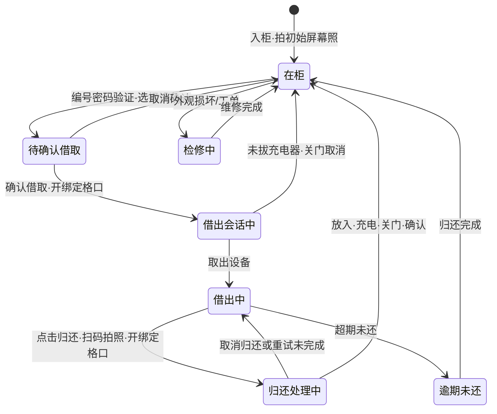

# AI学伴管理后台 — 设备管理需求文档

## 1. 文档信息

| 项目 | 内容 |
|------|------|
| 文档名称 | 设备管理需求文档 |
| 文档版本 | v1.56 |
| 创建日期 | 2026-06-05 |
| 修订日期 | 2026-08-27 |
| 文档状态 | 评审中（商务已确认柜机管理；柜机轮播已并入本文档） |
| 所属项目 | AI学伴管理后台 · 设备管理模块 |
| 关联文档 | [万象视界需求文档.md](./万象视界需求文档.md)（**同期交付**） |
| 原型入口 | `prototype/index.html`（`npm run dev` → http://localhost:8080）→ 左侧「设备管理」 |
| 数据持久化 | 浏览器 `localStorage`，键名 `ai_study_prototype_v44`（与万象视界共用） |

---

## 2. 文档范围

### 2.1 覆盖范围

平板借还柜机场景：**柜机管理**、平板设备监控、借还全流程追溯、外观检测、放置检测、状态告警、柜机广告轮播。柜机运行数据由借租柜供应商上报。

### 2.2 不在范围

- 万象视界内容运营（独立文档）
- 占位菜单：**不做**

### 2.3 交付与权限

- 与万象视界**同期交付**，需求文档分开维护
- 角色权限：**当前不做差异**

### 2.4 信息架构

```
设备管理
├── 概览（device-overview）
├── 柜机管理（cabinet）
│   ├── 柜机详情（cabinet-detail）
│   ├── 配置轮播（cabinet-carousel）
│   └── 批量配置轮播（cabinet-carousel-batch）
├── 平板设备（tablet）
│   └── 设备详情（tablet-detail）
├── 使用记录（device-usage）
│   └── 使用记录详情（device-usage-detail）
└── 状态告警（device-alert）
```

> 柜机广告轮播规格见 §4.16 与 §5.6.4～§5.6.6；详情页不展示轮播区块。
**导航：** 左侧菜单 + 顶部 Tab 页签 + 面包屑（与万象视界共用壳层）

## 3. 建设目标与设计原则

### 3.1 目标

1. 可视化管理柜机、平板、格口状态（后台不展示电量百分比）。
2. 完整记录借还全流程，支持管理员追溯与审计。
3. 外观检测与放置检测异常可告警、可处理。
4. 与万象视界同属 AI学伴后台，菜单并列，数据独立。

### 3.2 原则

| 原则 | 说明 |
|------|------|
| 流程闭环 | 入柜→借出→归还→检测→回柜全链路可查 |
| 借出确认 | 身份验证后选择设备并二次确认；确认前取消不打开柜门 |
| 取消可追 | 已开门后，设备未拔充电器且关门，记为取消借用；拔线再放回属于用户操作异常 |
| 归还可验 | 点击归还后扫码自动拍照；设备放入、充电、关门、确认均完成才归还成功 |
| 异常可追 | 告警关联使用记录、检测记录、工单 |

---

## 4. 核心业务逻辑与规则

> 第 5 章为页面规格；研发/测试以本章为准。

### 4.1 参与实体

```
柜机(Cabinet) ──包含──▶ 格口(Slot) ──承载──▶ 平板(Tablet)
学生(Student) ──产生──▶ 使用记录(UsageRecord)
                              ├── Inspection（检测记录）
                              ├── DeviceAlert（告警）
                              └── Workorder（工单）
```

### 4.2 借还主流程状态机



| 阶段 | 是否拍照 | 规则 |
|------|----------|------|
| 首次入柜 | ✅ | 拍**初始屏幕照**，作永久基准之一 |
| 借出 | ❌ | 编号+密码验证、选择设备、确认后开绑定格口；不拍照 |
| 归还 | ✅ | 先点击归还，再扫码；识别后约 1 秒自动拍照并开绑定格口 |
| 外观对比 | — | 后台用该照片与**上一次入柜基准照** AI 比对；借出/取消不拍照 |

#### 4.2.1 取消借用（已确认）

**借出流程：** 点击「借」→ 输入编号和密码 → 验证成功并进入设备列表 → 选择设备 → 弹窗确认借取 → 开**绑定格口**。确认前取消不打开柜门，也不生成借出记录；可重新验证后再借。

> **一机一格（已确认）：** 每台平板台账绑定唯一 `cabinetId` + `slotNo`。借出、归还开门均开**该设备对应格口**，不支持跨格口放入或自动分配空位。

| 情形 | 条件 | 结果 |
|------|------|------|
| 重复借用 | 用户已有已借出设备 | 提示「已有已借出的设备」，不可继续借 |
| 确认前取消 | 未确认借取 | 不开门、不生成记录 |
| 未拔线关门 | 设备仍在原格口且充电器未拔 | **取消借用**；设备保持在柜，记录「未取出设备」 |
| 取出设备 | 设备已离开格口 | 确认 **已借出**；之后归还须扫码 |
| 拔线再放回 | 已拔充电器后又放回并关门 | 仍为**已借出**，记录操作异常；不可按取消借用处理 |

**后台记录：**

| 位置 | 文案 |
|------|------|
| 状态 | **取消借用** |
| 说明 | **未取出设备** |
| 时间线·设备借出 | `确认借取，柜门打开` |
| 时间线·取消借用 | `设备未拔充电器，关门后取消借用` |
| 外观对比 | 无 |

字段：`cancelReason=charger_connected`，`cancelledAt`。

### 4.3 归还扫码拍照与外观对比（已确认）

#### 4.3.1 连拍 1～3 张、双重用途

归还时必须先点击「归还」。柜机扫描平板屏保二维码，识别后约 **1 秒**自动拍照；识别成功后打开该设备**绑定格口**，并提示确认归还。

| 用途 | 说明 |
|------|------|
| 扫码入柜 | 柜机本地识别二维码，校验借出设备身份并打开绑定格口 |
| 外观对比 | 连拍照片上传通晤纪后台，取**最后一张**（或 AI 选定最佳一张）与基准照做屏幕损伤 AI 对比 |

**数据字段：**

| 字段 | 说明 |
|------|------|
| `returnScan` | 识别结果（`screenQrMatched`、`qrCode`、`scannedAt`） |
| `returnScreenPhotos` | **推荐**：照片数组，每项含 `url`、`capturedAt`；长度 1～3 |
| `returnScreenPhoto` | **兼容**：单张照片对象；无数组时回退使用 |

`scannedAt` 与首张拍照时间相差约 1 秒。

#### 4.3.2 对比基准链

「上一次入柜时拍的照片」指该设备**上一次在柜内留档的屏幕照**：

| 归还次序 | 对比基准照 | 说明 |
|----------|------------|------|
| 该设备**第 1 次归还**（首次借出后归还） | **初始入柜屏幕照** | 与设备全新上架时拍摄的照片对比；`compareLabel` 标注「对比初始照」 |
| 第 2 次及以后归还 | **上一位用户归还时**的扫码屏拍照（连拍中的主对比照） | 即上一次入柜留档照，形成对比链；`compareLabel` 标注借用人或记录 ID |

> **已确认：** 第一次借出后归还，依旧与**初始照**对比，而非借出照（借出时不拍照）。

**AI 结果：** `normal` 正常 / `scratch` 擦伤 / `crack` 划痕或破裂

**损坏处理链：**

```
外观异常(scratch/crack)
  → 生成 damage 告警
  → 创建工单(Workorder)
  → 设备 status=maintenance，condition=damaged
  → 格口状态=异常
```

#### 4.3.3 使用记录详情 · 归还扫码屏拍照图集（已确认）

**入口：** 使用记录详情 · 全流程时间线 ·「外观对比判定」节点内按钮「查看本次归还扫码屏拍照」（**仅最终正常归还**时展示该节点）。

> 详情页不设独立「外观对比三列照片区」；对比基准链由数据层 `beforeCondition` 维护，通过时间线「查看本次归还扫码屏拍照」打开图集弹窗查看。

**图集弹窗（已确认布局）：**

| 区域 | 内容 |
|------|------|
| 标题 | 本次归还扫码屏拍照 |
| 副标题 | 上：初始入柜照 · 下：本次归还扫码连拍（可切换查看） |
| **上半部分** | **初始入柜屏幕照**（固定展示，含拍摄时间；与对比基准链中的初始照一致） |
| **下半部分** | **归还连拍轮播**：一次展示 1 张，支持切换 |
| 轮播切换 | **半透明圆形按钮**（‹ ›）叠放在当前图片**左右两侧**；禁用态当仅 1 张时 |
| 轮播信息 | 当前「图 i / N」+ 该张 `capturedAt` |
| 底部 | 「关闭」 |

> 弹窗内上半固定为**初始入柜照**，便于与下半归还连拍对照查看；对比基准链按 `beforeCondition` 取值（首次为初始照，后续可为上次归还照），不在详情页另设照片列表区。

### 4.4 归还确认与异常处理

归还只对**已借出的设备**生效。扫码拍照后，柜机打开该设备绑定格口；用户须放入设备、连接充电器、关门并在弹窗中确认。

| 场景 | 检测结果 | 弹窗与结果 |
|------|----------|------------|
| 归还成功 | 已放入 + 已充电 + 关闭 | 确认后归还成功；上传照片、外观对比、进入充电循环（记录为已归还） |
| 未关门 | 打开 | 提示「柜门未关」；可重试或取消归还；记录为开门中 |
| 未充电 | 关闭但未充电 | 提示「设备未充电」；可重试或取消归还；记录为归还异常 |
| 取消归还 | 任一归还步骤点击取消 | 柜门重新打开，不再弹窗；设备仍已借出；记录为归还异常 |

**重试：** 用户修正门/充电状态后点击「重试」。仅**设备在绑定格口、已充电、柜门关闭、确认归还**同时满足时，才写入 `returned`。

**取消后的风险：** 格口保持打开供用户取回设备。若未关门就被下一位用户放入其平板并关门，系统没有扫码、拍照、充电和确认归还记录；两台设备仍按原已借出状态追踪，可能逾期。后台使用记录保留「归还已取消」或「归还流程未完成」说明，供人工排查。

**后台告警：** 未关门生成 `return_door_open`；未充电生成 `return_not_charging`；若后续重试成功，告警可标记已解决。

### 4.5 逾期与强制退出规则（已确认）

**逾期阈值：** 借出后 **24 小时**未归还（`overdueHours = 24`，可配置）。

**时间线（以 `borrowAt` 为起点）：**

| 时点 | 偏移 | 行为 | 面向 |
|------|------|------|------|
| 提前告警 | **借出后 23 小时 50 分**（逾期前 **10 分钟**） | 向**学生端**推送归还提醒告警 | 学生端 |
| 强制退出 | **借出后 24 小时** | 学生端**强制退出登录**；设备标记逾期 | 学生端 + 后台 |
| 后台逾期记录 | 借出后 24 小时仍未归还 | 设备 `isOverdue=true`；生成 `overdue` 告警；记录 `lastUserNote` | 管理后台 |

**说明：**

- 提前 10 分钟告警**仅下发学生端**，不要求管理后台单独弹窗（后台可在使用记录详情查看 `preAlertAt`）。
- 满 24 小时未归还时执行强制退出，**不创建追缴工单**；管理后台仅保留逾期提醒类告警。
- 归还完成后 → 清除 `isOverdue`、强制退出状态；使用记录 `status=returned`。

### 4.6 充电与格口状态

格口状态只用于说明格口是否已被设备激活绑定，不再由电量、充电、柜门或损坏状态推导；异常体现在设备状态。

| 格口状态 | 判定规则 |
|------|----------|
| 已激活 | 格口已绑定平板。无论平板处于在柜、借出、充电或损坏等状态，均展示“已激活”。 |
| 未激活 | 格口未绑定平板。 |

> 设备或格口损坏时，格口仍为「已激活」，损坏信息在「设备状态·异常」与「说明」中体现。柜门、充电和设备状态继续独立展示，用于查看设备实际情况，但不影响格口状态。

### 4.7 告警类型与处理

| type | 触发 | 示例严重程度 |
|------|------|--------------|
| damage | 外观对比非 normal | 中/高 |
| overdue | 借出满 24 小时未归还 | 中 |
| overdue_pre_alert | （可选记录）借出后 23h50m 学生端提前告警 | 低 |
| return_door_open | 未关门（归还未完成） | 低/中 |
| return_not_charging | 未充电（归还未完成） | 低/中 |
| cabinet_offline | 柜机心跳超时 | 高 |
| manual_feedback | 现场人员人工上报格口/设备问题 | 中/高 |

**处理状态：** `pending`（待处理）→ `resolved`（已解决）

**告警内容文案（列表展示）：**

| type | 告警内容 |
|------|----------|
| damage | 外观对比发现损坏 |
| overdue | 借出满24小时未归还 |
| return_door_open | 未关门 |
| return_not_charging | 未充电 |
| cabinet_offline | 柜机心跳超时 |
| manual_feedback | 具体问题文案（见下表） |

**人工问题反馈（`manual_feedback`）内容选项：**

| 文案 | 说明 |
|------|------|
| 门关不上 | 格口柜门无法正常关闭 |
| 充电线损坏 | 格口充电线物理损坏 |
| 格口内有异物 | 格口内存在异物影响使用 |
| 设备损坏 | 设备本体损坏（非 AI 对比检出） |

列表操作：

| 处理状态 | 操作列展示 |
|----------|------------|
| `pending`（待处理） | 可点击「处理」→ 正式版更新状态；原型 Toast「已标记处理」 |
| `resolved`（已解决） | 灰色文案「已处理」，**不可点击** |

### 4.8 概览页统计计算规则

| 指标 | 计算 |
|------|------|
| 柜机在线 | `online=true` 的柜机数 / 总数；卡片可点击跳转柜机管理 |
| 平板总数 | `tablets.length` |
| 在柜 | `status=in_cabinet` |
| 离柜 | `status≠in_cabinet`（含已借出、检修中等） |
| 逾期提醒 | `isOverdue=true` 的设备数 |
| 待处理告警 | `deviceAlerts` 中 `status≠resolved` |

> 概览页**不单独展示「已借出」**统计卡片，借出设备计入「离柜」；逾期设备在「逾期提醒」中单独计数（可与离柜重叠）。

### 4.9 平板列表字段语义

| 字段 | 展示规则 |
|------|----------|
| 设备SN | 设备序列号 |
| 柜机ID | 设备所属柜机的唯一编号 |
| 柜机名称 | 设备当前所在柜机名称；借出/离柜时展示最后已知柜机名称 |
| 格口号 | 展示设备绑定的格口号；借出时仍展示绑定格口 |
| 柜门 | `closed` 关闭 / `open` 打开 / —（已借出为 —） |
| 格口状态 | 已激活 / 未激活（见 §4.6）；借出设备的绑定格口仍展示已激活 |
| 设备状态 | **充电中** / **已借出** / **异常**（见 §4.9.1） |
| 说明 | 异常原因（含在柜门开的「未关门」），或已借出设备的归还未关门、未充电、已取消归还、疑似误放等提示；其余展示「—」 |

> 后台列表不展示「电量」「充电」「外观状态」列。外观损伤归入「设备状态·异常」+「说明」。

**工具栏右侧摘要：** `总计：N`（`tablets.length`）

**列表分页：** 静态 UI（含每页条数选择、跳页输入，不可切换）

#### 4.9.1 设备状态与说明推导（平板列表 / 柜机详情设备表）

**判定顺序（自上而下，命中即停）：**

| 顺序 | 条件 | 设备状态 | 说明（示例） |
|------|------|----------|--------------|
| 1 | 外观损坏（`condition=damaged/scratch`）、逾期（`isOverdue=true`）、在柜且柜门开（`status=in_cabinet` 且 `doorStatus=open`），或存在未解决关联告警（**不含** `return_door_open`/`return_not_charging`，二者由门/充电状态单独体现） | **异常** | `设备擦伤` / `借出满24小时未归还` / `未关门` / 告警简短文案；多项以「；」拼接 |
| 2 | `status=borrowed` 且非异常 | **已借出** | — |
| 3 | `status=in_cabinet` 且非异常 | **充电中** | — |
| 4 | 其余且非异常 | **已借出** | — |

> **产品说明：** 设备状态和格口状态分别展示。格口状态只表示是否已绑定设备（已激活/未激活），不代表设备是否可借、正在充电或柜门开关；损坏体现在设备状态·异常。在柜设备统一展示「充电中」，不再单列「已充满」。

**列表筛选（UI）：** 设备状态：全部 / 充电中 / 已借出 / 异常

### 4.10 使用记录列表关键列逻辑

**列顺序：** 记录ID、设备SN、格口号、所属柜机ID、学生、**状态**、**说明**、借出时间、归还时间、操作

| 列 | 含义 |
|----|------|
| 状态 | **开门中** / **已归还** / **借出中** / **归还异常** / **已逾期** / **取消借用**（见 §4.10.1） |
| 说明 | 异常/取消原因说明；正常已归还时「—」（见 §4.10.1） |
| 借出时间 | `borrowAt` |
| 归还时间 | `returnAt`；取消借用可展示 `cancelledAt`；未归还展示「—」 |

> 使用记录列表不以独立列展示对比基准、放置检测、借前/借后状态；相关信息见详情页时间线与基础信息。

#### 4.10.1 使用记录状态与说明推导

**状态判定顺序：**

| 顺序 | 条件 | 状态 |
|------|------|------|
| 1 | `status=cancelled`（§4.2.1 取消借用） | **取消借用** |
| 2 | 已归还（`returnAt` 或 `status=returned`）且归还异常（外观对比非 normal、设备损坏、归还未最终完成等） | **归还异常** |
| 3 | 已归还且非异常 | **已归还** |
| 4 | 逾期（`overdue=true`，未归还） | **已逾期** |
| 5 | 归还流程中门未关（`returnAttempt.issue=door_open` 且 `pending`） | **开门中** |
| 6 | 归还异常（未充电、疑似误放、归还已取消等，未归还） | **归还异常** |
| 7 | 其余（已借出未归还） | **借出中** |

**说明文案（异常或取消时，多项以「；」拼接）：**

| 情形 | 说明 |
|------|------|
| 取消借用 | 未取出设备 |
| 逾期 | 借出满24小时未归还 |
| 外观擦伤 | `returnInspection.detail` 或默认「外观对比发现擦伤」 |
| 外观破裂 | `returnInspection.detail` 或默认「外观对比发现划痕/破裂」 |
| 归还取消 | 归还已取消，设备仍已借出 |
| 疑似误放 | 疑似误放，设备仍已借出 |
| 未关门 / 未充电 | 柜门未关 / 设备未充电，待重试 |

**筛选 · 记录状态：** 全部 / 开门中 / 已归还 / 借出中 / 归还异常 / 已逾期 / 取消借用

> **开门中：** 借出确认后门开未取（通常落入取消借用）与归还流程中门未关两种情形；后者记为开门中，设备仍已借出。

> **状态与时间线一致：** 归还门未关记为「开门中」；其他归还问题记为「归还异常」；满24小时未还记为「已逾期」；取消借用不计为已归还，也不做外观对比。

### 4.11 详情页时间线顺序

1. 编号密码验证  
2. 确认借取并打开绑定格口  
3. **取消借用**（未拔充电器且关门）或设备取出  
4. **扫码拍照 · 归还确认**（仅正式归还）；未关门、未充电、疑似误放或取消时展示「归还流程未完成」  
5. 外观对比判定（仅归还成功时）  
6. 未归还时展示「借出中 / 开门中 / 归还异常 / 已逾期」对应状态；逾期显示 `forceLogoutAt`  

### 4.12 边界与异常

| 场景 | 处理 |
|------|------|
| 检修中设备 | 不可借出 |
| 柜内无电量达标设备 | 柜机提示「晚点再来借吧」；**不计入**异常类型 |
| 柜机离线期间操作 | 产生 `cabinet_offline` 告警 |
| 连续多人归还同一格口 | 每次对比基准为**上一次归还照** |
| 错码归还 | 正式版须定义拒绝/异常记录策略；**不得**误开非绑定格口 |
| 归还格口与绑定格口不一致 | **不允许**；扫码后仅开设备绑定格口，柜机侧拦截 |
| 确认借取前取消 | 不开柜门、不生成借出记录 |
| 未拔充电器即关门 | **取消借用**（§4.2.1）；说明「未取出设备」 |
| 拔线再放回并关门 | 仍为已借出，记录操作异常 |
| 归还任一步取消 | 柜门重新打开；设备仍已借出 |

### 4.13 批量导入（设备）

- 工具栏「导入设备」打开批量导入弹窗（标题「导入设备」）
- **所属柜机**（必填）：下拉选择 `cabinets` 中柜机
- 交互规则同万象视界 §5.16（上传结果、上传按钮、无自动解析、模板下载）
- 正式版写入设备台账并关联所选柜机；原型仅 UI 演示

### 4.15 设备还原（擦伤恢复）

**入口：** 平板设备列表工具栏「导入设备」右侧「设备还原」

**适用场景：** 现场核验确认外观无问题后，将因外观擦伤进入「异常」状态的设备恢复为可借状态。

**弹窗交互：**

| 元素 | 规则 |
|------|------|
| 标题 | 设备还原 |
| SN 输入 | 多行文本框；支持换行、逗号、分号分隔多个 SN |
| 辅助说明 | 仅支持将「异常 · 设备擦伤」状态的设备还原为正常 |
| 检测按钮 | 校验输入 SN 是否均满足还原条件（见下） |

**检测条件（须同时满足）：**

1. SN 在设备台账中存在  
2. 设备状态为 **异常**（§4.9.1）  
3. 设备存在外观擦伤标记（`condition=damaged/scratch`）  
4. 说明中含 **设备擦伤**

**检测结果反馈：**

| 结果 | 文案 | 一键还原按钮 |
|------|------|--------------|
| 未输入 SN | 红字「请输入设备 SN」 | 置灰不可点 |
| 存在不符合条件的 SN | 红字「查询异常，{SN1}；{SN2}非异常（设备擦伤）状态，请删除后重试！」 | 置灰不可点 |
| 全部符合条件 | 绿字「查询成功，可将设备还原成正常状态！」 | **可点击** |
| 修改 SN 输入后 | 清空检测结果 | 重新置灰，须再次检测 |

**底部按钮：** 取消（关闭弹窗）/ **一键还原**（默认置灰；仅检测成功后可用）

**一键还原效果（原型写 localStorage）：**

- `condition` → `normal`  
- 设备还原后，设备和其绑定格口的异常状态一并清除
- 将该设备未解决的 `damage` 类型告警标记为 `resolved`  
- Toast「已成功还原 N 台设备」；关闭弹窗并刷新平板列表  

> **边界：** 仅处理「设备擦伤」类异常；逾期、放置检测等其他异常不在本功能范围内。

### 4.14 柜机管理逻辑

> **商务确认：** 需做柜机管理；柜机台账、在线心跳、格口/门/充电状态由供应商上报；远程开门等运维指令由后台下发。

#### 4.14.1 柜机生命周期

```
供应商注册/变更上报 → 后台建立柜机台账
定时心跳 → 更新 online、lastHeartbeat
心跳超时 → cabinet_offline 告警
```

#### 4.14.2 柜机与格口、设备关系

- 一台柜机包含 N 个格口（`totalSlots`）
- **一机一格：** 每台平板在台账中绑定唯一 `cabinetId` + `slotNo`；格口与设备一一对应，**不随借还变更**
- 借出：学生选定设备后，柜机打开**该设备绑定格口**
- 归还：扫屏保二维码识别设备后，柜机打开**该设备绑定格口**（须为本柜且与台账一致）
- 格口状态：已绑定平板显示已激活；未绑定平板显示未激活；设备或格口损坏时格口仍为已激活，异常在设备状态中体现
- 门、充电按**格口**独立上报，驱动归还放置判定（§4.4）
- 柜机离线期间：依赖供应商断网补传；后台标记离线并告警

#### 4.14.3 柜机字段语义

| 字段 | 来源 | 说明 |
|------|------|------|
| online | 心跳上报 | 在线/离线 |
| lastHeartbeat | 心跳上报 | 最近心跳时间 |
| totalSlots / usedSlots | 注册/格口汇总 | 格口总数 / 已占用；后台添加时初始 `totalSlots=0`，待供应商注册后更新 |
| boundPhone | 后台录入 | 柜机绑定手机号（11 位）；添加/编辑必填 |
| location / manager / managerContact | 供应商上报 / 后台录入 | 位置、负责人、负责人联系方式（负责人与联系方式可空） |

#### 4.14.4 后台对柜机的操作

| 操作 | 说明 |
|------|------|
| 添加柜机 | 后台录入台账：柜机 ID、名称、安装位置、**绑定手机号**（必填）、负责人（选填）、负责人联系方式（选填）；新建后 `totalSlots=0`、`usedSlots=0`、`online=false`，待供应商注册与心跳上线 |
| 查看列表/详情 | 展示台账 + 供应商上报数据 |
| 配置/批量轮播 | 见 §4.16 与 §5.6.4～§5.6.6；详情页不展示轮播 |
| 远程指令 | 重启、开门、锁格口（运维；原型开门弹窗见 §4.14.5） |
| 检修联动 | 设备损坏后下发格口 maintenance |

#### 4.14.5 远程开门弹窗（原型已实现 UI）

**入口：** 柜机详情 · 格口概览标题下方「远程开门」

| 元素 | 规则 |
|------|------|
| 标题 | 远程开门 |
| 副标题 | `{柜机名称}（{柜机ID}）· 请选择格口后确认下发 Q8 指令` |
| 格口选择 | 网格展示 `#1…#N`；显示绑定设备 ID 或「未激活」；点击选中 |
| 离线拦截 | 柜机 `online=false` 时 Toast「柜机离线，无法远程开门」 |
| 异常确认 | 选中异常格口时二次确认「格口 #N 当前异常，确认远程开门？」 |
| 按钮 | 取消 / 确认开门 |
| 成功反馈 | Toast「已向 {柜机名} 格口 #N 下发开门指令」（原型不下发真实指令） |

### 4.16 柜机广告轮播

> **范围：** 为借租柜机广告区下发图片轮播素材，按柜独立配置或批量覆盖多台。能力融入柜机管理，无独立一级菜单。不在本节范围：学生端首页热门轮播（万象视界「热门推荐」）；柜机端播放器实现细节。

#### 4.16.1 业务规则

| 项 | 规则 |
|----|------|
| 广告区尺寸 | **1080×600** |
| 素材类型 | **图片**（本地上传：jpg / png / webp / gif） |
| 单柜上限 | **3 条**；满额时「+ 添加图片」置灰，旁注「已达上限」 |
| 播放顺序 | 列表排序；支持上移 / 下移 |
| 图片停留 | 系统默认 **5 秒**（全柜统一，后台不提供配置入口） |
| 单柜保存 | 「保存并下发」写回该柜配置 |
| 批量保存 | 默认空列表；保存后**覆盖**所选柜机原有全部轮播（空列表即清空） |
| 删除单条 | 配置页删除后需再保存才同步 |

#### 4.16.2 数据结构

```js
cabinetCarousels[cabinetId] = {
  items: [ { id, type: 'image', name, url, sort } ],
  updatedAt
}
```

`items` 为空或不存在：该柜无轮播内容。

---

## 5. 页面与交互规格

### 5.1 设备概览 (`device-overview`)

**统计卡片（6 项）：**

| 卡片 | 说明 |
|------|------|
| 柜机在线 | `在线数/总数`；可点击跳转柜机管理 |
| 平板总数 | 已注册设备数 |
| 在柜 | 当前在柜设备数 |
| 离柜 | 不在柜设备数 |
| 逾期提醒 | `isOverdue=true` 数量 |
| 待处理告警 | 未解决告警数 |

**规则说明区：**

- **外观检测 · 扫码拍照对比规则**：首次归还对比初始入柜照；后续归还对比上次归还照
- **放置与检测 · 归还流程说明**：放入设备、充电、关门、确认归还才成功；未关门、未充电可重试或取消

> 概览页不展示顶部说明 Banner 与全流程步骤条；借还完整规则见 §4.2～§4.4。
**最近使用记录：** 取 `usageRecords` 前 5 条；列：记录ID、设备SN、格口号、所属柜机ID、学生、借出时间、**状态**、**说明**、操作（详情）；状态/说明规则同 §4.10.1

### 5.2 平板设备 (`tablet`)

**筛选：** 设备ID、设备SN、柜机ID、柜机名称均为文本输入，支持模糊查询；设备状态可选全部/充电中/已借出/异常。

**工具栏：**

| 元素 | 说明 |
|------|------|
| 导入设备 | 打开批量导入弹窗（须选所属柜机，见 §4.13） |
| 设备还原 | 打开设备还原弹窗（见 §4.15、§5.2.2） |
| 右侧摘要 | **总计：N** |

**列表列：** 设备ID、设备SN、型号、柜机ID、柜机名称、格口号、柜门、格口状态、设备状态、**说明**、操作（**无电量列**）

**在柜数据一致性：** 已绑定平板的格口均为已激活；未绑定平板为未激活；设备或格口损坏时格口仍为已激活，异常在设备状态中体现。在柜且门开设备显示异常·未关门；归还未完成设备保持已借出，说明展示未关门、未充电或疑似误放。

**操作：** 详情

**分页：** 静态 UI（含每页条数、跳页）

#### 5.2.1 编辑设备弹窗（原型列表未开放入口）

**标题：** 编辑设备

> 原型平板列表**仅保留「详情」**；编辑弹窗逻辑保留供正式版按需开放。设备 ID、屏保二维码在详情页只读展示；编辑弹窗**不展示** ID/二维码字段。

**可编辑：**

| 字段 | 必填 | 控件 | 说明 |
|------|------|------|------|
| SN 序列号 | 是 | 文本 | 不可与其他设备重复 |
| 型号 | 是 | 文本 | |
| 所属柜机 | 是 | 下拉 | 选项来自 `cabinets`（含柜机 ID） |
| 仓位 | 是 | 下拉 | 切换柜机后刷新为 `#1…#N`；同柜同仓位不可重复占用 |

**校验 Toast：** 请填写 SN/型号、请选择柜机/仓位、SN 已存在、仓位超出范围、仓位已被占用

**按钮：** 取消 / 保存（居中）  
**保存后：** 同步更新该设备关联使用记录中的 SN；重算各柜机 `usedSlots`；Toast「保存成功」；刷新列表（原型写 localStorage）。

#### 5.2.2 设备还原弹窗

见 §4.15。原型 Mock 可测 SN：`SN20260301005`（异常 · 设备擦伤）。

### 5.3 设备详情 (`tablet-detail`)

**基础信息：**

| 字段 | 说明 |
|------|------|
| 设备ID / SN / 型号 | 只读 |
| 屏保二维码 | 只读；标注「归还时柜机拍摄该码画面并识别」 |
| 所属柜机 / 仓位 | 台账归属 |
| 柜门 / 格口状态 | 在柜时展示实时状态（**不单独展示充电状态、电量**） |
| 设备状态 | 充电中 / 已借出 / 异常（§4.9.1） |
| 说明 | 异常时展示原因；无异常不展示该行 |
| 当前归属柜机 | 在柜显示柜机名；离柜显示「离柜中」 |
| 最后外观检测 | `lastInspection` |
| 当前借用人 | 已借出展示姓名+学号 |

**初始入柜屏幕照：** 照片卡片（可点击 Toast 查看）；含拍摄时间与 AI 结果

**使用记录（最近 5 条）：** 记录ID、学生、借出、归还、**状态**、**说明**、详情（规则同 §4.10.1）

**底部：** 返回列表

### 5.4 使用记录 (`device-usage` / `device-usage-detail`)

#### 5.4.1 列表页

**筛选（原型已实现过滤）：**

| 字段 | 控件 | 选项 / 说明 |
|------|------|-------------|
| 学号 / 姓名 | 文本 | 模糊匹配学号或姓名 |
| 设备 SN | 文本 | 模糊匹配 |
| 所属柜机ID | 文本 | 按设备所属柜机ID模糊匹配 |
| 记录状态 | 下拉 | 全部 / 开门中 / 已归还 / 借出中 / 归还异常 / 已逾期 / **取消借用** |
| 借出时间 | 日期范围 | `type=date` 起止 |
| 归还时间 | 日期范围 | `type=date` 起止；未填则不限制；无 `returnAt`/`cancelledAt` 的记录在填了归还时间时不匹配 |

**默认筛选：** 正式版借出时间=**当日**；**原型**为方便对照模拟数据，默认借出时间不限（展示全部样例，含取消借用等）

**搜索 / 重置：** 「搜索」按表单过滤；「重置」恢复默认筛选、清空归还时间

**结果提示：** 正式版 `默认展示今日借出记录…`；原型提示模拟数据全部条数及状态覆盖说明

**列表列：** 记录ID、设备SN、格口号、所属柜机ID、学生、**状态**、**说明**、借出时间、归还时间、操作

| 列 | 展示规则 |
|----|----------|
| 状态 | 开门中 / 已归还 / 借出中 / 归还异常 / 已逾期 / **取消借用**（§4.10.1） |
| 说明 | 取消借用固定「未取出设备」；归还未完成展示未关门、未充电、疑似误放或归还已取消；其余「—」 |
| 借出时间 | `borrowAt` |
| 归还时间 | `returnAt`；取消借用展示 `cancelledAt`；未归还「—」 |

**空态：** 「暂无符合条件的使用记录」

**分页：** 每页 **10** 条；底部分页切换器（上一页 / 页码 / 下一页）；搜索或重置后回到第 1 页

#### 5.4.2 详情页

**基础信息：** 记录ID、设备、借用人（含年级）、借出/归还（或取消）柜机与仓位时间、**状态**、**说明**、`preAlertAt`、`forceLogoutAt`、关联告警、归还异常告警

**全流程时间线（文案固定简化）：**

1. 编号密码验证  
2. 确认借取并打开绑定格口  
3. **取消借用**（未拔充电器且关门）或设备取出  
4. **扫码拍照 · 归还确认**（正式归还时）；未完成时展示待重试、疑似误放或已取消  
5. 外观对比判定（**仅归还成功**）— 含「查看本次归还扫码屏拍照」  
6. 未归还时展示「借出中 / 开门中 / 归还异常 / 已逾期」对应状态；逾期展示 `forceLogoutAt`

> 详情无独立逾期处理时间线；无放置检测场景独立字段、对比基准/借后状态详情字段。

**底部：** 返回列表

### 5.5 状态告警 (`device-alert`)

**筛选（原型已实现过滤）：**

| 字段 | 选项 |
|------|------|
| 设备SN | 文本输入，按设备SN模糊匹配 |
| 所属柜机ID | 文本输入，按柜机ID模糊匹配 |
| 告警类型 | 全部 / 外观损坏 / 逾期提醒 / **未关门** / **未充电** / 柜机离线 / **人工问题反馈** |
| 处理状态 | 全部 / 待处理 / 已解决 |
| 产生时间 | **按月**下拉（中文展示，如「2026年6月」） |

**默认筛选：** 产生时间=**当月**

**结果提示：** `按月份查询，当前 {年月}，共 N 条`

**列表列：** 告警ID、类型、设备SN、**格口**（设备当前所在格口，如 `#4`；无设备显示 —）、所属柜机ID、告警内容、状态、产生时间、操作

**操作：**

| 处理状态 | 操作列 |
|----------|--------|
| 待处理 | 「处理」可点击 |
| 已解决 | 「已处理」灰色文案，不可点击 |

**空态：** 「暂无符合条件的告警」

### 5.6 柜机管理 (`cabinet`)

> **逻辑依据：** §4.14 柜机管理、§4.8 概览统计、§4.16 柜机广告轮播

#### 5.6.1 柜机列表

**工具栏：** 添加柜机、**批量配置轮播内容**；右侧显示已选台数。未勾选时点批量 → Toast 提示。

**筛选：** 柜机名称、在线状态（全部/在线/离线）、安装位置、广告轮播（全部/已配置/未配置；原型占位）

**列表列：**

| 列 | 说明 |
|----|------|
| 勾选 | 批量配置轮播用 |
| 序号 | 列表顺延，非数据库 ID |
| 柜机 ID | `id`（独立列） |
| 柜机名称 | |
| 安装位置 | |
| 格口 | `usedSlots/totalSlots` |
| 在线状态 | 在线(绿) / 离线(红) |
| 轮播素材 | 缩略图条；无素材为「暂无素材」；仅图片，无视频角标 |
| 最近心跳 | `lastHeartbeat` |
| 绑定手机号 | `boundPhone` |
| 负责人 | |
| 负责人联系方式 | `managerContact`；未填展示「—」 |
| 操作 | 编辑、查看详情、查看轮播、配置轮播 |

#### 5.6.1.1 添加柜机弹窗

| 字段 | 必填 | 控件 | 说明 |
|------|------|------|------|
| 柜机 ID | 是 | 文本 | 默认按序号预填（如 `CAB-004`），可修改；不可与已有柜机重复 |
| 柜机名称 | 是 | 文本 | 不可与已有柜机重名 |
| 安装位置 | 是 | 文本 | |
| 绑定手机号 | 是 | 文本（tel） | 11 位手机号；格式校验 `^1\d{10}$` |
| 负责人 | 否 | 文本 | 未填存为「—」 |
| 负责人联系方式 | 否 | 文本 | 手机号等；未填存为「—」 |

**按钮：** 取消 / 确定  
**确定后：** 写入表单中的柜机 ID、`totalSlots=0`、`usedSlots=0`、`online=false`、`lastHeartbeat=—`；Toast「添加成功」；刷新列表（原型写 localStorage）。

#### 5.6.1.2 编辑柜机弹窗

**只读展示：** 柜机 ID、格口数量（`totalSlots`，含已占用数）、在线状态、最近心跳（供应商上报）

**可编辑：** 柜机名称、安装位置、绑定手机号、负责人、负责人联系方式

**校验：** 名称不可与其他柜机重复；绑定手机号必填且须为 11 位手机号

**按钮：** 取消 / 确定  
**确定后：** Toast「保存成功」；刷新列表。

#### 5.6.2 柜机详情

- **基础信息：** 柜机 ID、名称、安装位置、格口占用、在线状态、最近心跳、**绑定手机号**、负责人、负责人联系方式
- **格口概览：**
  - 标题下方工具栏：**远程重启**（Toast 演示）、**远程开门**（弹窗，见 §4.14.5）
  - 卡片网格展示 `#1…#N`；角标为格口状态，正文展示**柜门 / 设备状态**（**不含说明、电量**）；格口状态按 §4.6
  - 顶部展示状态图例（已激活 / 未激活）
  - 有设备格口可跳转「设备详情」；**格口卡片不提供单独「开门」按钮**
  - 未绑定平板的格口标签为「未激活」，显示「暂无设备」；损坏设备所在格口仍为「已激活」，异常在设备状态中体现
  - **原型演示：** `CAB-001` 展示已激活、未激活格口及损坏设备样例
- **绑定本柜机设备：** 表格列：序号、设备ID、SN、仓位、柜门、格口状态、设备状态、**说明**、操作；字段语义与格口概览、平板列表一致（§4.9、§4.9.1）；**不含电量/充电列**；按 `cabinetId` 筛选绑定本柜的设备（含 `status=in_cabinet` 与 `status=maintenance`）
- **最近告警：** 本柜机关联告警 Top5（含 `cabinet_offline`）；列：告警ID、类型、告警内容、状态、产生时间
- **底部：** 返回列表

#### 5.6.3 与概览联动

设备概览页「柜机在线 X/Y」统计卡片可点击跳转柜机管理，数据来自 `cabinets` 中 `online=true` 数量。

#### 5.6.4 查看轮播弹窗

**入口：** 柜机列表「查看轮播」。按 1080×600 比例预览；多则可切换；下方表列为序号、素材名称。底部：关闭 / 去配置。

#### 5.6.5 单柜配置轮播 (`cabinet-carousel`)

**路由：** `#cabinet-carousel?{"id":"CAB-xxx"}`

| 区块 | 说明 |
|------|------|
| 标题 | 配置轮播 · {柜机名称} |
| 柜机端预览 | 广告区比例预览当前素材；多则可切换；无角标 |
| 轮播素材列表 | 标题「轮播素材列表（上限3条）」 |
| 列表列 | 排序、素材名称、操作（删除） |
| 底部 | 取消 / 清空全部（有素材时）/ 保存并下发 |

**添加图片：** 本地上传（点击或拖拽），建议尺寸 1080×600，上传后可预览再确认添加。

#### 5.6.6 批量配置轮播 (`cabinet-carousel-batch`)

**路由：** `#cabinet-carousel-batch?{"ids":["CAB-001","CAB-002"]}`

**入口：** 勾选 ≥1 台柜机后从工具栏进入。标题「批量配置轮播 · 已选 N 台」；说明例：`已选 N 台：柜机A、柜机B。保存后将覆盖其原有轮播内容。`

默认空列表；空态文案「暂无素材，请添加图片」。编辑能力同单柜。「保存并批量下发」需二次确认。

---

## 6. 数据模型（摘要）

- `cabinets` — 柜机（`id`、`name`、`location`、`boundPhone`、`online`、`lastHeartbeat`、`totalSlots`、`usedSlots`、`manager`、`managerContact`；台账可后台添加，运行态由供应商心跳/注册维护）
- `cabinetCarousels` — 按柜机广告轮播（仅图片，上限 3；见 §4.16）
- `tablets` — 平板（`id`、`sn`、`model`、`cabinetId`、`slotNo`、`battery`、`status`、`isOverdue`、`charging`、`doorStatus`、`qrCode`、`condition`、`initialScreenPhoto`、`currentStudentId/Name`、`lastInspection`）
- `usageRecords` — 含 `placementDetection`、`beforeCondition`、`returnScan`、`returnScreenPhotos`（1～3 张，推荐）/ `returnScreenPhoto`（兼容）、`returnInspection`、`preAlertAt`、`forceLogoutAt`、`alertId`、`returnAlertIds`
- `deviceAlerts`、`workorders`、`inspections` — 告警/工单/检测（工单、检测无独立列表页；检测数据支撑外观对比链演示）

**原型 Mock 规模：** 3 台柜机、20 台平板、约 20 条使用记录、15 条告警（含损坏、逾期、柜机离线、未关门、人工问题反馈）

---

## 7. 原型实现边界

| 已实现（localStorage 或 session） | Mock-only |
|--------|-----------|
| 概览统计计算、流程/规则说明区、最近使用记录 | 概览外列表分页 |
| 使用记录筛选（默认全部样例、归还时间、搜索/重置） | 平板/柜机列表筛选 |
| 状态告警筛选（含默认当月、按月中文选项） | 告警「处理」写库 |
| 归还扫码屏拍照图集（时间线按钮 + 弹窗轮播） | 批量导入写库、照片真实预览 |
| 柜机添加/编辑（含绑定手机号校验）、格口状态样例（§4.6） | 供应商心跳/注册真实对接 |
| 柜机轮播：单柜/批量配置、查看预览、列表缩略图（仅图片） | 柜机端真实下发播放 |
| 平板编辑弹窗（SN/柜机/仓位校验，写 localStorage；列表未开放入口） | — |
| 设备还原弹窗（检测 + 一键还原擦伤状态，写 localStorage） | — |
| 远程开门弹窗（含离线/检修拦截；入口在格口概览下） | 远程重启真实下发 |
| 页面导航、Tab、Toast、确认框 | 权限 / 登录 |

**localStorage 键名：** `ai_study_prototype_v44`（与万象视界共用；清缓存恢复默认 mock）

---

## 8. 验收标准

- [ ] 设备管理子模块均可从菜单进入，Tab / 面包屑正确（含柜机轮播配置页）
- [ ] 概览统计与 §4.8 一致；柜机在线卡片可跳转柜机管理
- [ ] 概览含外观检测、归还规则说明；无顶部说明 Banner、无全流程步骤条
- [ ] 使用记录原型默认展示全部样例；支持按所属柜机ID和其他字段筛选，搜索/重置正确
- [ ] 使用记录列表筛选无「外观对比结果」；展示设备SN、格口号、所属柜机ID、状态、说明、借出时间、归还时间
- [ ] 平板设备列表无「电量」「充电」「外观状态」列；含设备状态（充电中/已借出/异常）与说明列；工具栏右侧为「总计：N」；筛选项为「所属柜机」
- [ ] 平板在柜正常数据为柜门关闭+充电；在柜且门开设备显示异常·未关门；归还未完成设备仍显示已借出，并有未关门、未充电或疑似误放说明
- [ ] 平板设备工具栏含「设备还原」；还原弹窗检测通过前一键还原置灰，通过后写库清除擦伤（可测 SN20260301005）
- [ ] 柜机详情「绑定本柜机设备」表与平板列表字段一致（含说明，无充电列）；详情页无轮播区块
- [ ] 状态告警已解决记录操作列为灰色「已处理」且不可点击；告警类型含「未关门」「未充电」「人工问题反馈」
- [ ] 使用记录列表状态为开门中/已归还/借出中/归还异常/已逾期/取消借用；详情展示确认借取、取消借用、扫码拍照归还、未关门(开门中)/未充电(归还异常)/疑似误放或取消等分支
- [ ] 平板设备列表展示设备SN、柜机ID、柜机名称及绑定格口号；操作仅「详情」；设备ID去 TAB- 前缀
- [ ] 状态告警默认当月筛选可演示；月份选项为中文
- [ ] 归还成功、未关门、未充电、取消归还在后台记录与详情时间线一致
- [ ] 外观对比链（首次 vs 初始、后续 vs 上次归还）可读可验（仅正常归还）
- [ ] 损坏→告警→检修链路在 mock 数据可演示（TAB-005）
- [ ] 使用记录详情无外观对比三列照片区；正常归还可从时间线打开图集弹窗（§4.3.3）
- [ ] 柜机列表含柜机 ID、绑定手机号、负责人联系方式、轮播素材；详情展示格口网格；远程重启/开门位于格口概览下；格口图例为已激活/未激活
- [ ] 格口状态展示符合 §4.6：绑定平板为已激活，未绑定平板为未激活；设备或格口损坏时格口仍为已激活，异常在设备状态中体现
- [ ] 添加/编辑柜机：必填校验（含绑定手机号 11 位）、编辑时格口数量为只读、成功后列表刷新；无固件版本字段
- [ ] 编辑设备：SN/型号/柜机/仓位校验、仓位冲突检测、同步 usageRecords SN（弹窗保留，列表无入口）
- [ ] 设备详情展示屏保二维码、说明（异常时）、初始入柜照
- [ ] 导入设备弹窗须选择所属柜机
- [ ] 一机一格：借出/归还仅开绑定格口；无跨格口归还
- [ ] 柜机轮播仅图片、单柜上限 3；批量覆盖所选柜机原内容
- [ ] 轮播入口在柜机管理；无独立一级菜单
- [ ] 列表可查看 / 配置轮播；含轮播素材缩略列与批量配置
- [ ] 单柜 / 批量均可添加图片（本地上传）、调序、删除；上限 3，满额置灰并提示已达上限
- [ ] 批量默认空，保存覆盖所选柜机原内容
- [ ] 预览区比例 1080×600；无类型/时长角标；素材表无预览/类型/时长列
- [ ] 柜机详情页无轮播区块
---

## 9. 修订记录

| 版本 | 日期 | 修订说明 |
|------|------|----------|
| v1.0 | 2026-06-05 | 从万象视界文档拆出 |
| v1.1 | 2026-06-05 | 新增第 4 章核心业务逻辑 |
| v1.2 | 2026-06-05 | 纳入对话全部设备规则：对比链、场景A/B/C分步上报、统计计算、列表字段语义、时间线、批量导入 |
| v1.3 | 2026-06-05 | 商务确认柜机管理纳入范围；新增 §4.14、§5.6；关联《借租柜对接接口文档》 |
| v1.4 | 2026-06-05 | 确认归还规则：柜机拍屏保二维码**一张照片**同时用于扫码入柜与外观对比；首次归还对比初始照 |
| v1.5 | 2026-06-05 | 逾期规则：借出 **24h** 未还；提前 **10 分钟**学生端告警；满 24h **强制退出登录** |
| v1.6 | 2026-06-05 | 状态告警处理状态简化为「待处理 / 已解决」，去掉「处理中」 |
| v1.7 | 2026-06-05 | 柜机管理新增「添加柜机」：名称、安装位置、格口数量、固件版本（后端预导入单选）、负责人（选填） |
| v1.8 | 2026-06-05 | 使用记录默认筛选今日借出；状态告警默认筛选本月并新增产生时间筛选项 |
| v1.9 | 2026-06-05 | 状态告警产生时间筛选改为按月查询（月份选择器） |
| v1.10 | 2026-06-05 | 状态告警产生时间月份选项改为中文展示（如 2026年6月） |
| v1.11 | 2026-06-05 | 柜机详情运维操作移除「下发自定义屏显」 |
| v1.12 | 2026-06-05 | 柜机列表操作新增「编辑」；平板设备列表操作新增「编辑」弹窗（SN/型号/柜机/仓位可改） |
| v1.13 | 2026-06-18 | 全文同步当前原型：信息架构、概览 6 项统计与规则说明区、使用记录/告警筛选实现、设备详情字段、远程开门弹窗、导入设备选柜机、编辑弹窗字段修正、localStorage v18、验收与边界更新 |
| v1.15 | 2026-06-22 | 放置检测三态重命名：状态·正常 / 状态·异常A / 状态·异常B（`scenario` A/B/C）；异常B 扩展为全部门未关情形（含借出/扫码后 5 分钟未关门）；告警筛选与原型 UI 同步 |
| v1.16 | 2026-06-22 | 归还扫码改为连拍 1～3 张（`returnScreenPhotos`）；§4.3.3 图集卡片与弹窗（上初始入柜照 + 下轮播、两侧圆形切换）；localStorage v21 |
| v1.17 | 2026-06-22 | 添加/编辑柜机新增负责人联系方式；柜机列表与详情展示联系方式；添加柜机弹窗含柜机 ID 字段；localStorage v22 |
| v1.18 | 2026-06-22 | 状态告警内容按类型统一简短文案（§4.7）；柜机详情最近告警列改为「告警内容」；localStorage v23 |
| v1.19 | 2026-06-26 | 同步原型 UI：§4.4 归还不限定借出格口；§4.9/§5.2 列表「当前所在柜机」、移除列表「编辑」；§4.10/§5.4 使用记录新增归还时间与筛选、移除归还扫码列、调整列顺序；§5.6.2 柜机详情「当前已放置本柜机设备」、远程操作移至格口概览下、移除格口开门与页底运维区及 E 接口标注文案；§4.12 低电量不可借与跨格口归还边界 |
| v1.22 | 2026-06-30 | §4.9/§4.9.1 平板列表设备状态收敛为充电中/借出中/异常，新增说明列，移除充电/外观状态列；§4.10/§4.10.1 使用记录列表合并为状态+说明，移除借前/借后/对比基准/放置检测列；§4.11/§5.4.2 归还时间线调整为扫码放置拍外观照→关门上传外观照；§4.7/§5.5 告警已解决展示「已处理」不可点；§4.15/§5.2.2 新增设备还原弹窗；§5.6.2 柜机详情设备表与平板列表对齐；localStorage v24 |
| v1.23 | 2026-07-10 | §4.4 取消「关门未充电/异常A」，归还异常统一为「未关门」（未充电不允许关门）；§4.7/§5.5 告警类型同步；§4.10/§4.11/§5.4.2 时间线合并为「扫码放置·关门上传外观照」，未关门无外观对比；状态只看最终结果；平板列表在柜正常=门关+充电；工具栏总计；localStorage v29 |
| v1.25 | 2026-07-23 | localStorage 键同步为 `ai_study_prototype_v33`（与万象视界共用） |
| v1.26 | 2026-07-23 | 设备管理全面移除「电量」展示；设备状态新增「已充满」（在柜且电量≥100%）；筛选/列表/详情/柜机详情/§4.9.1 同步 |
| v1.28 | 2026-07-23 | §5.6.2 格口概览与「当前已放置」状态字段统一；CAB-001 mock 覆盖全部样例状态；localStorage `v34` |
| v1.29 | 2026-07-24 | 新增 §4.2.1 借出异常取消借用：未取走关门 / 未关过门插回关门 → 取消并留痕；已关过门后必须扫码归还；取消后 3 分钟锁定（仅剩一台豁免）；取消后未满电仍可借；调整 §4.4.1 借出不催关；使用记录状态新增「取消借用」 |
| v1.31 | 2026-07-24 | TAB-001 增加两条取消借用 mock（未取走关门 / 未关过门插回）；使用记录状态「取消借用」可演示；localStorage `v35` |
| v1.32 | 2026-07-24 | 使用记录 mock 扩至 20 条覆盖待归还/已归还/取消借用/异常；默认筛选改为展示全部；localStorage `v36` |
| v1.33 | 2026-07-24 | §4.2.1 与柜机对齐：取消借用仅依据「取走/未取走」，去掉充电断开/插电判定与文案；mock/时间线同步；localStorage `v37` |
| v1.34 | 2026-07-24 | 定稿取消借用：§3.2/§4.2.1/§4.11/§5.4 与原型需求说明同步；删除插回/充电断开等已否决表述；界面文案仅取走/未取走；localStorage `v38` |
| v1.35 | 2026-08-05 | §4.7/§5.5 状态告警新增「人工问题反馈」类型（门关不上/充电线损坏/格口内有异物/设备损坏）；列表新增「格口」列；localStorage `v40` |
| v1.36 | 2026-08-05 | **一机一格**：每台设备绑定唯一格口；借出/归还扫码后仅开对应格口；废除跨格口归还（§4.4、§4.12、§4.14.2）；mock 同步 |
| v1.37 | 2026-08-06 | 柜机管理列表独立展示柜机 ID、绑定手机号、负责人联系方式 |
| v1.38 | 2026-08-06 | 移除柜机「固件版本」字段（详情/mock/台账）；同步删除 §4.14.3 相关描述 |
| v1.39 | 2026-08-06 | 删除《借租柜对接接口文档》及全文引用；去掉 E/Q 接口目录依赖；对齐柜机轮播 IA/列表工具栏；修正原型使用记录默认全部与验收项；清理已否决表述 |
| v1.40 | 2026-08-07 | 设备概览移除顶部说明 Banner 与全流程步骤条 |
| v1.41 | 2026-08-07 | 借还流程改为确认借取、扫码自动拍照、归还确认；取消/未关门/未充电均保留借出状态并可追溯 |
| v1.42 | 2026-08-10 | 平板设备列表在“当前所在柜机”右侧新增“格口号”，展示设备绑定格口 |
| v1.43 | 2026-08-10 | 使用记录及概览最近使用记录在“设备”后新增“所属柜机ID” |
| v1.44 | 2026-08-10 | 使用记录筛选区新增“所属柜机ID”，支持模糊查询 |
| v1.45 | 2026-08-10 | 状态告警列表在“格口”后新增“所属柜机ID”，筛选区同步支持模糊查询 |
| v1.46 | 2026-08-10 | 使用记录及概览最近使用记录的设备列仅显示设备ID，后新增格口号 |
| v1.47 | 2026-08-10 | 使用记录及概览最近使用记录的“设备”列改为“设备SN”，展示设备SN |
| v1.48 | 2026-08-10 | 平板设备和状态告警的设备列改为设备SN；平板设备新增柜机ID、柜机名称及柜机ID输入筛选 |
| v1.49 | 2026-08-10 | 格口状态统一为已使用、未使用、异常；删除电量、充电和柜门推导格口状态的旧规则 |
| v1.50 | 2026-08-10 | 平板设备列表在柜机名称前展示柜机ID，并支持按柜机ID筛选 |
| v1.51 | 2026-08-10 | 平板设备的柜机名称筛选改为文本输入，支持模糊查询 |
| v1.52 | 2026-08-10 | 状态告警筛选新增设备SN文本搜索 |
| v1.53 | 2026-08-10 | 状态告警筛选将设备SN和所属柜机ID调整为前两个搜索项 |
| v1.54 | 2026-08-25 | 同步原型：§4.9.1 设备异常新增「在柜且门开→未关门」，关联告警排除 `return_door_open`/`return_not_charging`；§4.9/§4.10.1/§4.11/§5.4 新增「疑似误放」说明与时间线分支；§5.6.2 柜机详情设备表改为「绑定本柜机设备」（按 `cabinetId` 筛选）；§4.14.5 远程开门副标题改为「Q8 指令」 |
| v1.55 | 2026-08-26 | 状态术语统一（原型+文档）：柜门状态改为「打开/关闭」；格口状态改为「已激活/未激活」（取消格口异常，损坏并入设备状态）；设备状态改为「充电中/已借出/异常」（取消「已充满」，在柜统一为充电中）；使用记录状态改为「开门中/已归还/借出中/归还异常/已逾期/取消借用」（§4.10.1 重排判定顺序，归还门未关=开门中，其他归还问题=归还异常，满24h未还=已逾期）；筛选选项、列表列、详情、柜机详情图例与验收同步 |
| v1.56 | 2026-08-27 | 将《柜机轮播需求文档》并入本文档：新增 §4.16 柜机广告轮播（业务规则、数据结构）、§5.6.4 查看轮播弹窗、§5.6.5 单柜配置轮播、§5.6.6 批量配置轮播；更新关联文档引用与验收要点 |
