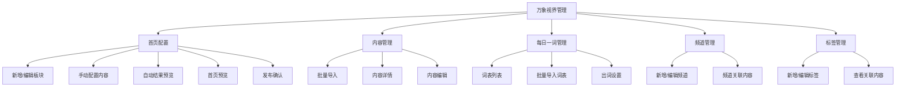

# 万象视界 · 后台管理需求文档

| 项目 | 说明 |
|------|------|
| 文档版本 | v1.0 |
| 状态 | 待评审 |
| 更新日期 | 2026-05-27 |
| 适用端 | 后台管理平台 |
| 关联原型/文档 | `万象视界-首页配置-需求与线框.md`（历史引用，文件未入库） |
| 本期范围 | 首页配置、内容管理、频道管理、标签管理 |
| 暂不包含 | 爱心公告栏模块 |

---

## 1. 背景与目标

### 1.1 背景

「万象视界」学生端首页由多个内容板块纵向组成，学生可在首页查看图文、视频等内容，并通过频道、内容类型、标签等维度进行后台组织和运营筛选。后台管理平台需要为运营人员提供完整的内容池管理、频道组织、标签维护和首页板块配置能力，保证后台配置结果能够稳定、准确地映射到学生端展示。

### 1.2 建设目标

1. 支持运营配置学生端首页板块，包括板块新增、编辑、排序、启停、删除、发布。
2. 支持首页板块通过「自动取数」或「手动选取」两种方式关联内容。
3. 支持内容通过频道、内容类型、标签等维度进行组织，满足学生端首页和频道页的展示闭环。
4. 支持内容批量导入、查看、编辑、启停、软删除及标签维护。
5. 支持频道、标签的基础增删改查，并联动内容管理与首页配置。
6. 支持草稿与发布分离，避免后台编辑未完成时直接影响学生端线上页面。

### 1.3 设计原则

| 原则 | 说明 |
|------|------|
| 学生端闭环 | 后台配置的板块、频道、内容类型、标签、内容状态必须能明确影响学生端展示 |
| 草稿隔离 | 首页配置的新增、编辑、排序先进入草稿，发布后才影响学生端 |
| 已启用可见 | 学生端仅展示已发布配置中处于启用状态的板块和内容 |
| 可追溯 | 内容、频道、标签、首页板块的关键变更需要保留更新时间与操作日志 |
| 可运营 | 列表筛选、缺省提示、批量导入、关联内容选择等流程需符合运营使用习惯 |

---

## 2. 模块范围

后台管理平台「万象视界管理」包含以下模块：

| 模块 | 职责 | 与学生端关系 |
|------|------|--------------|
| 首页配置 | 配置学生端万象视界首页板块、排序、内容来源和发布 | 决定学生端首页板块结构与展示内容 |
| 内容管理 | 管理内容池，包括图文/视频内容导入、编辑、启停、删除、标签维护 | 为首页、频道页、标签筛选提供内容数据 |
| 每日一词管理 | 管理双语新知「每日一词」专用词表、导入与按日出词规则 | 决定学生端双语新知中「每日一词」每日展示内容 |
| 频道管理 | 管理频道及父子频道关系，并维护频道关联内容 | 支撑学生端按频道浏览内容 |
| 标签管理 | 管理标签及标签下关联内容 | 支撑后台筛选、自动取数规则和运营管理；本期学生端不展示标签 |

---

## 3. 核心概念定义

| 概念 | 定义 |
|------|------|
| 板块 | 学生端首页的一个内容展示区域，如「今日推荐」「校园热点」 |
| 板块名称 | 后台识别用名称，可与学生端展示名称一致 |
| 副标题 | 学生端板块下方或旁侧可展示的辅助文案，纯文本，可为空 |
| 内容 | 万象视界内可展示给学生的资源，当前包括图文和视频 |
| 内容类型 | 内容的展示形态，当前包括图文、视频，后续可扩展 |
| 频道 | 内容的组织维度，可存在父子级结构 |
| 标签 | 内容的补充标识，一条内容最多可选择 8 个标签 |
| 自动来源 | 系统根据频道、内容类型、标签、排序规则等条件自动选取内容 |
| 手动来源 | 运营人工从内容池中选择内容并关联到板块或频道 |
| 词表 | 每日一词使用的结构化单词列表，按排序号确定出词顺序 |
| 出词起始日 | 每日一词第 1 条词生效对应的自然日 |
| 循环模式 | 每日一词词表用尽后的策略，可选循环展示或停止更新 |
| 草稿 | 后台已保存但尚未发布到学生端的首页配置版本 |
| 已发布状态 | 学生端当前读取和展示的首页配置版本 |

---

## 4. 学生端展示闭环规则

### 4.1 首页展示规则

1. 学生端首页展示后台「首页配置」中已发布、已启用的板块。
2. 首页板块展示顺序与后台发布版本中的板块排序一致。
3. 每个板块最多展示后台配置的「展示上限」条内容，展示上限范围为 1～5。
4. 板块内容仅展示已启用内容；已停用或已删除内容不在学生端展示。
5. 若板块没有可展示内容，学生端默认隐藏该板块，避免空模块展示。
6. 板块副标题为空时，学生端不展示副标题区域或按前端样式自动收起。
7. 图文内容使用图文卡片组件展示；视频内容使用视频卡片组件展示。

### 4.2 频道页展示规则

1. 学生端频道入口读取后台已创建并有效的频道。
2. 频道排序按后台频道管理中的排序结果展示。
3. 父级频道下存在子级频道时，学生端可按产品原型展示为一级/二级频道结构。
4. 频道页仅展示已启用内容。
5. 内容可归属多个频道；同一内容在不同频道中可重复出现。

### 4.3 类型与标签展示规则

1. 内容类型决定学生端内容卡片的展示方式和内容详情页渲染方式。
2. 本期学生端不展示标签；标签仅用于后台内容筛选、自动取数规则和运营管理。
3. 一条内容最多绑定 8 个标签。
4. 删除标签后，学生端不再展示该标签；内容与该标签的绑定关系同步移除。

---

## 5. 首页配置

### 5.1 页面目标

首页配置用于管理学生端万象视界首页的板块结构、展示顺序、内容来源、展示上限和发布状态。

### 5.2 首页配置列表

#### 5.2.1 筛选条件

| 筛选项 | 类型 | 说明 |
|--------|------|------|
| 板块名称 | 输入框 | 支持模糊搜索 |
| 状态 | 下拉单选 | 全部、启用、停用 |
| 来源 | 下拉单选 | 全部、自动、手动 |

#### 5.2.2 列表字段

| 字段 | 说明 |
|------|------|
| 拖动按钮 | 每行前置拖动按钮，用于调整板块排序 |
| 排序 | 当前板块排序序号 |
| 板块名称 | 后台和学生端可识别的板块名称，最多 6 个字 |
| 副标题 | 纯文本副标题，可为空 |
| 类型 | 当前板块关联内容类型，如图文、视频、不限 |
| 来源 | 自动或手动 |
| 内容数 | 当前板块有效关联内容数 |
| 状态 | 启用或停用 |
| 操作 | 编辑、启用/停用、删除 |

#### 5.2.3 页面操作

| 操作 | 规则 |
|------|------|
| 新增板块 | 点击后进入新增板块子页面 |
| 拖动排序 | 支持通过行首拖动按钮调整排序，排序变更保存到草稿 |
| 发布 | 点击右上角发布按钮，将当前已启用板块发布到学生端 |
| 编辑 | 进入编辑板块子页面，字段和新增一致 |
| 启用/停用 | 更新板块状态，并保存到草稿 |
| 删除 | 删除板块前二次确认，删除结果保存到草稿 |
| 回退到当前已发布状态 | 清空草稿，恢复至上一次发布版本 |

#### 5.2.4 草稿与发布规则

1. 新增、编辑、删除、启停、排序操作均先自动保存到草稿。
2. 保存成功提示「已更新到草稿」。
3. 草稿未发布前，学生端仍展示上一次已发布版本。
4. 点击「发布」时，系统将当前草稿中已启用的板块发布为新的学生端首页版本。
5. 发布前需校验：
   - 是否存在启用但无有效内容的板块；
   - 是否存在关联已停用或已删除内容；
   - 是否存在失效频道、内容类型、标签条件；
   - 是否存在内容数量超过展示上限。
6. 若仅存在内容不足展示上限的情况，允许发布，但需提示运营确认。
7. 点击「回退到当前已发布状态」时，弹窗提示「是否确认回退到当前已发布状态？」；确认后清空草稿并恢复至上一次发布状态。

### 5.3 新增/编辑板块

#### 5.3.1 基础字段

| 字段 | 必填 | 默认值 | 规则 |
|------|------|--------|------|
| 板块名称 | 是 | 无 | 6 个字内；同一首页配置内不可重复 |
| 副标题 | 否 | 空 | 纯文本；建议限制 30 字内 |
| 启用状态 | 是 | 启用 | 可选启用、停用 |
| 展示上限 | 是 | 1 | 至少 1 条，最多 5 条 |
| 数据来源 | 是 | 自动 | 可选自动、手动 |
| 发布时间 | 是 | 即时生效 | 可选即时生效、定时发布 |

#### 5.3.2 发布时间规则

| 类型 | 规则 |
|------|------|
| 即时生效 | 发布首页后立即对学生端生效 |
| 定时发布 | 需选择日期时间；到达时间后自动发布或进入待发布任务，具体由技术实现确认 |

补充规则：

1. 定时发布时间不得早于当前时间。
2. 定时发布任务以创建定时任务时当前已发布版本为准；草稿仅用于暂存当前编辑中的设置，不影响已创建的定时发布内容。
3. 若定时发布时校验失败，发布任务应失败并记录原因，后台需提示运营处理。

### 5.4 自动来源配置

当数据来源选择「自动」时，展示自动配置项和自动关联结果列表。

#### 5.4.1 自动配置项

| 配置项 | 必填 | 说明 |
|--------|------|------|
| 来源 | 是 | 频道，单选 |
| 排序依据 | 是 | 最新发布、阅读量、点击率、阅读时长；默认最新发布 |
| 自动刷新频率 | 是 | 每日 0 点刷新、每周一 0 点刷新 |
| 内容类型 | 是 | 图文、视频、不限，根据所选频道下可用内容类型动态展示 |
| 标签 | 否 | 可多选标签，用于限定自动取数范围 |

#### 5.4.2 内容类型动态规则

1. 若当前频道下同时存在图文和视频内容，则内容类型显示「图文、视频、不限」。
2. 若当前频道下仅存在图文内容，则只显示「图文」，默认选中且置灰不可改。
3. 若当前频道下仅存在视频内容，则只显示「视频」，默认选中且置灰不可改。
4. 若当前频道下无启用内容，则内容类型置空，并提示「当前频道暂无可用内容」。

#### 5.4.3 自动取数规则

1. 系统仅从已启用内容中取数。
2. 系统根据频道、内容类型、标签条件过滤内容。
3. 系统按排序依据倒序取数：
   - 最新发布：按发布时间或导入时间倒序；
   - 阅读量：按阅读量从高到低；
   - 点击率：按点击率从高到低；
   - 阅读时长：按阅读时长从高到低。
4. 自动选取条数与展示上限匹配：展示上限为几条则最多自动选几条。
5. 内容不足展示上限时，有几条展示几条，并提示「内容池不足，当前仅选中 N 条」。
6. 同一板块内同一内容不可重复出现。
7. 自动刷新只影响自动来源板块；手动来源板块不受刷新影响。
8. 自动刷新会按刷新频率自动更新已发布版本中的自动板块内容结果，无需运营再次手动发布；草稿中的自动规则仅在保存和预览时试算，不影响已发布版本。

#### 5.4.4 自动关联列表字段

| 字段 | 说明 |
|------|------|
| 排序 | 当前自动结果排序 |
| 标题 | 内容标题，点击可查看详情 |
| 内容 | 内容摘要或正文截断 |
| 配图 | 有图则展示缩略图，点击预览 |
| 视频 | 有视频则展示视频标识或封面，点击预览 |
| 阅读量 | 内容阅读量 |
| 点击率 | 内容点击率 |
| 阅读时长 | 内容阅读时长 |
| 类型 | 图文或视频 |
| 频道 | 内容所属频道 |
| 标签 | 内容已绑定标签，最多展示 8 个，可折叠展示 |
| 更新时间 | 最近更新时间 |

#### 5.4.5 自动模式保存

1. 点击保存后，板块基础信息、自动规则和当前自动结果保存至草稿。
2. 保存成功提示「已更新到草稿」。
3. 若为新增板块，额外提示「新增成功」。

### 5.5 手动来源配置

当数据来源选择「手动」时，运营需从内容池中手动添加内容。

#### 5.5.1 自动切手动规则

若当前板块已存在自动选取结果，切换为手动时弹窗提示：「是否将自动选取的内容同步到手动？」

| 用户选择 | 结果 |
|----------|------|
| 确认 | 自动选取结果添加到手动选择列表，并占用展示上限 |
| 取消 | 不同步自动结果，手动列表为空 |

#### 5.5.2 手动关联内容缺省态

当手动列表无数据时，显示缺省文案：「暂无关联内容，点击添加」。其中「点击添加」为可点击按钮，点击后弹出添加内容列表。

#### 5.5.3 添加内容弹窗筛选项

| 筛选项 | 类型 | 说明 |
|--------|------|------|
| 标题 | 输入框 | 支持模糊搜索 |
| 类型 | 下拉单选/多选 | 图文、视频 |
| 频道 | 下拉单选/多选 | 按频道筛选内容 |
| 标签 | 下拉多选 | 按标签筛选内容 |
| 更新时间 | 日期范围 | 按更新时间筛选 |

#### 5.5.4 添加内容列表字段

| 字段 | 说明 |
|------|------|
| ID | 内容唯一标识 |
| 标题 | 点击查看内容详情 |
| 内容 | 内容摘要或正文截断 |
| 配图 | 点击预览图片 |
| 视频 | 点击预览视频 |
| 阅读量 | 内容阅读量 |
| 点击率 | 内容点击率 |
| 阅读时长 | 内容阅读时长 |
| 类型 | 图文或视频 |
| 频道 | 内容所属频道 |
| 标签 | 内容已绑定标签 |
| 更新时间 | 最近更新时间 |
| 操作 | 添加 |

#### 5.5.5 手动添加规则

1. 添加内容列表仅展示已启用内容。
2. 点击「添加」后，将内容加入当前板块手动关联列表。
3. 已添加内容不可重复添加，按钮置灰并显示「已添加」。
4. 已选内容数量达到展示上限后，不允许继续添加，并提示「已达到展示上限」。
5. 手动关联列表支持拖动排序，学生端按该排序展示。
6. 点击内容标题查看详情，详情包含除 ID 外的列表字段。
7. 点击配图或视频分别打开图片/视频预览弹窗。

### 5.6 删除与启停规则

1. 停用板块后，学生端下一次发布后不再展示该板块。
2. 删除板块时需二次确认。
3. 删除已发布过的板块时，建议提示「删除后发布将影响学生端展示，是否继续？」。
4. 删除仅影响首页板块配置，不删除内容池中的内容。

---

## 6. 频道管理

### 6.1 页面目标

频道管理用于维护万象视界内容频道及频道下关联内容，支撑学生端频道导航和首页自动取数的频道来源。

### 6.2 前置规则

1. 当系统内尚未创建任何频道时，用户在需要选择频道的页面添加内容，应提示「请先创建频道」。
2. 创建频道后，用户可返回频道管理或内容关联流程继续添加内容。

### 6.3 频道列表

#### 6.3.1 筛选条件

| 筛选项 | 类型 | 说明 |
|--------|------|------|
| 频道名称 | 输入框 | 支持模糊搜索 |
| 创建时间 | 日期范围 | 按频道创建时间筛选 |

#### 6.3.2 列表字段

| 字段 | 说明 |
|------|------|
| 拖动按钮 | 用于频道排序 |
| ID | 频道唯一标识 |
| 频道名称 | 频道展示名称 |
| 父级 | 父级频道名称，无父级则显示「无」 |
| 内容数 | 当前频道关联的有效内容数量 |
| 类型 | 频道下内容类型汇总，如图文、视频、混合 |
| 创建时间 | 频道创建时间 |
| 操作 | 编辑、删除 |

#### 6.3.3 页面操作

| 操作 | 规则 |
|------|------|
| 新增频道 | 进入新增频道子页面 |
| 编辑频道 | 进入编辑频道子页面 |
| 删除频道 | 二次确认后删除；若存在关联内容或子频道需提示 |
| 拖动排序 | 调整频道在学生端或后台筛选项中的展示顺序 |

### 6.4 新增/编辑频道

#### 6.4.1 基础字段

| 字段 | 必填 | 规则 |
|------|------|------|
| 频道名称 | 是 | 同级频道名称不可重复 |
| 父级频道 | 否 | 可选择已有频道；不可选择自身或其子级作为父级 |
| 发布时间 | 是 | 即时生效或定时发布 |

#### 6.4.2 关联内容

1. 新增频道时，关联列表默认为空。
2. 关联内容需手动添加。
3. 添加内容流程与首页板块手动添加内容流程一致，但筛选项和列表字段中去掉「频道」字段。
4. 频道关联内容仅展示并允许添加已启用内容。
5. 频道内关联内容支持排序，且该排序影响学生端频道页内容展示顺序。
6. 若同一内容已在其他频道中，允许多频道关联；如需限制，由内容管理中的频道编辑规则控制。

### 6.5 频道删除规则

1. 若频道下存在子频道，不允许直接删除，需先删除或迁移子频道。
2. 若频道下存在关联内容，删除前提示「当前频道下存在关联内容，删除后将解除关联，是否继续？」。
3. 删除频道后：
   - 内容与该频道的关联关系解除；
   - 使用该频道作为自动来源的首页板块标记为「配置失效」；
   - 发布首页前必须重新选择有效频道。

---

## 7. 内容管理

### 7.1 页面目标

内容管理用于维护万象视界内容池。所有首页板块、频道、标签下展示的内容均来自内容管理。

### 7.2 内容导入

#### 7.2.1 导入方式

1. 内容通过「批量导入资源内容」进入内容池。
2. 导入方式为上传文件。
3. 文件格式支持 `.xlsx` 和 `.csv` 两种格式；视频、图片可通过 URL 字段或资源文件包方式关联。

#### 7.2.2 建议导入字段

| 字段 | 必填 | 说明 |
|------|------|------|
| 标题 | 是 | 内容标题 |
| 内容 | 否 | 图文正文、摘要或内容描述 |
| 配图 | 否 | 图片 URL 或资源标识 |
| 视频 | 否 | 视频 URL 或资源标识 |
| 类型 | 是 | 图文或视频 |
| 频道 | 否 | 可多个频道，需匹配已存在频道 |
| 标签 | 否 | 可多个标签，最多 8 个，需匹配已存在标签或按规则自动创建 |
| 阅读量 | 否 | 默认 0 |
| 点击率 | 否 | 默认 0 |
| 阅读时长 | 否 | 默认 0 |
| 状态 | 否 | 默认已启用 |
| 发布时间 | 否 | 默认导入成功时间 |

#### 7.2.3 导入校验

1. 标题、类型为必填。
2. 类型必须为系统支持的内容类型，本期固定为图文、视频。
3. 每条内容标签数量不得超过 8 个。
4. 频道不存在时，导入失败或进入异常数据列表，由产品确认。
5. 导入时不自动创建标签；标签需由运营在标签管理中自定义新增后，再通过内容编辑或批量关联方式绑定到各个内容。
6. 若导入文件中填写了不存在的标签，导入失败并在失败原因中提示「标签不存在，请先创建标签」。
7. 图片、视频资源地址需校验格式合法性。
7. 导入完成后显示导入结果：成功条数、失败条数、失败原因下载。

### 7.3 内容列表

#### 7.3.1 筛选条件

| 筛选项 | 类型 | 说明 |
|--------|------|------|
| 标题 | 输入框 | 支持模糊搜索 |
| 类型 | 下拉单选/多选 | 图文、视频 |
| 频道 | 下拉单选/多选 | 支持按频道筛选 |
| 标签 | 下拉多选 | 支持按标签筛选 |
| 状态 | 下拉单选 | 全部、已启用、已停用 |
| 更新时间 | 日期范围 | 按更新时间筛选 |

#### 7.3.2 列表字段

| 字段 | 说明 |
|------|------|
| ID | 内容唯一标识 |
| 标题 | 点击可查看内容详情 |
| 内容 | 内容摘要或正文截断 |
| 配图 | 点击弹窗预览图片 |
| 视频 | 点击弹窗预览视频 |
| 阅读量 | 内容阅读量 |
| 点击率 | 内容点击率 |
| 阅读时长 | 内容阅读时长 |
| 类型 | 图文或视频 |
| 频道 | 已关联频道，支持多个展示 |
| 标签 | 已关联标签，最多 8 个 |
| 状态 | 已启用或已停用 |
| 更新时间 | 最近更新时间 |
| 操作 | 查看、编辑、删除、停用/启用 |

### 7.4 内容查看

1. 点击标题或操作列「查看」打开内容详情弹窗。
2. 详情展示除 ID 外的所有列表字段。
3. 图片支持点击预览。
4. 视频支持点击播放或预览。

### 7.5 内容编辑

#### 7.5.1 可编辑字段

| 字段 | 规则 |
|------|------|
| 类型 | 可修改为系统支持的内容类型，本期固定为图文、视频 |
| 频道 | 可多选频道 |
| 标签 | 可多选标签，最多 8 个 |
| 状态 | 可设置已启用或已停用 |
| 阅读时长 | 可编辑，需为非负数 |

#### 7.5.2 频道编辑限制

编辑频道时需查询当前内容是否已在其他频道中：

1. 若内容未关联其他频道，正常保存。
2. 若内容已在其他频道中，弹窗提示「当前内容已在其他频道中，是否调整？」。
3. 弹窗按钮为「取消」「确定调整」。
4. 点击「取消」后，不保存频道变更。
5. 点击「确定调整」后，按当前多选频道结果保存。

#### 7.5.3 标签编辑限制

1. 单条内容最多选择 8 个标签。
2. 标签选择项来源于标签管理中的有效标签。
3. 超过 8 个时禁止保存，并提示「每条内容最多可选择 8 个标签」。

### 7.6 内容启停与删除

| 操作 | 影响 |
|------|------|
| 停用内容 | 学生端不再展示；首页配置和频道关联中保留但标记不可用 |
| 启用内容 | 恢复为可被首页、频道和自动规则选取 |
| 删除内容 | 采用软删除；所有首页板块、频道、标签关联关系同步标记失效 |

补充规则：

1. 删除内容前需二次确认。
2. 若内容已被首页板块或频道引用，删除前提示影响范围。
3. 删除后发布首页时，不得展示已删除内容。
4. 内容状态变化后，首页配置列表中的内容数需同步刷新。

---

## 8. 标签管理

### 9.1 页面目标

标签管理用于统一维护内容标签，并查看标签下所有关联内容。标签用于内容管理、首页配置手动筛选和自动取数规则。

### 9.2 标签列表

#### 9.2.1 筛选条件

| 筛选项 | 类型 | 说明 |
|--------|------|------|
| 标签名称 | 输入框 | 支持模糊搜索 |
| 创建时间 | 日期范围 | 按创建时间筛选 |

#### 9.2.2 列表字段

| 字段 | 说明 |
|------|------|
| ID | 标签唯一标识 |
| 标签名称 | 标签展示名称 |
| 关联内容数 | 当前绑定该标签的内容数量 |
| 创建时间 | 标签创建时间 |
| 操作 | 编辑、删除、查看关联内容 |

### 9.3 新增标签

1. 点击「新增标签」后弹窗输入标签名称。
2. 点击保存后创建标签。
3. 标签名称必填，不可与已有标签重复。
4. 建议标签名称限制 2～10 个字。

### 9.4 编辑标签

1. 点击编辑后弹窗修改标签名称。
2. 修改标签名称后，内容管理、首页配置筛选项、自动规则中的标签名称同步更新。
3. 标签 ID 不变，历史关联关系不变。

### 9.5 删除标签

1. 删除前二次确认。
2. 若标签存在关联内容，提示「当前标签已关联 N 条内容，删除后将同步解除关联，是否继续？」。
3. 删除后：
   - 标签实体删除；
   - 内容与该标签的关联关系解除；
   - 首页配置中使用该标签的自动规则标记为失效；
   - 发布前要求运营重新选择有效标签。

### 9.6 查看标签关联内容

点击「查看关联内容」进入或弹出关联内容列表。

#### 9.6.1 筛选条件

| 筛选项 | 类型 | 说明 |
|--------|------|------|
| 标题 | 输入框 | 支持模糊搜索 |
| 类型 | 下拉 | 图文、视频 |
| 频道 | 下拉 | 支持按频道筛选 |
| 状态 | 下拉 | 已启用、已停用 |
| 更新时间 | 日期范围 | 按更新时间筛选 |

#### 9.6.2 列表字段

字段与内容管理列表保持一致：ID、标题、内容、配图、视频、阅读量、点击率、阅读时长、类型、频道、标签、状态、更新时间、操作。

---

## 9. 跨模块联动规则

### 9.1 首页配置与内容管理

1. 首页配置选择内容时，只能选择已启用内容。
2. 内容停用后，首页已关联该内容仍保留关系，但学生端不展示。
3. 内容删除后，首页关联关系失效，发布前需提示运营。
4. 内容标签变化后，首页自动规则下次刷新时按最新标签关系重新取数。

### 9.2 首页配置与频道管理

1. 自动来源的频道选项来自频道管理。
2. 删除频道后，引用该频道的首页板块自动规则失效。
3. 频道排序变化影响学生端频道导航，不影响首页板块排序。

### 9.3 首页配置与内容类型

1. 首页配置中的内容类型选项为系统固定支持的图文、视频、不限。
2. 本期不提供类型管理功能，不支持运营自定义新增、停用或删除内容类型。
3. 已发布首页中的历史内容需保证学生端兼容展示；若无法兼容，发布前应阻断。

### 9.4 内容管理与标签管理

1. 内容编辑时可绑定标签。
2. 一条内容最多绑定 8 个标签。
3. 标签删除后，所有内容自动解除该标签绑定。
4. 标签名称修改后，内容列表和筛选器中同步显示新名称。

---

## 10. 权限与操作日志

### 10.1 权限建议

| 角色 | 权限 |
|------|------|
| 超级管理员 | 全部功能，包括发布、删除、频道与标签管理 |
| 运营管理员 | 首页配置、内容管理、频道管理、标签管理 |
| 内容运营 | 内容导入、内容编辑、标签绑定、频道关联 |
| 只读人员 | 仅查看列表和详情 |

### 10.2 操作日志

以下操作建议记录操作日志：

1. 首页配置发布、回退、排序、删除板块。
2. 内容导入、编辑、启停、删除。
3. 频道新增、编辑、排序、删除。
4. 标签新增、编辑、删除。

日志字段建议包括：操作人、操作时间、操作模块、操作对象、操作类型、变更前内容、变更后内容。

---

## 11. 页面交互与原型补充说明

> 说明：墨刀原型链接当前在外部读取时仅返回站点标题，无法直接解析具体画面。以下内容基于现有原型文档、后台管理需求和常见管理后台交互补齐；待提供原型截图或导出图后，可继续逐屏校准字段、按钮位置和文案。

### 11.1 全局页面布局

1. 后台左侧导航中应包含「万象视界」一级菜单。
2. 「万象视界」下至少包含以下二级菜单：
   - 首页配置；
   - 内容管理；
   - 频道管理；
   - 标签管理。
3. 页面主体采用「标题区 + 筛选区 + 表格区 + 分页区」结构。
4. 标题区展示当前页面名称、简短说明和主操作按钮。
5. 筛选区默认展开，筛选项过多时允许折叠为「展开更多」。
6. 表格区默认展示最近更新时间倒序或排序号升序，具体按页面业务决定。
7. 分页区位于表格底部，支持每页 10 / 20 / 50 条切换。
8. 列表刷新后应保留当前筛选条件；新增、编辑、删除完成后返回列表并刷新数据。

### 11.2 首页配置页面交互

#### 11.2.1 进入页面

1. 默认进入「草稿视图」。
2. 若不存在草稿，则以当前已发布版本生成可编辑草稿。
3. 页面顶部展示发布状态提示：
   - 无草稿变更：显示「当前配置已发布」；
   - 有草稿变更：显示「存在未发布修改，学生端仍展示上一发布版本」。
4. 顶部主按钮建议包括「预览首页」「发布首页」「回退到已发布状态」。

#### 11.2.2 新增板块

1. 点击「新增板块」进入新增页面或打开抽屉。
2. 用户填写基础信息、展示上限、来源配置后可点击：
   - 「取消」：返回列表，若已编辑未保存则二次确认；
   - 「保存」：保存为草稿并返回列表；
   - 「保存并配置内容」：仅手动来源展示，保存后进入内容配置区域。
3. 保存失败时在表单字段下方展示具体错误，并在页面顶部展示错误提示。

#### 11.2.3 编辑板块

1. 点击「编辑」后回显该板块当前草稿配置。
2. 若修改数据来源：
   - 自动切手动：询问是否保留当前自动结果；
   - 手动切自动：询问是否清空手动选择内容。
3. 若降低展示上限导致已选内容超限，不允许保存，并提示需先移除超出的内容。
4. 编辑保存后仅更新草稿，不直接影响学生端。

#### 11.2.4 排序交互

1. 首页配置列表支持拖拽排序。
2. 拖拽后页面出现「排序已变更，请保存排序」提示。
3. 点击「保存排序」后写入草稿。
4. 若用户排序后离开页面且未保存，需二次确认。
5. 排序保存失败时恢复到保存前顺序。

#### 11.2.5 手动配置内容

1. 手动内容配置建议采用「左侧内容库 + 右侧已选内容」双栏布局。
2. 左侧内容库支持标题、类型、频道、标签、状态、更新时间筛选。
3. 左侧仅允许添加已启用内容；停用或删除内容不可添加。
4. 右侧已选内容支持拖拽排序和移除。
5. 已选数量达到展示上限后，左侧添加按钮置灰。
6. 保存后提示「已更新到草稿」。

#### 11.2.6 自动配置内容

1. 自动来源需要先选择频道，再选择类型、标签、排序依据和刷新频率。
2. 条件变更后自动结果不立即落库，需点击「预览自动结果」或「保存」。
3. 自动预览列表展示预计选中的内容，支持重新计算。
4. 若内容池不足，展示警告但允许保存；发布时再次提示。
5. 若频道、类型、标签失效，阻断保存或发布。

#### 11.2.7 发布首页

1. 点击「发布首页」后打开发布确认弹窗。
2. 弹窗展示本次发布摘要：板块数量、启用板块数量、停用板块数量、内容不足板块、失效配置项。
3. 存在阻断项时，「确认发布」按钮置灰，并展示需处理的问题列表。
4. 仅存在提醒项时允许发布，但需二次确认。
5. 发布成功后草稿版本成为已发布版本，学生端读取新版本。

### 11.3 内容管理页面交互

#### 11.3.1 内容导入

1. 点击「批量导入」打开导入弹窗。
2. 导入弹窗包含：下载模板、上传文件、导入说明、导入结果。
3. 上传文件后先进行格式校验，校验通过后才能提交导入。
4. 导入过程中按钮显示 loading，禁止重复提交。
5. 导入完成后展示成功数、失败数和失败明细下载入口。
6. 导入成功的数据进入内容列表，默认状态按导入文件或系统默认值处理。

#### 11.3.2 内容列表

1. 页面进入时默认展示全部内容，按更新时间倒序。
2. 标题搜索支持回车触发查询。
3. 点击「重置」清空筛选项并重新加载列表。
4. 标签列超过 3 个时折叠展示，鼠标悬浮或点击后展示完整标签。
5. 配图和视频字段支持点击预览。
6. 列表中的停用内容需有明显状态标识。

#### 11.3.3 查看与编辑内容

1. 点击标题或「查看」打开详情弹窗或详情页。
2. 详情页只读展示内容信息、频道、标签、数据指标和引用关系。
3. 点击「编辑」进入编辑态。
4. 修改频道或标签后，需同步影响首页自动规则和频道页取数。
5. 点击保存前校验标签数量、类型有效性、频道有效性。
6. 保存成功后返回列表并保留筛选条件。

#### 11.3.4 启停与删除内容

1. 停用内容需二次确认，并提示学生端与首页板块展示影响。
2. 删除内容需展示引用范围，包括首页板块、频道、标签。
3. 删除后内容不再出现在添加内容弹窗和学生端页面。
4. 若采用软删除，后台默认列表不展示已删除内容，可在高级筛选中查看。

### 11.4 频道管理页面交互

1. 频道列表支持拖拽排序；排序保存后影响学生端频道展示顺序。
2. 新增频道时若选择父级频道，应实时校验是否形成循环引用。
3. 编辑频道时若改名，内容列表和首页自动来源中的频道名称同步更新。
4. 删除频道时：
   - 存在子频道：禁止删除，并提示先处理子频道；
   - 存在关联内容：允许解除关联后删除，但需二次确认；
   - 被首页自动规则引用：删除后相关规则标记失效。
5. 频道关联内容页与首页手动配置内容页交互保持一致。
6. 频道关联内容保存后，学生端频道页按最新排序展示。

### 11.5 标签管理页面交互

1. 标签列表支持按标签名称和创建时间筛选。
2. 新增标签使用弹窗，保存成功后刷新标签列表。
3. 编辑标签名称后，内容管理、首页配置、频道关联内容等页面同步展示新名称。
4. 删除标签前展示关联内容数。
5. 删除标签后直接解除所有内容关联，并使引用该标签的自动规则失效。
6. 点击「查看关联内容」进入关联内容列表或打开抽屉。
7. 关联内容列表支持继续按标题、类型、频道、状态、更新时间筛选。

### 11.6 通用弹窗与反馈

| 场景 | 交互要求 |
|------|----------|
| 新增/编辑保存成功 | Toast 提示「保存成功」或「已更新到草稿」 |
| 删除/停用/发布 | 必须二次确认 |
| 表单校验失败 | 字段下方展示原因，页面顶部可展示汇总提示 |
| 异步处理中 | 按钮 loading，禁止重复提交 |
| 网络异常 | Toast 提示「网络异常，请稍后重试」 |
| 权限不足 | 页面或按钮置灰，并提示「暂无操作权限」 |
| 离开未保存页面 | 弹窗确认是否放弃当前修改 |
| 预览图片/视频 | 使用弹窗或抽屉，不跳离当前页面 |

### 11.7 页面跳转关系

---

## 12. 每日一词管理

### 12.1 页面目标

每日一词管理用于维护双语新知中「每日一词」的专用词表，支持批量导入、词条启停、出词起始日配置与词表循环策略配置，保障学生端每日自动更新。

### 12.2 与现有内容管理边界

1. 每日一词为独立子模块，不进入通用内容池，不参与首页板块自动取数规则。
2. 双语资讯仍按现有内容管理流程维护（每日一词、双语资讯两类）。
3. 学生端双语新知中的「每日一词」由每日一词模块单独接口提供；不依赖内容 `publishDate=今天` 规则。

### 12.3 词表列表

#### 12.3.1 筛选条件

| 筛选项 | 类型 | 说明 |
|--------|------|------|
| 批次 | 下拉单选 | 按导入批次筛选 |
| 英文/中文 | 输入框 | 支持模糊搜索 |
| 状态 | 下拉单选 | 全部、启用、停用 |

#### 12.3.2 列表字段

| 字段 | 说明 |
|------|------|
| 排序号 | 词条顺序，决定默认出词顺位 |
| 英文 | 词条英文 |
| 中文 | 词条中文释义 |
| 词性 | 如 n. / v. / adj. |
| 音标 | 支持 IPA 文本 |
| 知识点 | 展示摘要，支持展开 |
| 状态 | 启用/停用 |
| 批次 | 所属导入批次 |
| 更新时间 | 最近更新时间 |
| 操作 | 编辑、启用/停用、删除 |

#### 12.3.3 列表规则

1. 排序号默认按导入顺序生成，支持手动调整。
2. 停用词条不参与每日出词计算。
3. 删除词条需二次确认，删除后不可参与后续出词。
4. 支持按日期预览出词结果，便于运营提前校验。

### 12.4 词表导入

#### 12.4.1 导入方式

1. 支持上传 `.xlsx`、`.csv` 文件批量导入。
2. 导入弹窗包含：下载模板、上传文件、导入说明、导入结果。
3. 导入模式支持：
   - 追加导入：在当前词表末尾继续追加；
   - 新建批次导入：创建新批次并可切换为生效词表。

#### 12.4.2 建议导入字段

| 字段 | 必填 | 说明 |
|------|------|------|
| 英文 | 是 | 词条英文 |
| 中文 | 是 | 词条中文释义 |
| 词性 | 否 | 如 n.、v.、adj. |
| 音标 | 否 | 如 /ˌɪnəˈveɪʃən/ |
| 知识点 | 否 | 多条可用分隔符拆分 |
| 排序号 | 否 | 不填则按行号顺延 |

#### 12.4.3 导入校验

1. 英文、中文必填。
2. 同一批次内英文词条不可重复。
3. 排序号冲突时阻断导入并返回错误明细。
4. 导入完成后需展示成功条数、失败条数与失败原因下载。

### 12.5 出词设置

#### 12.5.1 配置项

| 配置项 | 必填 | 说明 |
|--------|------|------|
| 生效词表批次 | 是 | 当前用于每日出词的批次 |
| 出词起始日 | 是 | 起始日对应第 1 条词 |
| 用尽策略 | 是 | 循环展示 / 停止更新 |
| 时区 | 是 | 默认 Asia/Shanghai |

#### 12.5.2 出词规则

1. 系统每日按自然日计算当前应展示词条。
2. 启用词条总数记为 `N`，起始日到目标日的天数差记为 `D`。
3. 循环展示模式下，出词下标为 `D % N`。
4. 停止更新模式下，当 `D >= N` 时返回缺省态，不展示词条。
5. 当 `N=0`（无启用词条）时，学生端展示每日一词缺省态。

#### 12.5.3 发布与生效规则

1. 出词设置保存后即时生效，无需参与首页配置发布。
2. 切换生效批次时，需二次确认是否重置出词起始日。
3. 若仅追加词条且不重置起始日，后续按新词条总量继续循环。

### 12.6 运营提醒与风险控制

1. 当启用词条可覆盖天数少于预警阈值（如 7 天）时，提示「词表即将用尽，请及时导入」。
2. 当词表已用尽且策略为停止更新时，后台首页给出红色告警提示。
3. 提供「指定日期出词预览」能力，支持运营提前核对节假日展示词条。

---

## 13. 异常与缺省态

| 场景 | 处理 |
|------|------|
| 首页暂无板块 | 显示缺省态「暂无板块，点击新增板块」 |
| 手动关联暂无内容 | 显示「暂无关联内容，点击添加」 |
| 内容池无可选内容 | 显示「暂无可用内容，请先导入或启用内容」 |
| 每日一词无启用词条 | 显示「暂无每日一词，请稍后查看」 |
| 每日一词词表用尽且策略为停止更新 | 显示缺省态并提示运营处理 |
| 频道为空 | 需要选择频道时提示「请先创建频道」 |
| 标签为空 | 标签筛选为空态，支持跳转新增标签 |
| 自动取数不足 | 显示当前取到数量和缺少数量，允许保存但发布时提示 |
| 发布校验失败 | 阻断发布并展示失败原因 |
| 文件导入失败 | 展示失败原因并支持下载失败明细 |

---

## 14. 数据字段建议

### 14.1 首页板块

| 字段 | 说明 |
|------|------|
| section_id | 板块 ID |
| name | 板块名称 |
| subtitle | 副标题 |
| sort_order | 排序 |
| source_type | 数据来源：auto/manual |
| display_limit | 展示上限，1～5 |
| content_type | 内容类型：图文、视频、不限 |
| status | 启用/停用 |
| publish_type | 即时/定时 |
| publish_time | 定时发布时间 |
| auto_rule | 自动规则配置 |
| draft_version | 草稿版本 |
| published_version | 已发布版本 |
| created_at / updated_at | 创建/更新时间 |

### 14.2 内容

| 字段 | 说明 |
|------|------|
| content_id | 内容 ID |
| title | 标题 |
| body | 内容正文或摘要 |
| image_url | 配图 |
| video_url | 视频 |
| read_count | 阅读量 |
| click_rate | 点击率 |
| read_duration | 阅读时长 |
| type_id | 类型 ID |
| channel_ids | 频道 ID 集合 |
| tag_ids | 标签 ID 集合，最多 8 个 |
| status | 已启用/已停用 |
| published_at | 发布时间 |
| updated_at | 更新时间 |

### 14.3 频道

| 字段 | 说明 |
|------|------|
| channel_id | 频道 ID |
| name | 频道名称 |
| parent_id | 父级频道 ID |
| sort_order | 排序 |
| status | 状态 |
| publish_type | 发布时间类型 |
| publish_time | 定时发布时间 |
| created_at / updated_at | 创建/更新时间 |

### 14.4 标签

| 字段 | 说明 |
|------|------|
| tag_id | 标签 ID |
| name | 标签名称 |
| related_content_count | 关联内容数 |
| created_at / updated_at | 创建/更新时间 |

### 14.5 每日一词词条

| 字段 | 说明 |
|------|------|
| word_id | 词条 ID |
| batch_id | 导入批次 ID |
| sort_order | 排序号 |
| english | 英文 |
| chinese | 中文释义 |
| part_of_speech | 词性 |
| pronunciation | 音标 |
| knowledge_points | 知识点（JSON 数组） |
| status | 启用/停用 |
| created_at / updated_at | 创建/更新时间 |

### 14.6 每日一词出词配置

| 字段 | 说明 |
|------|------|
| schedule_id | 配置 ID |
| active_batch_id | 当前生效批次 ID |
| start_date | 出词起始日 |
| cycle_mode | 用尽策略：loop/stop |
| timezone | 业务时区 |
| warning_threshold_days | 预警阈值天数 |
| updated_at | 最近更新时间 |

---

## 15. 验收标准

### 15.1 首页配置

1. 可按板块名称、状态、来源筛选板块。
2. 可新增、编辑、启停、删除板块。
3. 可拖动调整板块排序，并在发布后影响学生端展示顺序。
4. 自动来源可按频道、排序依据、刷新频率、内容类型、标签自动取数。
5. 手动来源可从内容池添加内容，并受展示上限限制。
6. 板块保存后进入草稿，发布后才影响学生端。
7. 可回退到当前已发布状态。

### 15.2 频道管理

1. 可按频道名称、创建时间筛选频道。
2. 可新增、编辑、删除、排序频道。
3. 支持父子频道结构。
4. 新增/编辑频道时可手动关联已启用内容。
5. 删除频道后，相关首页自动规则能够识别失效。

### 15.3 内容管理

1. 支持通过文件批量导入内容。
2. 可按标题、类型、频道、标签、状态、更新时间筛选内容。
3. 内容列表字段完整展示 ID、标题、内容、配图、视频、阅读量、点击率、阅读时长、类型、频道、标签、状态、更新时间和操作。
4. 可查看、编辑、删除、启用/停用内容。
5. 单条内容最多可绑定 8 个标签。
6. 停用内容后，学生端不再展示该内容。

### 15.4 标签管理

1. 可按标签名称、创建时间筛选标签。
2. 可新增、编辑、删除标签。
3. 可查看标签下所有关联内容。
4. 删除标签后，内容标签关系解除，首页自动规则识别失效。
5. 内容列表、首页添加内容弹窗、频道关联内容列表均支持标签字段和标签筛选。

### 15.5 每日一词管理

1. 支持下载模板并通过 `.xlsx` / `.csv` 批量导入词表。
2. 可按批次、英文/中文、状态筛选词条。
3. 可对词条进行编辑、启停、删除与排序管理。
4. 可配置生效批次、出词起始日、用尽策略和时区。
5. 循环模式下，词表用尽后可从第一条继续展示。
6. 停止模式下，词表用尽后学生端展示缺省态并触发后台告警。
7. 支持按指定日期预览当日出词结果。

---

*文档结束*
