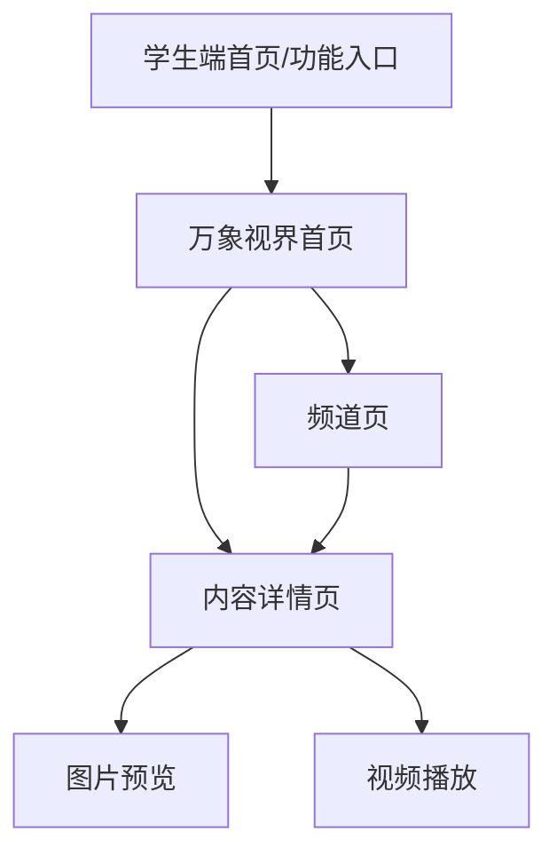
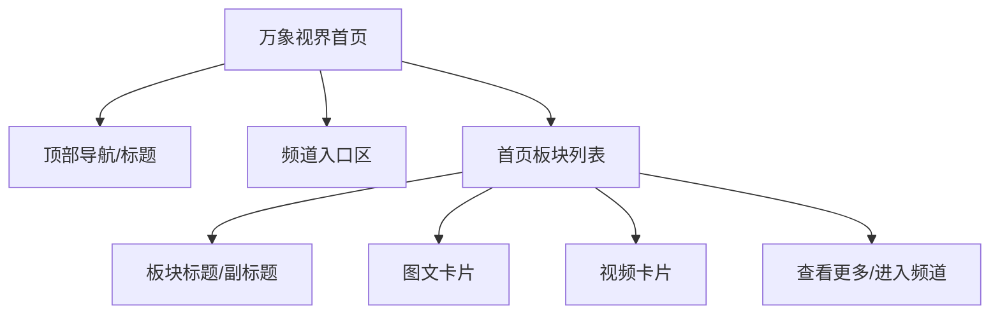
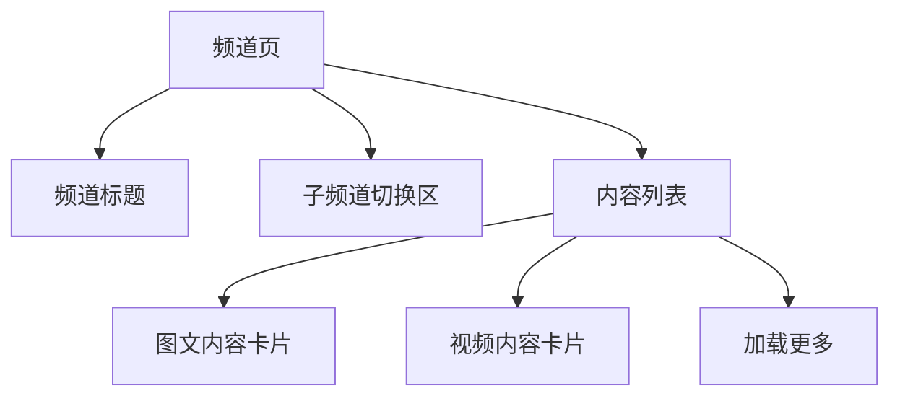

# 万象视界 · 学生端需求文档

| 项目 | 说明 |
|------|------|
| 文档版本 | v1.0 |
| 状态 | 待评审 |
| 更新日期 | 2026-05-27 |
| 适用端 | 学生端 |
| 关联文档 | [`万象视界-后台管理需求文档.md`](./万象视界-后台管理需求文档.md)、`万象视界-首页配置-需求与线框.md`（历史引用，文件未入库） |
| 本期范围 | 万象视界首页、频道页、内容详情页、图文/视频内容展示 |
| 暂不包含 | 爱心公告栏、学生端标签展示、A/B 实验、分群首页、评论互动、点赞收藏分享、内容创作审核 |

---

## 1. 背景与目标

### 1.1 背景

「万象视界」是学生端的内容浏览与学习资讯模块。学生可在该模块中浏览运营配置的图文、视频等内容，并通过首页推荐板块和频道入口快速发现内容。

后台管理平台负责维护内容池、频道、标签和首页板块配置；学生端负责读取后台已发布、已启用、可展示的数据，并以符合学生阅读体验的方式进行展示。

### 1.2 建设目标

1. 为学生提供统一的内容浏览入口，支持图文、视频内容展示。
2. 学生端首页可按照后台发布配置动态展示多个内容板块。
3. 支持按频道浏览内容，频道顺序和频道内容顺序与后台配置保持一致。
4. 支持内容详情页，学生可查看图文正文或播放视频。
5. 对后台停用、删除、未发布或无可用内容的数据进行自动过滤，避免学生看到无效内容。
6. 支持缺省、加载、异常等基础状态，保证学生端体验完整。

### 1.3 设计原则

| 原则 | 说明 |
|------|------|
| 后台驱动 | 学生端首页板块、频道和内容均以后台已发布配置为准 |
| 可用优先 | 仅展示已启用、未删除、符合展示条件的内容 |
| 简洁浏览 | 学生端不暴露运营配置逻辑，不展示标签等后台运营字段 |
| 容错隐藏 | 板块、频道或内容无有效数据时自动隐藏或展示缺省态 |
| 类型适配 | 图文、视频使用不同卡片和详情展示方式 |

---

## 2. 模块范围

### 2.1 学生端页面范围

| 页面 | 说明 |
|------|------|
| 万象视界首页 | 展示后台配置的首页板块、频道入口和推荐内容 |
| 频道页 | 展示某个频道下的内容列表，可包含子频道切换 |
| 内容详情页 | 展示图文详情或视频详情 |
| 图片预览 | 图文详情中图片点击后的预览能力，若当前客户端已支持则复用通用能力 |
| 视频播放 | 视频内容播放能力，若当前客户端已支持则复用通用播放器 |

### 2.2 本期内容类型

| 内容类型 | 展示位置 | 展示方式 |
|----------|----------|----------|
| 图文 | 首页板块、频道页、详情页 | 图文卡片 + 图文详情 |
| 视频 | 首页板块、频道页、详情页 | 视频卡片 + 视频播放详情 |

说明：后台标签仅用于运营筛选和自动取数，本期学生端不展示标签。

### 2.3 不在本期范围

1. 学生对内容点赞、收藏、评论、分享。
2. 学生端标签展示和按标签筛选。
3. 个性化推荐、A/B 实验、分年级或分校区首页。
4. 内容搜索。
5. 内容付费、权限解锁、学习任务绑定。
6. 爱心公告栏模块。

---

## 3. 核心概念定义

| 概念 | 定义 |
|------|------|
| 万象视界 | 学生端内容浏览模块名称 |
| 首页板块 | 学生端首页中的一个内容区域，如今日推荐、校园热点等 |
| 板块标题 | 学生端展示给学生看的板块名称，来源于后台配置 |
| 副标题 | 板块下方或旁侧的辅助文案，可为空 |
| 内容 | 学生可浏览的图文或视频资源 |
| 图文内容 | 以标题、正文、配图等信息组成的内容 |
| 视频内容 | 以视频资源、封面、标题、说明等信息组成的内容 |
| 频道 | 内容组织维度，学生可按频道浏览内容 |
| 已发布配置 | 后台已发布到学生端的首页配置版本 |
| 有效内容 | 已启用、未软删除、资源可访问且满足展示条件的内容 |

---

## 4. 数据来源与展示闭环

### 4.1 数据来源

学生端万象视界的数据来自后台管理平台：

| 学生端模块 | 后台来源 |
|------------|----------|
| 首页板块 | 后台「首页配置」已发布版本 |
| 首页板块内容 | 后台首页配置中的手动选择内容或自动取数结果 |
| 频道入口 | 后台「频道管理」中有效频道 |
| 频道内容 | 后台频道关联内容及内容管理中的有效内容 |
| 内容详情 | 后台「内容管理」中的内容详情数据 |

### 4.2 基础过滤规则

学生端展示数据时需统一过滤以下数据：

1. 未发布的首页草稿配置。
2. 已停用的首页板块。
3. 已停用或已软删除的内容。
4. 已删除或失效频道下无法归属的频道内容。
5. 图片、视频等关键资源不可访问且无法降级展示的内容。
6. 超出后台展示上限的内容。

### 4.3 首页与后台配置关系

1. 学生端首页只读取后台当前已发布版本。
2. 后台草稿修改不影响学生端线上展示。
3. 后台发布成功后，学生端下一次刷新或重新进入页面时读取新配置。
4. 自动来源板块按后台配置的刷新频率更新已发布版本中的自动板块结果。
5. 手动来源板块内容以后台运营手动选择和排序为准。

---

## 5. 信息架构

### 5.1 页面结构

### 5.2 万象视界首页结构

### 5.3 频道页结构

---

## 6. 万象视界首页需求

### 6.1 页面目标

万象视界首页用于承载学生进入模块后的首屏内容浏览，按照后台配置展示多个内容板块，帮助学生快速发现最新、重点或推荐内容。

### 6.2 页面组成

| 区域 | 是否必需 | 说明 |
|------|----------|------|
| 页面标题 | 是 | 展示「万象视界」或产品原型指定标题 |
| 频道入口 | 否 | 展示后台有效频道；若无频道则隐藏 |
| 首页板块列表 | 是 | 按后台已发布板块顺序纵向展示 |
| 内容卡片 | 是 | 根据内容类型展示图文或视频卡片 |
| 缺省态 | 是 | 无任何可展示内容时展示 |

### 6.3 首页加载规则

1. 进入万象视界首页时，请求当前已发布首页配置。
2. 若请求成功，按后台发布版本中的板块排序渲染。
3. 若请求失败，展示异常状态并提供重试入口。
4. 若无任何有效板块或有效内容，展示首页缺省态。
5. 页面下拉刷新时重新请求首页数据。
6. 若客户端支持缓存，可先展示本地缓存，再异步刷新最新数据。

### 6.4 首页板块展示规则

1. 仅展示后台已发布且已启用的板块。
2. 板块展示顺序与后台发布配置中的排序一致。
3. 板块标题展示后台配置的学生端标题。
4. 板块副标题为空时，不展示副标题区域。
5. 板块无有效内容时，隐藏该板块。
6. 每个板块展示内容数量不得超过后台配置的展示上限。
7. 内容不足展示上限时，展示实际可用内容数量。
8. 同一内容如果被配置到多个板块，本期允许在多个板块重复展示。

### 6.5 多内容类型展示规则

1. 本期支持图文、视频两类内容。
2. 若同一板块包含图文和视频，可按产品原型选择混排或分组展示；若无明确原型约束，建议按照后台排序结果混排展示。
3. 若采用分组展示，建议组顺序为视频、图文。
4. 图文内容使用图文卡片组件。
5. 视频内容使用视频卡片组件，并展示播放标识。
6. 本期不展示后台标签。

### 6.6 首页卡片点击规则

| 点击对象 | 跳转/动作 |
|----------|-----------|
| 图文卡片 | 进入图文内容详情页 |
| 视频卡片 | 进入视频内容详情页或直接进入视频播放页，按客户端现有播放规范执行 |
| 频道入口 | 进入对应频道页 |
| 查看更多 | 进入对应频道页或板块内容列表；若原型无该入口则不展示 |

### 6.7 首页缺省态

| 场景 | 展示规则 |
|------|----------|
| 无已发布配置 | 展示「暂无内容」或产品指定空态 |
| 无有效板块 | 展示「暂无内容」 |
| 所有板块均无有效内容 | 展示「暂无内容」 |
| 网络异常 | 展示异常提示和「重试」按钮 |
| 加载中 | 展示骨架屏或 loading |

---

## 7. 频道入口与频道页需求

### 7.1 频道入口

1. 频道入口展示后台频道管理中的有效频道。
2. 频道顺序与后台频道排序一致。
3. 若频道存在父子结构，首页入口可仅展示一级频道，频道页内再展示子频道。
4. 若无有效频道，首页隐藏频道入口区。
5. 点击频道入口进入对应频道页。

### 7.2 频道页目标

频道页用于展示某一频道下的内容列表，帮助学生按内容主题或运营分类浏览内容。

### 7.3 频道页页面组成

| 区域 | 是否必需 | 说明 |
|------|----------|------|
| 顶部导航 | 是 | 返回按钮 + 频道名称 |
| 子频道切换 | 否 | 当前频道存在子频道时展示 |
| 内容列表 | 是 | 展示频道下有效内容 |
| 加载更多 | 否 | 内容分页加载时展示 |
| 缺省态 | 是 | 频道无有效内容时展示 |

### 7.4 频道内容展示规则

1. 频道页仅展示已启用、未软删除的内容。
2. 内容顺序按照后台频道关联内容排序展示。
3. 若后台未配置频道内容排序，可按发布时间倒序兜底展示。
4. 内容可同时归属多个频道，同一内容在不同频道可重复出现。
5. 当前频道无有效内容时，展示频道缺省态。
6. 频道被后台删除或失效后，学生端再次进入应展示异常或返回上一级页面。

### 7.5 子频道规则

1. 若当前频道存在子频道，频道页展示子频道切换区。
2. 默认选中第一个子频道或「全部」，具体以产品原型为准。
3. 切换子频道后刷新内容列表。
4. 子频道顺序与后台频道排序一致。
5. 子频道无内容时展示当前子频道缺省态，不影响其他子频道。

---

## 8. 内容卡片需求

### 8.1 图文卡片

#### 8.1.1 展示字段

| 字段 | 是否必需 | 说明 |
|------|----------|------|
| 标题 | 是 | 内容标题 |
| 摘要/正文截断 | 否 | 内容摘要或正文前若干字 |
| 配图 | 否 | 有图展示缩略图；无图按无图样式展示 |
| 发布时间/更新时间 | 否 | 是否展示以学生端原型为准 |
| 阅读量 | 否 | 若原型展示则读取后台指标 |

#### 8.1.2 交互规则

1. 点击卡片进入图文详情页。
2. 标题超长按前端样式截断。
3. 摘要为空时隐藏摘要区域。
4. 配图加载失败时展示默认占位图或隐藏配图区域。

### 8.2 视频卡片

#### 8.2.1 展示字段

| 字段 | 是否必需 | 说明 |
|------|----------|------|
| 标题 | 是 | 视频标题 |
| 视频封面 | 否 | 有封面展示封面；无封面展示默认视频占位 |
| 播放标识 | 是 | 展示播放按钮或视频角标 |
| 视频说明 | 否 | 视频摘要或描述 |
| 播放量/阅读量 | 否 | 若原型展示则读取后台指标 |
| 发布时间/更新时间 | 否 | 是否展示以学生端原型为准 |

#### 8.2.2 交互规则

1. 点击视频卡片进入视频详情页或播放页。
2. 视频封面加载失败时展示默认视频占位图。
3. 视频资源不可播放时展示错误提示，不应导致页面崩溃。
4. 若视频需要横屏或全屏播放，复用客户端播放器能力。

---

## 9. 内容详情页需求

### 9.1 通用规则

1. 内容详情页根据内容类型展示不同模板。
2. 仅允许打开已启用、未软删除的内容。
3. 若内容已停用、删除或不存在，展示「内容不存在或已下架」。
4. 本期不展示标签。
5. 详情页返回后保留来源页面的滚动位置，若客户端能力支持则实现。

### 9.2 图文详情页

#### 9.2.1 页面组成

| 区域 | 是否必需 | 说明 |
|------|----------|------|
| 顶部导航 | 是 | 返回入口 |
| 标题 | 是 | 图文标题 |
| 发布时间/更新时间 | 否 | 是否展示以原型为准 |
| 正文 | 是 | 图文正文内容 |
| 图片 | 否 | 正文内图片或配图 |
| 底部安全区 | 是 | 适配移动端底部区域 |

#### 9.2.2 展示规则

1. 正文支持换行、段落和基础富文本样式。
2. 图片按原比例或容器宽度自适应展示。
3. 图片加载失败时展示占位或忽略该图片。
4. 正文为空但存在摘要时，可展示摘要；正文和摘要均为空时展示缺省提示。

#### 9.2.3 交互规则

1. 点击正文图片可进入图片预览，若客户端通用能力支持。
2. 页面支持上下滚动阅读。
3. 返回后回到来源页面。

### 9.3 视频详情页

#### 9.3.1 页面组成

| 区域 | 是否必需 | 说明 |
|------|----------|------|
| 顶部导航 | 是 | 返回入口 |
| 视频播放器 | 是 | 播放视频内容 |
| 标题 | 是 | 视频标题 |
| 视频说明 | 否 | 视频摘要或描述 |
| 发布时间/更新时间 | 否 | 是否展示以原型为准 |

#### 9.3.2 展示规则

1. 视频详情页加载后展示视频封面和播放按钮。
2. 学生点击播放后开始播放视频。
3. 视频播放失败时展示失败提示和重试入口。
4. 视频标题、说明按样式截断或完整展示，以原型为准。

#### 9.3.3 播放规则

1. 支持播放、暂停、进度拖动、全屏等基础能力，复用客户端通用播放器。
2. 网络较差时展示缓冲状态。
3. 视频资源失效时提示「视频暂时无法播放」。
4. 退出详情页时停止播放。

---

## 10. 状态与异常处理

### 10.1 加载状态

| 场景 | 处理 |
|------|------|
| 首页首次加载 | 展示骨架屏或 loading |
| 频道页首次加载 | 展示列表骨架屏或 loading |
| 分页加载 | 底部展示加载中 |
| 详情页加载 | 展示详情骨架屏或 loading |

### 10.2 缺省态

| 场景 | 文案建议 |
|------|----------|
| 首页无内容 | 暂无内容 |
| 频道无内容 | 当前频道暂无内容 |
| 内容不存在 | 内容不存在或已下架 |
| 搜索/筛选无结果 | 本期无搜索筛选；若后续支持，展示暂无相关内容 |

### 10.3 异常态

| 场景 | 处理 |
|------|------|
| 网络异常 | 展示网络异常提示和重试按钮 |
| 接口超时 | 展示加载失败，可重试 |
| 图片加载失败 | 展示占位图或隐藏图片 |
| 视频加载失败 | 展示视频无法播放提示 |
| 频道失效 | 提示频道不存在或返回上一级 |
| 内容下架 | 提示内容不存在或已下架 |

### 10.4 刷新与分页

1. 首页支持下拉刷新。
2. 频道页支持下拉刷新。
3. 频道内容较多时支持分页加载。
4. 分页加载到底后展示「没有更多了」或不再展示加载入口，具体按客户端规范。
5. 刷新后需重新过滤无效内容。

---

## 11. 后台配置变化对学生端影响

| 后台操作 | 学生端影响 |
|----------|------------|
| 发布首页配置 | 学生端刷新后展示新首页配置 |
| 编辑首页草稿但未发布 | 学生端不受影响 |
| 停用首页板块并发布 | 学生端不再展示该板块 |
| 删除首页板块并发布 | 学生端不再展示该板块 |
| 调整首页板块排序并发布 | 学生端按新顺序展示板块 |
| 手动调整板块内容并发布 | 学生端按新内容和排序展示 |
| 自动板块到达刷新时间 | 学生端自动板块内容按最新自动结果更新 |
| 停用内容 | 学生端不再展示该内容 |
| 软删除内容 | 学生端不再展示该内容；详情页提示已下架 |
| 新增频道 | 学生端刷新后可展示新频道入口 |
| 调整频道排序 | 学生端频道入口和频道页按新排序展示 |
| 删除频道 | 学生端不再展示该频道入口 |
| 删除标签 | 学生端无直接展示变化，仅影响后台自动取数规则 |

---

## 12. 接口需求概要

> 接口路径以技术设计为准，以下为学生端所需能力概要。

| 能力 | 方法 | 说明 |
|------|------|------|
| 获取万象视界首页 | GET | 返回已发布首页配置、板块列表和板块内容 |
| 获取频道列表 | GET | 返回有效频道及父子结构 |
| 获取频道内容 | GET | 返回指定频道下内容列表，支持分页 |
| 获取内容详情 | GET | 返回图文或视频详情 |
| 上报内容曝光 | POST | 若本期需要埋点，可上报首页/频道内容曝光 |
| 上报内容点击 | POST | 若本期需要埋点，可上报卡片点击 |
| 上报视频播放 | POST | 若本期需要埋点，可上报播放行为 |

### 12.1 首页接口返回建议

| 字段 | 说明 |
|------|------|
| page_title | 页面标题 |
| channels | 频道入口列表 |
| sections | 首页板块列表 |
| section_id | 板块 ID |
| section_title | 板块标题 |
| subtitle | 板块副标题 |
| sort_order | 板块排序 |
| items | 板块内容列表 |

### 12.2 内容基础字段建议

| 字段 | 说明 |
|------|------|
| content_id | 内容 ID |
| title | 内容标题 |
| summary | 内容摘要 |
| type | 内容类型：article/video |
| image_url | 配图或封面 |
| video_url | 视频地址，仅视频内容需要 |
| read_count | 阅读量，按原型决定是否展示 |
| published_at | 发布时间 |
| updated_at | 更新时间 |

---

## 13. 埋点建议

> 后台需求文档暂未强制要求埋点，本章作为建议项，可按项目排期取舍。

| 事件 | 触发时机 | 主要参数 |
|------|----------|----------|
| wanxiang_home_view | 进入万象视界首页 | user_id、page_id、timestamp |
| wanxiang_section_expose | 首页板块曝光 | section_id、section_title、position |
| wanxiang_content_expose | 内容卡片曝光 | content_id、section_id、channel_id、type、position |
| wanxiang_content_click | 点击内容卡片 | content_id、source_page、section_id、channel_id、type |
| wanxiang_channel_click | 点击频道入口 | channel_id、channel_name、position |
| wanxiang_detail_view | 进入内容详情 | content_id、type、source_page |
| wanxiang_video_play | 点击视频播放 | content_id、duration、source_page |

---

## 14. 验收标准

### 14.1 首页

1. 学生可从指定入口进入万象视界首页。
2. 首页按后台已发布配置展示板块。
3. 板块顺序与后台发布排序一致。
4. 已停用、已删除、无有效内容的板块不展示。
5. 每个板块展示内容数量不超过后台展示上限。
6. 图文和视频内容可使用对应卡片展示。
7. 点击内容卡片可进入对应详情页。
8. 首页无内容、加载失败、网络异常时有对应状态展示。

### 14.2 频道页

1. 首页可展示有效频道入口。
2. 频道顺序与后台频道排序一致。
3. 点击频道后进入频道页。
4. 频道页仅展示有效内容。
5. 频道内容顺序与后台频道关联内容排序一致。
6. 子频道存在时可按原型展示和切换。
7. 频道无内容时展示缺省态。

### 14.3 内容详情

1. 图文内容可进入图文详情页。
2. 视频内容可进入视频详情页并播放。
3. 内容停用、软删除或不存在时，详情页展示下架提示。
4. 图片加载失败、视频播放失败时有兜底提示。
5. 返回后可回到来源页面。

### 14.4 后台联动

1. 后台发布首页配置后，学生端刷新可看到新配置。
2. 后台草稿未发布时，学生端不受影响。
3. 后台停用内容后，学生端不再展示该内容。
4. 后台调整频道排序后，学生端频道展示顺序同步变化。
5. 后台标签新增、编辑、删除不在学生端直接展示。

---

## 15. 待补充事项

| 编号 | 问题 | 建议 |
|------|------|------|
| S-TBD-1 | 学生端首页是否有顶部 Banner 或搜索入口 | 以后续原型截图为准 |
| S-TBD-2 | 首页板块内图文和视频是混排还是分组展示 | 若原型无明确要求，建议按后台内容排序混排 |
| S-TBD-3 | 首页是否展示「查看更多」入口 | 以后续原型截图为准 |
| S-TBD-4 | 频道页是否展示「全部」子频道 | 以后续原型截图为准 |
| S-TBD-5 | 内容卡片是否展示阅读量、发布时间 | 以后续原型截图为准 |
| S-TBD-6 | 是否本期接入埋点 | 建议至少接入曝光、点击、详情访问 |

---

*文档结束*
