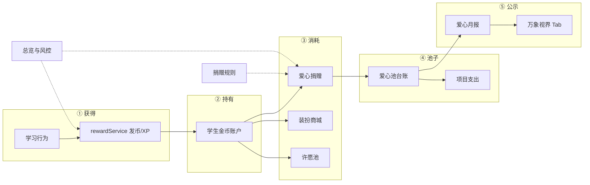
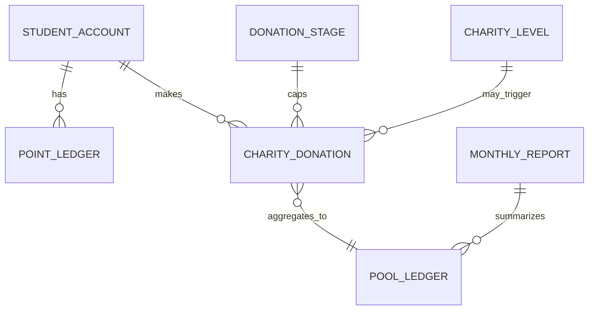

# 公益爱心大使 · 需求文档

| 项目 | 说明 |
|------|------|
| 文档版本 | **v2.0** |
| 状态 | 已梳理对齐原型代码（2026-06-15） |
| 模块范围 | 学生端公益爱心大使 + 万象视界公益月报 + 内部管理「公益金币运营」+ 金币经济衔接 |
| 关联文档 | [奖励结算体系.md](./奖励结算体系.md)（Learn-to-Earn 细则） · [爱心大使.md](./爱心大使.md)（风控运营手册） |

---

## 0. 文档地图

| 你若关注… | 阅读章节 |
|-----------|----------|
| 三端做什么、边界在哪 | **§1～§2** |
| 学生端现有能力与入口 | **§4** |
| 内部管理 5 菜单 + 筛选项 | **§5**（**§5.3 筛选速查表**） |
| XP / 金币 / 日 cap / 7 获币场景 | **[奖励结算体系.md](./奖励结算体系.md)** + **§3.2** |
| 折算比、称号、募款阶段 | **§3.3、§6** |
| 风控怎么判、怎么结案 | **§7** + [爱心大使.md](./爱心大使.md) |
| 多套 KPI 数字为何不同 | **§8（必读）** |
| 原型已做 / 未做 | **§9** |
| 代码文件在哪 | **§10** |

### 0.1 三文档分工

| 文档 | 职责 |
|------|------|
| **本文（v2.0）** | 公益爱心大使 **产品需求总纲**：三端分工、后台 IA、数据模型、规则分层、筛选项、实现状态 |
| **奖励结算体系.md** | **Learn-to-Earn** 细则：XP/金币分离、7 获币场景完成条件、流水 type 枚举、日 cap 80 |
| **爱心大使.md** | **风控运营手册**：待复核含义、处理抽屉三选一、RK 案例（不重复 IA） |

---

## 1. 产品概述

### 1.1 业务闭环

学生通过学习获得 **金币**（及 **经验 XP**），可自愿捐入 **爱心池**；平台配套资助并执行公益项目；学生获得 **称号/证书**；在 **万象视界 · 公益月报** 查看公示。运营在 **内部管理平台（公益金币运营）** 完成：获币规则、账户流水、捐赠审计、池子对账、月报发布、称号配置与风控。



### 1.2 三端分工

| 端 | 阵地 | 用户 / 运营 |
|----|------|-------------|
| **平板 · 我的** | 公益爱心大使（三 Tab） | 捐赠、记录、证书、阶段进度、池子摘要 |
| **平板 · 万象视界** | 公益月报 Tab | 读已发布月报 KPI、脱敏捐赠榜 |
| **内部管理** | 公益金币运营（5 菜单） | 金币全生命周期运营 + 风控 |
| **教师平台** | 班级激励 · 许愿池 | **仅**许愿池兑换核销；**不涉及**爱心捐赠 |

### 1.3 设计原则

| 原则 | 说明 |
|------|------|
| 自愿捐赠 | 不自动扣金币 |
| 透明公示 | 池子收支、项目落地对学生可见 |
| 正向激励 | 称号记录参与；月报 Tab 可有 **脱敏捐赠榜**（非竞技冲榜） |
| 隐私合规 | 反馈素材无学生正脸/真名（成果反馈 v1 暂停） |
| 后台驱动 | 月报、称号门槛、募款阶段由运营配置 |
| 可对账 | **学生账户流水 ≠ 爱心池台账**，字段不混用 |
| 折算恒定 | **100 金币 = ¥1.00** 为系统常量，单笔捐赠落库快照 |

### 1.4 核心术语

| 术语 | 定义 |
|------|------|
| **金币 Coins** | 可捐、可兑的稀缺货币；与 **XP** 分离（见奖励结算 §0） |
| **爱心捐赠** | 学生 **主动** 将金币捐入爱心池 |
| **折算爱心值（¥）** | 捐赠时按 **100:1** 折算；落库 `amount_yuan` 后 **不变** |
| **学生金币账户** | 某学生可用金币余额；流水有「变动后余额」 |
| **爱心池 / 池子台账** | 平台资金池层面的汇入与支出；**不是**某学生余额 |
| **募款阶段 Stage** | 有 `cap_coins` 上限；满额 **硬拦截** 捐赠 |
| **捐赠结果** | 业务是否捐成：成功 / 失败 / 已退款 |
| **风控审查** | 合规是否审完：正常 / 待复核 / 已确认 / 已退款 |
| **称号 / 证书** | 按 **累计折算爱心值（¥）** 解锁；学生 UI 同时展示金币与 ¥ |

---

## 2. 范围与版本策略

### 2.1 学生端策略（相对 v0.5）

| 类别 | 策略 |
|------|------|
| **核心 UI 冻结** | `GrowthProfile` 公益三 Tab、首页爱心入口、文案、Mock 数字、动效 — **不因后台改造而改动** |
| **已实施的演示扩展** | 万象视界公益月报 Tab、奖励获得动效、Learn-to-Earn 部分场景 — **视为现状真值** |
| **孤儿 / 死代码** | `CharityStationTab`（未挂接）、`DashboardImmersive` 内公益弹层（无入口）— **需求不描述为活跃功能** |

### 2.2 内部管理策略

| 项 | 结论 |
|----|------|
| 菜单数 | **5 个**（v0.9 目标态，已实现） |
| 能力范围 | 第 5 章 **全量保留**，仅重构 IA，不删减 |
| 原型阶段 | Mock 数据 + 部分操作仅 Toast；正式版要求见 **§9** |

### 2.3 明确不在 v1 的范围

| 项 | 说明 |
|----|------|
| 真实支付 / 第三方公益 API | Mock |
| 成果反馈全链路 | v1 **暂停**（后台与学生主导航均不展示） |
| 风控自动规则引擎 | P1；原型为 Mock 列表 + 人工抽屉 |
| 后台发布月报 → 学生端实时同步 | P1（附录 E-01） |
| 捐赠扣币写流水闭环 | **P0 缺口**（§9.1） |
| 教师端公益模块 | 不做 |

### 2.4 已拍板决策速查（2026-06-12 沟通）

| 主题 | 结论 |
|------|------|
| XP vs 金币 | XP 高频成长；金币低频里程碑，**不按题发** |
| 日总上限 | 默认 **80 金币/人/日** |
| 折算比 | **100:1 系统常量**，后台只读 |
| 快捷捐赠档 | 50 / 100 / 200 / 500 |
| 称号 v1 | 仅 **改门槛**；名称/证书/图标不可改；已解锁不收回 |
| 月报 v1 | 仅 **爱心月报**；发布 = 预览 → 二次确认 |
| 成果反馈 | v1 **不做** |
| 月报 Tab 捐赠榜 | **原型已做**（脱敏 Top5；全部/上月切换） |
| 7 获币场景 | 原型已接 3/7：满分、攻克、微课（其余见 §9） |

---

## 3. 金币经济（与公益的衔接）

> 细则全文见 [奖励结算体系.md](./奖励结算体系.md)。本章只保留与 **捐赠/运营** 相关的摘要。

### 3.1 XP vs 金币

| | XP | 金币 |
|---|-----|------|
| 用途 | 等级、联赛、今日目标 | 捐赠、商店、许愿池 |
| 频率 | 高 | 低（里程碑） |
| 日 cap | 无（独立目标） | **80** |

### 3.2 金币出口（消耗）

| 出口 | 后台菜单 | 流水 type |
|------|----------|-----------|
| 爱心捐赠 | 捐赠与爱心池 · 捐赠记录 | 爱心捐赠（扣减） |
| 装扮商城 | 商店兑换 · 装扮商城 | 商店兑换（扣减） |
| 许愿池 | 商店兑换 · 许愿池 | 商店兑换（扣减） |

### 3.3 规则三层模型

| 层级 | 管什么 | 配置位置 | 怎么改 |
|------|--------|----------|--------|
| **① 系统常量** | 100 金币 = ¥1 | 代码常量 | **不可改** |
| **② 运营可调** | 称号门槛、获币规则、日 cap、风控阈值 | 捐赠规则 / 金币入账 | 保存即生效（已获称号不收回） |
| **③ 阶段周期** | 募款上限、项目名、结项 | 捐赠与爱心池 | 调整上限 / 结项开下阶段 / 月报发布联动 |

**通胀控制** 优先动 **获币规则与日 cap**，**不动折算比**。

---

## 4. 平板学生端

> 代码主文件：`GrowthProfile.tsx`、`DiscoveryFullPage.tsx`、`App.tsx`（`openCharitySignal`）

### 4.1 入口与导航

| 入口 | 行为 |
|------|------|
| 首页顶栏「爱心」 | 切到「我的」并打开公益页 · 总览 |
| 我的「爱心公益」卡 | 打开公益页 · 总览 |
| 成就墙已解锁称号 | 打开公益页 · 证书 |
| 万象视界 Feed 卡片 | 切到公益月报 Tab |

打开公益全屏页时 **隐藏底部导航**（`onCharityOpenChange`）。

### 4.2 公益爱心大使 · 三 Tab

| Tab | 区块 | 说明 |
|-----|------|------|
| **总览** | 捐赠区 | 档位 50/100/200/500；阶段进度；一键点亮 |
| | 我的累计参与 | 当前称号、累计金币/¥、下一档进度 |
| | 称号横滑 | 五档门槛展示 |
| | 爱心池总览 | 全局四维 Mock（见 §8.1） |
| **记录** | 个人捐赠列表 | Mock 3 条 + 当次捐赠追加 |
| **证书** | 五档证书卡 | 未解锁灰显；捐赠成功动效后跳转 |

**页头状态：** `募集中` → 显示 **进行中**；否则 **已结束**（`isCharityCampaignRunning`）。

**捐赠拦截（已实现）：**

| 条件 | 行为 |
|------|------|
| 金币余额不足 | 按钮禁用 |
| 阶段剩余 < 本次数量 | 禁用 + 提示剩余可捐 |
| 阶段已满 / 已结项 | 禁用 + 文案 |

**捐赠闭环（未实现 · P0）：**

- 不扣减 `userStats.coins`
- 不写 `PointLedger` / `DonationRecord`
- 不触发风控 `riskStatus`

阶段进度 **会** 更新（`charityStage.ts` · `applyStageDonation`）。

### 4.3 称号默认五档

| 累计爱心值（¥） | 约需金币 | 称号 | 证书 |
|-----------------|----------|------|------|
| ¥1 | 100 | 爱心小星星 | 爱心参与证 |
| ¥10 | 1,000 | 爱心小天使 | 爱心守护证 |
| ¥50 | 5,000 | 爱心小大使 | 爱心大使证 |
| ¥100 | 10,000 | 爱心守护官 | 爱心守护官证 |
| ¥300 | 30,000 | 公益小领航员 | 公益领航证 |

后台「改门槛」原型仅改本地 state；**学生端仍读硬编码**（E-05）。

### 4.4 万象视界 · 公益月报 Tab

**入口：** `DiscoveryFullPage` → Tab「公益月报」

| 区块 | 内容 |
|------|------|
| Banner | 品牌头图 + 口号 |
| 月报主卡 | 周期、捐赠金币、参与人数、配捐、池余额 |
| 捐赠榜 | **全部 / 上月** 切换；脱敏姓名 Top5 |

**数据来源（原型）：** `mockCharityAdminData.getPublishedMonthlyReport()` — **未**读后台发布状态。

**不含：** 已执行项目详情、下阶段计划、成果反馈（v1 范围外）。

### 4.5 成果反馈（v1 暂停）

| 项 | 状态 |
|----|------|
| `CharityStationTab.tsx` | 组件含完整月报+反馈 UI，**项目内无 import** |
| 万象视界公益月报 Tab | **不含** 反馈 |
| 内部管理 | **无** 成果反馈 Tab |

恢复条件：公益项目方案敲定 → 后台编辑 + 学生端挂接。

### 4.6 Learn-to-Earn 接入摘要

| 行为 | 金币 | 原型 |
|------|------|------|
| 当日首次满分 | +10 | ✅ |
| 每日攻克提交 | +20 | ✅ |
| 微课首次达标 | +5 | ✅ |
| 完成今日任务 | +10～20 | 🔲 |
| 变式订正 | +10 | 🔲 |
| 成就 / 联赛 / 见面礼 | 50～300 | 🔲 |
| 爱心捐赠 | 扣减 | 🔲 UI 有，扣币未接 |

统一服务：`services/rewardService.ts` · 日 cap **80** · 动效 `RewardGainOverlay`。

---

## 5. 内部管理平台（公益金币运营）

### 5.1 信息架构

```
公益金币运营（侧栏标题：金币运营）
├── 总览与风控                    §5.4
├── 金币入账
│   ├── [Tab] 获取规则            §5.5.1
│   └── [Tab] 金币流水            §5.5.2
├── 商店/许愿池兑换
│   ├── [Tab] 许愿池兑换          §5.6.1
│   └── [Tab] 装扮商城            §5.6.2
├── 捐赠与爱心池
│   ├── [Tab] 捐赠记录            §5.7.1
│   ├── [Tab] 爱心池台账          §5.7.2
│   └── [Tab] 月报与公示          §5.7.3
└── 捐赠规则                      §5.8
```

**生命周期分区依据：** 入账（怎么来）→ 持有（流水）→ 消费（商店/捐赠）→ 池子（台账）→ 公示（月报）→ 规则/风控横切。

### 5.2 全局交互规范

| 规则 | 说明 |
|------|------|
| 筛选隔离 | 每列表独立 state key；切换 Tab/菜单不污染 |
| 「全部」 | 表示 **不加** 该维度条件 |
| 未实现维度 | **不得展示**空筛选项（如台账无「状态」） |
| 时间快捷项 | 统一 **`全部 / 今天 / 近7天 / 近30天`**（`LIST_TIME_RANGE_OPTIONS`） |
| 分页 | 默认 20 条/页 |
| 二次确认 | 发布月报、结项阶段、池子/账户人工调整、风控扣减 |
| 术语 | 后台统一用 **金币**，不用「积分」 |

### 5.3 筛选速查表（验收对照）

#### A. 总览与风控 · 异常列表

| 筛选项 | 可选值 | 说明 |
|--------|--------|------|
| 异常用户 / 原因 | 文本 | 模糊 |
| **状态** | 全部 / 待复核 / 已处理 / 误报 / 观察中 | 工单处理状态 |
| 类型 | — | 用列表上方 Chip：全部 / 刷金币 / 异常捐赠 |
| 时间 | — | 本页 compact 模式 **不展示** 时间下拉 |

Filter key：`总览与风控`

#### B. 金币入账 · 金币流水

| 筛选项 | 可选值 | 说明 |
|--------|--------|------|
| 流水编号 / 用户 | 文本 | 模糊 |
| **状态** | 全部 / 已入账 / 已捐赠 / 已调整 / 已到账 | 本条流水业务状态 |
| **类型** | 全部 / 任务奖励 / 学习激励 / 成就奖励 / 爱心捐赠 / 商店兑换 / 人工调整 | 对齐 [奖励结算 §7.3](./奖励结算体系.md) |
| **时间范围** | 全部 / 今天 / 近7天 / 近30天 | |

**类型不含「签到奖励」**（v1 未纳入发币场景）。

Filter key：`金币-流水`

#### C. 捐赠与爱心池 · 捐赠记录

| 筛选项 | 可选值 | 说明 |
|--------|--------|------|
| 学生 / 捐赠编号 | 文本 | 模糊 |
| **捐赠结果**（statusLabel） | 全部 / 成功 / 失败 / 已退款 | 业务是否捐成 |
| 类型 | — | **不展示**（无独立类型维） |
| **时间范围** | 全部 / 今天 / 近7天 / 近30天 | |

**工具栏快捷：**「异常捐赠」→ 等价筛选 **风控审查 = 待复核**（非捐赠结果维）。

Filter key：`捐池-捐赠`（与台账 Tab 隔离）

#### D. 捐赠与爱心池 · 爱心池台账

| 筛选项 | 可选值 | 说明 |
|--------|--------|------|
| 编号 / 说明 | 文本 | 模糊 |
| **状态** | — | **不展示**（池子汇总无账户侧状态） |
| **类型** | 全部 / **学生捐赠** / **项目支出** | v1 仅两类 |
| **时间范围** | 全部 / 今天 / 近7天 / 近30天 | |

| 类型 | 方向 | 说明 |
|------|------|------|
| 学生捐赠 | 汇入 +¥ | 金币折算的日/批汇总 |
| 项目支出 | 支出 −¥ | 公益项目拨付 |

Filter key：`捐池-台账`

#### E. 商店兑换 · 许愿池 / 装扮

许愿池：学校、班级、老师、学生、**状态**（全部/待核销/已核销/已拒绝）、时间。  
装扮商城：学校、班级、学生、兑换类型、装扮分类、适用对象、时间。

### 5.4 总览与风控

**KPI 四卡：** 池余额 ¥、累计捐赠金币、平台配套资助 ¥、今日捐赠金币。

**金币消耗看板：** 近 30 天爱心捐赠 / 许愿池 / 装扮占比（可点击跳转对应菜单）。

**风控 KPI：** 待复核、可疑用户、今日新增（点击联动列表筛选）。

**异常列表字段：** 用户、学校、风险分、异常类型、原因、状态、时间、操作。

**处理抽屉（三选一）：** 详见 §7 与 [爱心大使.md](./爱心大使.md)。

### 5.5 金币入账

#### 5.5.1 获取规则 Tab

| 区块 | 内容 |
|------|------|
| 全局规则 | 日上限 80、获取阈值 3次/分、捐赠次数 3、间隔 30min、统计窗 24h |
| 7 场景表 | `COIN_EARN_RULES`，与奖励结算 §4.1.1 一致 |
| 风控联动表 | 只读推导 |

#### 5.5.2 金币流水 Tab

**列表字段：** 流水编号、来源、用户、金币变动、类型、变动后金币余额、状态、时间。

**工具栏：** 新增金币调整、导出。

**原型缺口：** 新增调整仅 Toast，不追加行（E-04）。

### 5.6 商店/许愿池兑换

**许愿池：** 列表 + 详情 Drawer（只读）；核销在 **教师平台** `ClassIncentives`。

**装扮商城：** `REDEEM_ROWS` 兑换记录；筛选见 §5.3-E。

### 5.7 捐赠与爱心池

**页顶阶段卡（三 Tab 共用）：** 阶段名、周期、已募/上限、状态（募集中/已满/已结项）、调整上限、结项并开下阶段（二次确认）。

#### 5.7.1 捐赠记录

**列表字段（12 列）：** 捐赠编号、学生、学校、班级、捐赠金币、折算爱心值、捐赠后余额、触发称号、**捐赠结果**、**风控审查**、时间、操作。

**两列必读：**

| | 捐赠结果 | 风控审查 |
|--|----------|----------|
| 回答问题 | 捐没捐成 | 有没有风险、审没审 |
| 典型 | 成功 + 正常 | 成功 + 待复核 |

**详情 Drawer：** 快照字段、异常原因、退款/确认正常；可跳转关联风控单。

#### 5.7.2 爱心池台账

**周期汇总条：** 期初余额、学生捐赠汇入、项目支出、期末余额（周期：本月/上月/自定义）。

**列表字段：** 时间、类型、金额(¥)、说明、池子余额(¥)。

**操作：** 导出台账、查看捐赠明细（跳转 Tab）。

#### 5.7.3 月报与公示

**v1 仅爱心月报 Tab。**

**列表：** 标题、周期、状态（草稿/已发布/已下线）、发布时间、KPI 摘要。

**发布流：** 预览 → 确认发布 → 状态变已发布 + **联动结项当前阶段**（原型已实现）。

**编辑表单字段（目标）：** 基础信息 + 01 捐赠与参与 + 02 已执行项目 + 03 下阶段计划（原型部分只读）。

### 5.8 捐赠规则

| 配置项 | v1 |
|--------|-----|
| 折算 100:1 | 只读 StatCard |
| 快捷档 50/100/200/500 | 只读 |
| 称号五档 | **改门槛** Modal；名称/证书/图标只读 |
| 阶段进度 | 只读展示；上限在「捐赠与爱心池」配置 |

---

## 6. 数据模型与落库

### 6.1 三账本



| 账本 | 视角 | 典型实体 |
|------|------|----------|
| 学生账户 | 个人金币增减 | `PointLedger` |
| 捐赠单 | 每笔捐赠 + 快照 | `CharityDonation` |
| 爱心池 | 池子汇入/支出 | `PoolLedger` |

### 6.2 关键实体字段

**CharityDonation：** `id, userId, donated_coins, coins_per_yuan, amount_yuan, balanceAfter, stage_id, status, riskStatus, triggeredTitle, time`

**PointLedger：** `id, userId, change, type, balanceAfter, status, source, time`  
**type 枚举（v1）：** 任务奖励 | 学习激励 | 成就奖励 | 爱心捐赠 | 商店兑换 | 人工调整

**PoolLedger：** `id, type(学生捐赠|项目支出), amountYuan, poolBalanceAfter, note, time`

**DonationStage：** `id, name, period, capCoins, receivedCoins, status, ruleVersion, closedAt?`

**CharityMonthlyReport：** 标题、周期、四维 KPI、executedProjects[]、nextPhasePlans[]、status、publishTime

### 6.3 捐赠快照（落库必填）

| 字段 | 说明 |
|------|------|
| `donated_coins` | 当次金币 |
| `coins_per_yuan` | 固定 100 |
| `amount_yuan` | 当次折算 ¥ |
| `stage_id` | 所属募款阶段 |

**历史不回算：** 改门槛、改折算政策均不影响已捐记录的 `amount_yuan` 与已解锁称号。

### 6.4 Mock 数据文件

| 文件 | 用途 |
|------|------|
| `data/charityStage.ts` | 募款阶段运行时（学生+后台共享） |
| `data/mockCharityAdminData.ts` | 后台全量 Mock；Discovery 月报摘要；捐赠榜 |
| `data/mockCharityData.ts` | 富文本月报 + 反馈（`CharityStationTab` 专用，未挂接） |
| `services/rewardService.ts` | 金币/XP 入账（localStorage）；无捐赠 |

---

## 7. 风控

> 运营操作细则见 [爱心大使.md](./爱心大使.md)

### 7.1 一句话区分

| 类型 | 管什么 |
|------|--------|
| **刷金币** | 金币 **怎么进来**（入账异常） |
| **异常捐赠** | 金币 **怎么捐出去**（频次/节奏异常） |

与 **爱心池台账人工调整** 是不同对象（池子 vs 学生账户）。

### 7.2 待复核出现的两个地方

| 位置 | 含义 |
|------|------|
| 捐赠记录 · **风控审查** = 待复核 | 捐赠已成功，但模式可疑 |
| 总览 · 异常列表 · **状态** = 待复核 | 系统风控工单待处理 |

### 7.3 默认阈值（`COIN_GLOBAL_RULES`）

| 规则 | 默认值 | 服务 |
|------|--------|------|
| 日金币总上限 | 80 | 刷金币 |
| 异常获取冻结 | 3 次/分钟 | 刷金币 |
| 每日捐赠次数 | 3 次/24h | 异常捐赠 |
| 捐赠间隔 | 30 分钟 | 异常捐赠 |

**原型：** `RISK_ROWS` 静态 Mock；自动引擎 P1。

### 7.4 处理抽屉（三选一）

| 操作 | 适用 |
|------|------|
| 确认正常（误报） | 通用 |
| 限制获取 7 天 | 刷金币 |
| 扣减并结案 | 刷金币（扣 `abnormalCoins`） |
| 限制捐赠 7 天 | 异常捐赠 |
| 退款并结案 | 异常捐赠 |

---

## 8. KPI 与数值口径（易混 · 必读）

同一产品内存在 **四套不同语义** 的数字，不可直接横向对比。

| 口径 | 典型字段 | 示例值 | 语义 | 出现位置 |
|------|----------|--------|------|----------|
| **A. 我的·池总览** | 累计捐赠金币 | 128,800 | 产品叙事用累计 | `GrowthProfile` 四维 |
| | 参与人数 | 3,642 | 累计参与 | |
| | 企业/通晤纪配捐 | ¥12,880 | 累计配套 | |
| | 当前池结余 | ¥28,600 | **当前**池余额 | |
| **B. 已发布月报（周期）** | 上月捐赠金币 | 128,560 | **统计周期内** | `MONTHLY_REPORTS` / Discovery |
| | 参与人数 | 3,842 | 周期内 | |
| | 通晤纪配捐 | ¥28,600 | **该月**配套 | |
| | 累计池余额 | ¥156,800 | 月报字段名易混：实为 **累计** | |
| **C. 募款阶段** | 已募 / 上限 | 128,800 / 200,000 | **当前阶段**进度 | `charityStage.ts` |
| **D. 总览 KPI** | 今日捐赠 | 8,600 币 | **当日** | 后台总览 |

**文档策略：**

- 学生端已展示数字 = **产品叙事真值**，后台对齐时不反向改学生端。
- 月报、总览、阶段进度 **允许口径不同**，须在 UI 副文案标明「累计 / 本月 / 当前阶段」。
- 正式版应统一 **单一数据源 + 字段命名**（P1）。

---

## 9. 实现状态与分期

### 9.1 P0 · 捐赠闭环（未打通）

| 步骤 | 状态 |
|------|------|
| 学生点击捐赠 → 扣减金币 | ❌ |
| 写 PointLedger（爱心捐赠） | ❌ |
| 写 DonationRecord + 快照 | ❌ |
| 更新 stage.receivedCoins | ✅ |
| 触发称号判定 | ❌（仅 UI Mock） |
| 可选写 riskStatus | ❌ |

### 9.2 P0 · 后台已演示

| 能力 | 状态 |
|------|------|
| 5 菜单 + Tab 导航 | ✅ |
| 筛选隔离 + 分页 | ✅ |
| 风控列表 + 抽屉 | ✅ |
| 月报预览发布 + 结项阶段 | ✅ |
| 称号改门槛（本地） | ✅ |
| 阶段调整上限 / 结项确认 | ✅ |

### 9.3 P1 · 原型缺口

| # | 缺口 | 说明 |
|---|------|------|
| E-01 | 后台发布 → 学生端月报 | 统一读发布表 |
| E-02 | 7 获币场景 4 个未接 | 任务/变式/成就/联赛 |
| E-03 | 每日攻克题量 | 改为 `min(待攻克,5)` |
| E-04 | 金币调整不写流水 | 保存应 append 行 |
| E-05 | 称号门槛不同步学生端 | 读配置表 |
| E-06 | 风控自动触发 | 接 §7.3 规则 |
| E-07 | 捐赠次数/间隔硬拦截 | 学生端或 API |

### 9.4 P2 · 暂缓

成果反馈全链路、审批流、同校聚集捐规则引擎、称号新增档位、池子人工调整入列表类型。

---

## 10. 代码索引

| 路径 | 说明 |
|------|------|
| `components/Growth/GrowthProfile.tsx` | 学生 · 公益爱心大使 |
| `components/Dashboard/DiscoveryFullPage.tsx` | 万象视界 · 公益月报 Tab |
| `components/Dashboard/DashboardImmersive.tsx` | 首页爱心入口 |
| `components/Dashboard/CharityStationTab.tsx` | 孤儿组件（未挂接） |
| `components/InternalAdmin/InternalAdminApp.tsx` | 内部管理主界面 |
| `components/Teacher/Incentives/ClassIncentives.tsx` | 许愿池核销（非公益） |
| `data/charityStage.ts` | 募款阶段状态机 |
| `data/mockCharityAdminData.ts` | 后台 Mock + 流水/风控/称号常量 |
| `data/mockCharityData.ts` | 富月报 Mock |
| `services/rewardService.ts` | Learn-to-Earn 入账 |
| `components/Rewards/RewardGainOverlay.tsx` | 获币/XP 动效 |

---

## 附录 A · 学生端线框

```
我的 · 公益爱心大使
[总览][记录][证书]
  捐赠区 → 档位 + 阶段进度 + 一键点亮
  我的累计参与 → 称号/进度
  称号横滑
  爱心池总览（全局四维）

万象视界 · 公益月报 Tab
  Banner → 月报 KPI 卡 → 捐赠榜（全部/上月）
```

## 附录 B · 后台线框

见 §5.1。

## 附录 C · 历史问题清单（v0.5 前原型）

> 大部分已在 `InternalAdminApp` 重做中修复。保留供审计。

| 类别 | 代表问题 |
|------|----------|
| IA | 缺捐赠记录/月报；风控无菜单 |
| 交互 | 筛选「全部」误筛空；state 跨页污染 |
| 语义 | 池余额与用户余额混用 |

## 附录 D · v0.4 MVP 废止

v0.4「删学生端、后台只做 2 页」等 **全部废止**。见 v0.5 结论：学生端冻结 + 后台全量。

---

## 变更记录

| 版本 | 日期 | 摘要 |
|------|------|------|
| v0.1～v1.1 | 2026-06-12 | 初版至沟通纪要（见 Git 历史） |
| v1.2 | 2026-06-15 | 取消版本发布；三层规则；捐赠规则菜单 |
| v1.3 | 2026-06-15 | 台账/流水筛选项细化 |
| **v2.0** | **2026-06-15** | **全文重构**：统一 IA/术语/筛选项速查/KPI 口径/实现状态；消解 4vs5 菜单、捐赠榜、成果反馈等文档矛盾；对齐当前代码 |

---

**维护说明：** 后续需求变更请同时更新 **§5.3 筛选速查表**、**§8 KPI 口径** 与对应 Mock 常量（`mockCharityAdminData.ts`）。Learn-to-Earn 细则变更以 [奖励结算体系.md](./奖励结算体系.md) 为准，本文 §3 仅保留摘要。
