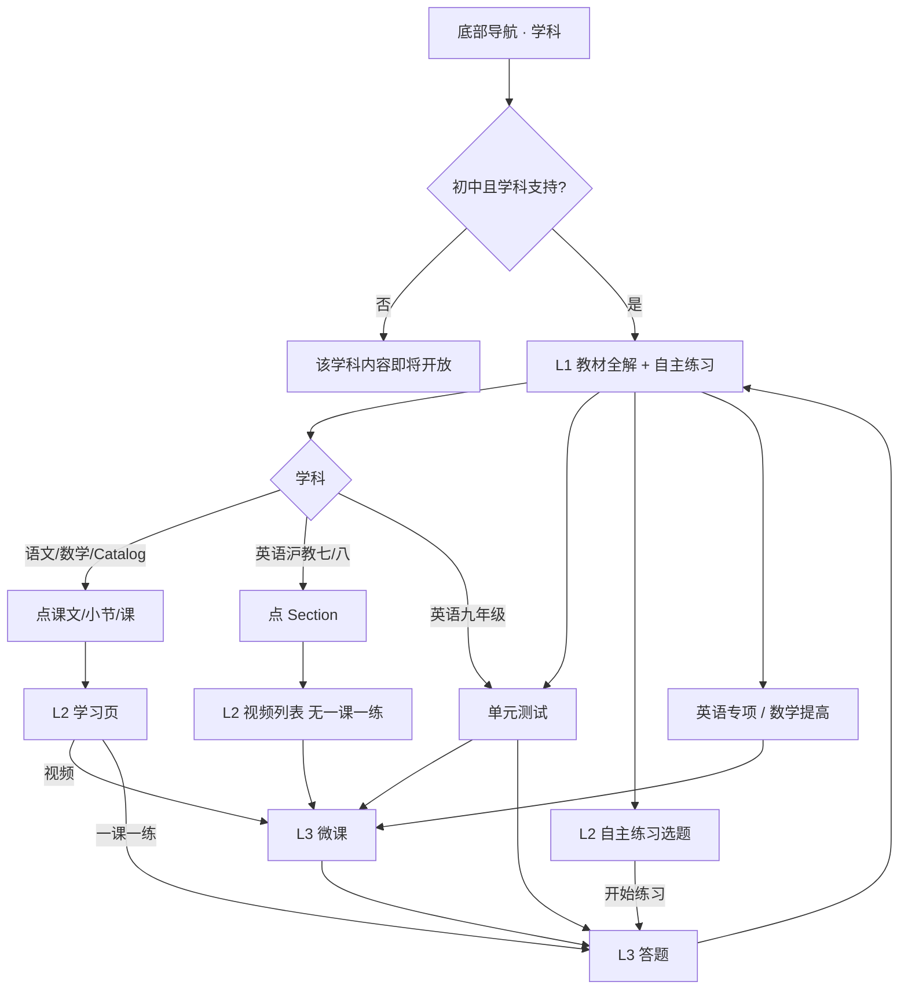

# 学科 Tab · 课本同步学 · 交互需求文档

> **已并入** [课本同步学/05-同步课本与自主练习-阅读版.md](./课本同步学/05-同步课本与自主练习-阅读版.md)。本文不再维护。

| 项目 | 说明 |
|------|------|
| 文档版本 | v2.0 |
| 状态 | 已实现（平板原型） |
| 更新日期 | 2026-08-14 |
| 适用端 | 学生端 · 平板 |
| 入口 | 底部导航「学科」 |
| 关联代码 | `App.tsx`、`SubjectMap.tsx`、`SubjectSwipeSwitcher.tsx`、`ModeSwitchRail.tsx`、`SyncSectionPage.tsx`、`SyncSelfTestPage.tsx`、`data/jyeooSelfTest.ts` |
| 本期范围 | 初中学段课本同步学：目录浏览、微课、一课一练、单元测试、自主测、英语专项、数学提高 |
| 不在本期 | 小学学段精编内容、知识图谱画布、真实视频 CDN / 进度持久化、后端组卷 |

---

## 1. 背景与目标

### 1.1 学生要完成的事

按课本进度自学：先定位「年级 → 学科 → 版本 → 册次 → 章/单元 → 课时」，再走一条完整学习链：

```
看微课（本节） → 一课一练（本节） → 单元测试（本章/本 Unit）
```

整册自选练习走首页「自主练习」，不占学科 L1。三种「测/练」粒度必须分开。

### 1.2 三种测练口径（已定）

| 能力 | 范围 | 选题方式 | 入口位置 | 与当前小节关系 |
|------|------|----------|----------|----------------|
| **一课一练** | 当前课时 / 课文 / 课题（英语不做） | 固定 5 题中等同步练；入口三态：未练习 / 练习中 / 已练完；已练完再点换新卷 | L2 学习路径末条 | **强绑定**当前课时 |
| **单元测试** | 当前章 / 单元 / Unit | 当场组卷（先选题量/难度），不解锁 | 教材全解卡片底部 | **跟筛选器父级走**，不跟当前子级走 |
| **自主练习** | **整册书** | 学生自选目录叶子组卷 | 教材全解右侧竖卡；首页也可进 | **与当前小节无关** |

不做解锁：单元测试、自主练习随时可进。

### 1.3 设计原则

| 原则 | 说明 |
|------|------|
| 教材优先 | 内容组织对齐课本章节，不按抽象知识树当主目录 |
| 一屏可达 | L1 展示当前章/单元下的子级列表，点进去才看视频 |
| 学科差异内化 | 英语沪教七/八 Unit 下列 Section；九年级技能格；语文/英语自主练习无知识点层 |
| 状态可预期 | 切年级 / 学科 / 版本 / 册次 / 学制时重置选中态与二级页 |
| 非阻断空态 | 无数据展示「即将开放」，不弹错误 |

---

## 2. 适用范围

### 2.1 学段

| 学制 | 初中年级 |
|------|----------|
| 六三制 | 七、八、九年级 |
| 五四制 | 六、七、八、九年级 |

判定：`isJuniorGrade(grade, schoolSystem)`。非初中进入学科 Tab 时，展示「该学科内容即将开放」。

### 2.2 学科 Tab 列表（随年级变化）

**六三制**

| 年级 | 学科 |
|------|------|
| 七年级 | 语文、数学、英语、道德与法治、历史、生物、地理、科学 |
| 八年级 | 语文、数学、英语、物理、道德与法治、历史、生物、地理、科学 |
| 九年级 | 语文、数学、英语、物理、化学、道德与法治、历史、科学 |

**五四制**

| 年级 | 学科 |
|------|------|
| 六年级 / 七年级 | 语文、数学、英语、道德与法治、历史、生物、地理、科学 |
| 八年级 | 语数英 + 物理化学 + 道法历史生物地理科学 |
| 九年级 | 语数英 + 物理化学 + 道法历史（无生物 / 地理 / 科学） |

配置：`data/subjectCatalog.ts` 的 `getGradeSubjects(grade, schoolSystem)`。学科顶栏只展示、只切科，不改年级 / 学制。

### 2.3 学科类型（影响 L1 / L2 / 自主测）

| 类型 | 学科 | L1 主列表 | L2 | 自主测叶子 |
|------|------|-----------|----|------------|
| 语文 | 语文 | 课文列表 | 视频学习页 | **课文 / 篇目**（无知识点） |
| 数学 | 数学 | 小节列表 | 阶段学习路径 | **知识点** |
| 英语 | 英语 | Unit → Section 列表（沪教七/八）；九年级技能格 | Section 视频列表（无一课一练）；九年级点格直进 | **课时块**（无知识点） |
| Catalog | 道法、历史、生物、地理、物理、化学、科学 | 课 / 节 / 课题列表 | 阶段学习路径 | **知识点**（菁优有则展示；无则停在节） |

---

## 3. 页面结构

### 3.1 L1 整体布局（课本同步学默认态）

```
┌──────────────────────────────────────────────────────────────────┐
│ [七年级 · 上册 ▼]  语文  数学  英语  道法  历史  …                 │  顶栏
├────┬─────────────────────────────────────────────────────────────┤
│课  │ ┌────────┐ ┌ 教材全解 ──────────────────────────────────┐ ┌自主练习┐ │
│本  │ │名师广告│ │ 版本▾   [章/单元 · 可选子级 ▾]              │ │进入练习│ │
│同  │ │(通栏高)│ │ 子级列表（课文/小节/技能格/课）              │ └───────┘ │
│步  │ └────────┘ │ 单元测试                                    │           │
│学  │            └─────────────────────────────────────────────┘           │
│    │ ┌ 专项提升（英语 7–9）或 同步提高（数学）─────────────────┐         │
├────┴─────────────────────────────────────────────────────────────┤
│  首页  |  学科  |  错题  |  伙伴  |  我的                               │
└──────────────────────────────────────────────────────────────────┘
```

- 左侧模式栏约 56px（内容区 `pl-14`）。
- 内容区顶留白约 72px（顶栏），底留白约 96px（BottomNav）。
- 教材全解与自主练习**等高并排**；专项条在二者下方、与整行同宽。

### 3.2 模式切换

| 模式 ID | 展示名 | 说明 |
|---------|--------|------|
| `pro` | 课本同步学 | **默认**；本文档范围 |
| `sync` | 个性化学习 | 远征向导 + 关卡地图，**本期不展开** |

侧栏隐藏（同时隐藏 BottomNav）：任一同步学 L2 打开（课时详情、专项页、自主测页等）。

### 3.3 层级

| 层级 | 定义 | 典型界面 |
|------|------|----------|
| L0 | App 壳 | BottomNav、TopStatusBar |
| L1 | 课本同步学首页 | 教材全解 + 自主测 + 专项条 |
| L2 | 全屏滑入（z≈550） | 课时学习路径、专项页、自主测选题 |
| L3 | 学习流 | 视频 / 答题 |
| Overlay | 弹层（z≈990） | 章/单元切换。年级 / 册次 / 学制 / 版本改入口在「我的 · 我的课本」 |

---

## 4. 顶栏交互

组件：`SubjectSwipeSwitcher`

### 4.1 年级胶囊

展示：`{年级} · {册次}`（初中）或仅 `{年级}`（小学）。第一次打开用档案里的年级、册次。

**只读，不能点开。** 没有下拉箭头。年级 / 册次 / 学制改入口：底栏「我的」→「我的课本」。

### 4.2 学科 Tab

| 操作 | 行为 |
|------|------|
| 点击学科名 | 立即切换 `activeSubject` |
| 左右滑动（水平位移 ≥ 40px 且水平主导） | 切相邻学科 |
| 当前学科 | 15px 加粗 + 靛色波浪下划线 |
| 非当前 | 13px 灰色 |

不展示「左右滑动切换学科」等引导文案。

### 4.3 切换后重置

年级 / 学科 / 册次 / 版本 / 学制任一变化时：

- 章/单元索引归零
- 关闭所有 L2（课时、专项、自主测）
- 清空 catalog 选中课时与小节筛选

---

## 5. 教材全解（L1 核心）

### 5.1 标题行

从左到右：

| 顺序 | 控件 | 文案 / 内容 | 行为 |
|------|------|-------------|------|
| 1 | 图标 | BookOpen | — |
| 2 | 标题 | **教材全解** | — |
| 3 | 版本 | `{syncTextbookVersion}` 只读 | 不切换。改版本去「我的 · 我的课本」 |
| 4 | 章节胶囊 | `{父级}`，有子级筛选时追加 ` · {子级}` | 打开章/单元切换弹层 |

标题行不展示任务名。语文活动·探究的任务名在课文列表里当分组小标题，不可点；catalog / 数学 / 英语不展示。

### 5.2 教材版本

学科页不提供版本弹层。改版本、册次、年级、学制都在「我的 · 我的课本」。

- 标题行只展示当前版本名。
- 当前册次在新版本不可用时，内容侧自动落到该版本第一个可用册次，不改学生锁定的册次偏好。

**默认版本偏好**

| 学科 | 六三制 | 五四制 |
|------|--------|--------|
| 语文 | 人教版（数据侧常映射统编版） | 人教版 |
| 数学 | 北师大版 | 人教五四制版 |
| 英语 | 沪教版 | 人教五四制版 |
| 物理 | 人教版 | 鲁科五四制版 |
| 化学 | 人教版 | 人教五四制版 |
| 生物 | 人教版 | 鲁科五四制版 |
| 地理 | 人教版 | 鲁教五四制版 |
| 科学 | 浙教版 | 沪教版 |
| 其他 | 人教版 | 人教版 |

> UI 展示「人教版」时，语文菁优目录按「统编版」匹配。

### 5.3 章 / 单元切换弹层

**父级 / 子级叫法**

| 学科 | 父级 | 子级 |
|------|------|------|
| 语文 | 单元 | 课文 |
| 数学 | 章 | 小节 |
| 英语 | 单元 | **无**（Unit 即叶子） |
| 化学 | 单元 | 课题 |
| 历史 / 道德与法治 | 单元 | 课 |
| 物理 / 地理 / 科学 | 章 | 节 |
| 生物等 `unit-chapters` | 单元 | 章 |

**交互规则（已定）**

1. 打开弹层时，定位到当前父级；有子级的学科可展开当前父级。
2. **点父级**：选中该章/单元，并展开/收起子级列表；**不自动选第一个子级**；**不关弹层**（英语无子级时点父级即选中并关闭）。
3. **点子级**（课文 / 小节 / 课 / 课题）：
   - 语文 / 数学 / catalog：选中后**直接进入 L2 学习页**，并关弹层。
   - 主列表同时切到该父级下的全部子级（不是只留当前一条）。
4. 主列表始终展示**当前父级下全部子级**；筛选器子级名仅作定位高亮，不折叠列表。

### 5.4 L1 列表 · 按学科

#### A. 语文 / 数学 / Catalog

组件：`SyncChildEntryList`

- 每行：图标 + 标题 + 右箭头。
- 点整行 → 打开 L2（语文/数学：`SyncSectionPage`；catalog 同样走 `SyncSectionPage`，不再单独用 catalog 封面页）。
- 空列表：缺省图 +「该章节下暂无内容」（章切换末尾「空态演示章节」可稳定复现）。

标题格式：已有序号或 `Unit n` 则原样；否则补 `{index+1} `。

#### B. 英语

七 / 八年级沪教（Unit 下有 Section）：

- 组件：`SyncChildEntryList`
- 当前 Unit 下列 Section 行（如 Section 1 Experiencing and understanding language）。
- 点整行 → 打开 L2 `SyncSectionPage`，列出该 Section 视频；点条进 L3。
- **不加一课一练**。

九年级或无 Section 的册次：

- 组件：`EnglishSkillGrid`
- 当前 Unit 下 **5 列**技能格；点格 **直接进 L3 视频**。

### 5.5 单元测试（教材全解底栏）

组件：`SyncUnitTestFooter`

- 文案仅 **「单元测试」**，不展示「本章 / 第 n 章」等范围副标题。
- 范围仍按当前**父级**出卷：
  - 语文：当前单元
  - 数学 / catalog：当前章或单元
  - 英语：当前 Unit
- 点击 → 先出题量/难度确认弹窗（与自主练习同一套），再当场组卷进 L3，`aiReasoning = 同步单元测试`。
- 题量区间 5–20，默认难度中等；推荐题量公式见《04-课本同步与自主练习-PRD》C4。
- 题不够时让学生选减题量或降难度，不能直接组卷失败。
- 展示条件：初中学段（`isSyncAssessmentPilot` = 六～九年级）。

### 5.6 名师精讲广告

左侧通栏卡 `SyncTeacherAdCard`，铺满可用高度。点击进 L3 微课（约 10 分钟，`同步课堂微课`）。

---

## 6. 自主练习（原学科自主测）

### 6.1 入口

- 学科 Tab L1：教材全解右侧竖卡，文案「自主练习 / 进入练习」。
- 首页「自主练习」也可进同一套选题页（`SelfPracticePage`）。
- 首页「同步课本」点科目后的二级页 **不放** 自主练习入口，只保留教材全解 / 单元测试 / 专项。
- 点击学科 Tab 或首页自主练习 → L2 `SyncSelfTestPage`；底栏「开始练习」先出题量/难度确认弹窗，再进答题。

### 6.2 数据来源

菁优网教材目录：`同步章节映射知识点数据-菁优网/jyeoo_metadata/`  
构建产物：`data/jyeooJuniorBooks.json`（脚本 `scripts/build-jyeoo-junior-books.mjs`）。

匹配规则：当前学科 + 年级 + 册次 + 版本（含统编/人教、五四制别名）；上/下册无书时回退「全一册」。无菁优书时，用同步学目录生成降级树。

### 6.3 目录结构（按真实数据）

**语文（章节下没有知识点）**

```
第一单元
 ├─ 1 春/朱自清          ← 可选叶子（课文）
 ├─ 4 古代诗歌四首
 │    ├─ 观沧海/曹操     ← 可选叶子（篇目）
 │    └─ …
 └─ 写作 热爱生活，热爱写作
```

**英语（章节下没有知识点）**

```
Units
 └─ Unit 1 My name’s Gina.
      ├─ Section A
      │    ├─ 1a-1c      ← 可选叶子（课时块）
      │    └─ …
      └─ Section B
```

**数学 / 物理等（节下挂知识点）**

```
第1章 有理数
 └─ 1.1 正数和负数
      └─ [正数和负数] [ … ]   ← 标签勾选
```

父级有更细子目录时，不以父级上的重复 Points 冒充一层。

### 6.4 L2 选题页交互

| 区域 | 行为 |
|------|------|
| 标题 | **自主测 · 整册** |
| 副标题 | `{版本} · {年级}{册次} · {学科}` + 语文/英语「按目录勾选课文/课时组卷」；其余「按章节勾选知识点组卷」 |
| 树 | 任意层可勾选；勾父级 = 全选叶子；半选展示 indeterminate |
| 知识点 | 节下全部为知识点时，用**胶囊标签**勾选，不再继续缩进树 |
| 课文/课时 | 普通复选行 |
| 底栏 | 未选：「请选择你要练习的课文 / 课时 / 章节或知识点」；已选：「已选 N · x 章 · 推荐 y 题」+ 清空 |
| 开始自测 / 开始练习 | 未选禁用；先弹出确认设置，再进 L3 |

### 6.5 开始前确认（题量 / 难度）

点「开始练习」或「开始自测」后，先出确认弹窗，不直接进答题。

| 项 | 规则 |
|----|------|
| 形态 | 居中确认弹窗（不是整页） |
| 题量 | 5–20，步进 ±1，并提供 5 / 10 / 15 / 20 快捷档 |
| 默认题量 | 按已选叶子数 + 覆盖章数给出推荐，学生可改 |
| 难度 | **较易 / 容易 / 中等 / 较难 / 困难**，默认中等 |
| 推荐算法 | 本期占位：每叶子约 2 题，跨章 +2，夹在 5–20；细规则稍后写 |
| 确认 | 按所选题量、难度组卷后进 L3 |

组卷只统计**叶子**。语文叶子 = 课文/篇目；英语叶子 = 课时块；其余叶子 = 知识点。

---

## 7. L2 课时学习页

组件：`SyncSectionPage`，全屏自右滑入。

### 7.1 进入

| 学科 | 触发 | 页头标题 |
|------|------|----------|
| 语文 / 数学 | 点 L1 课文/小节行，或在切换器点子级 | 课文 / 小节名 |
| Catalog | 点 L1 课/节/课题行 | 课时名 |
| 英语 | 点 L1 Section 行 | Section 名 |

左上角返回 → 回 L1，BottomNav / 模式栏恢复。

### 7.2 内容形态（当前原型）

| 学科 | `layout` | 实际 UI |
|------|----------|---------|
| 语文 | `path` | 分组「学习路径」大卡（视频 tag 横排/网格） |
| 数学 / Catalog | `grid`（默认） | **阶段列表** `LearningPathView` |
| 英语 | `grid` | 该 Section 视频列表，**无一课一练**；九年级无 Section 时不走本页 |

**阶段列表规则（数学 / Catalog）**

按视频 tag 归入三段，同段合并展示：

| 阶段 | 展示名 | 归入规则 |
|------|--------|----------|
| learn | **名师带你学** | 默认（精讲、导学、解读等） |
| practice | **同步巩固练** | tag 含 经典题型 / 题型 / 易错 / 练习 / 一课一练 |
| extend | **拓展提升** | tag 含 拓展 / 新课标 |

- 无法匹配的视频并入「名师带你学」，不单开「补充」。
- 路径末条固定 **一课一练**（琥珀色），点击进 L3 答题，`aiReasoning = 同步课时练习`。固定 5 题、中等、同步练习。入口三态：**未练习**（未作答过任何一题）/ **练习中**（作答过但中途退出未提交，不保存作答）/ **已练完**（提交完成；再点仍显示已练完，换新卷）。
- L1 **不再**钉一课一练。
- **英语不加一课一练**（七 / 八年级沪教 Section 学习页也不加）。

> 待对齐：语文 L2 仍是旧「学习路径」大卡，尚未与数学/Catalog 的三阶段列表统一。

---

## 8. 专项入口（L1 底部）

### 8.1 英语 · 专项提升

- 条件：英语 + 七 / 八 / 九年级。
- 布局：左侧竖排图标 +「专项提升」；右侧三入口横排：**同步词汇 / 外教口语 / 语法精讲**。
- 各自打开对应 L2（`SyncVocabPage` / `SyncSpeakingPage` / `SyncGrammarPage`），再进 L3。

### 8.2 数学 · 同步提高

- 条件：当前学科为数学（各年级入口都在；精编数据目前主要七上）。
- 整行按钮：标题「同步提高」、副文案「章节拓展精练」、右侧「进入学习」。
- 打开 `SyncImprovePage`。

其他学科：无底部专项条。

---

## 9. 学习播放闭环（L3）

从学科页发起时统一构造 Task：

| 入口 | `aiReasoning` | 默认时长 |
|------|----------------|----------|
| 技能格 / 路径视频 / 名师广告 | 同步课堂微课 | 8 / 10 分钟 |
| 一课一练 | 同步课时练习 | 10 分钟 |
| 单元测试 | 同步单元测试 | 约 20–40 分钟（随小节数） |
| 自主测 | 同步自主测 | max(题量×1.5, 10) 分钟 |
| 单词讲解 | 同步课堂微课 | 5 分钟 |

流程：

```
微课：VideoLesson → QuizPage → 回学科 Tab
练习/测验：直接 QuizPage（forceQuizOnly）
```

微课观看达标线：45 秒。

---

## 10. 状态与空态

### 10.1 关键状态

| 状态 | 含义 |
|------|------|
| `userGrade` / `schoolSystem` / `textbookTerm` | 年级、学制、册次 |
| `activeSubject` | 当前学科 |
| `syncTextbookVersion` | 按学科独立记版本 |
| `selectedChineseLesson` | 语数英当前父级索引 |
| `syncSectionFilter` / `catalogLessonFilterId` | 切换器子级定位（不折叠主列表） |
| `selectedSyncTopic` / `selectedCatalogLesson` | L2 课时页 |
| `isSelfPracticeOpen` | 自主练习 L2 选题（学科竖卡 / 首页共用） |
| `isVocab/Speaking/Grammar/ImprovePageOpen` | 专项 L2 |

### 10.2 空态

| 场景 | 展示 |
|------|------|
| 非初中或未支持学科 | 居中「该学科内容即将开放」 |
| 当前章/单元无小节 | 教材全解列表缺省图 +「该章节下暂无内容」 |
| 自主测无菁优且无降级目录 | 「该教材暂无章节目录」 |
| 课时 L2 无步骤 | 「该小节内容即将开放」 |

---

## 11. 主路径流程图



---

## 12. 验收标准

### 12.1 顶栏

- [ ] 六三制七年级 8 科；八年级含物理共 9 科；九年级含物理化学、无生物地理
- [ ] 五四制六年级 8 科；八年级含物理+化学
- [ ] 胶囊展示「年级 · 册次」；册次在年级弹层内切换
- [ ] 切年级后学科列表更新；不可用学科回语文
- [ ] 滑动/点击切学科后，不残留上一科 L2

### 12.2 教材全解

- [ ] 点父级：主列表换成该章/单元**全部**子级，不自动进 L2
- [ ] 点子级：进 L2；英语沪教七/八点 Section 进 L2 视频列表（无一课一练）；九年级点技能格直进 L3
- [ ] 英语九年级技能格两行完整可见，超三行才滚动
- [ ] 单元测试钉在教材全解底部，测的是当前父级整章/整 Unit
- [ ] 自主练习在右侧，进整册选题；点开始练习先选题量/难度

### 12.3 自主练习

- [ ] 语文：单元 → 课文/篇目，无知识点标签；底栏「篇课文」
- [ ] 英语：Unit → Section → 1a-1c，无知识点标签；底栏「个课时」
- [ ] 数学等：章 → 节 → 知识点胶囊；底栏「个知识点」
- [ ] 未选不能开始；勾父级等于全选叶子

### 12.4 学习链

- [ ] 一课一练只出现在 L2 路径末（数学/Catalog）；L1 无该入口
- [ ] 一课一练入口三态：未练习 / 练习中 / 已练完
- [ ] 微课走视频+测验；练习/单元测/自主测直接答题
- [ ] L2 打开时底栏与左侧模式栏隐藏，返回后恢复

### 12.5 专项

- [ ] 英语 7–9 年级显示专项提升三入口
- [ ] 数学显示同步提高
- [ ] 其他学科不显示该底栏

---

## 13. 待确认 / 后续

| # | 问题 | 现状 |
|---|------|------|
| 1 | 语文 L2 是否与数学统一为三阶段列表 | 语文仍是「学习路径」大卡 |
| 2 | 数学提高是否仅七上有内容 | 入口全年级都在，精编数据偏七上 |
| 3 | 自主测 / 自主练习题量推荐 | 弹窗内可选 5–20；推荐算法占位（叶子×2 + 跨章加成），细规则待写 |
| 4 | 视频完成态 / 课时进度 | 未持久化 |
| 5 | 小学学科 Tab | 不走初中同步学主流程 |
| 6 | 个性化学习与同步学的长期关系 | 左侧栏仍保留入口，需求不展开 |

---

## 14. 关键源码

| 路径 | 职责 |
|------|------|
| `components/Layout/SubjectSwipeSwitcher.tsx` | 只读年级胶囊 + 学科 Tab |
| `components/Growth/MyTextbooksPage.tsx` | 我的课本：年级 / 册次 / 学制 / 分科版本 |
| `components/Layout/ModeSwitchRail.tsx` | 课本同步学 / 个性化学习 |
| `components/SubjectMap/SubjectMap.tsx` | L1 布局与状态机 |
| `components/SubjectMap/SyncSectionPage.tsx` | L2 课时学习路径 |
| `components/SubjectMap/SyncSelfTestPage.tsx` | L2 自主测 / 自主练习选题 |
| `components/SubjectMap/PracticeSetupDialog.tsx` | 开始前题量 / 难度确认弹窗 |
| `data/jyeooSelfTest.ts` / `jyeooJuniorBooks.json` | 自主测目录 |
| `data/juniorSyncAssessment.ts` | 单元测信息、叶子统计 |
| `scripts/build-jyeoo-junior-books.mjs` | 从菁优元数据构建整册 JSON |
| `utils/kgMicroLesson.ts` | 微课 / 练习 / 单元测 / 自主测 scope |

---

## 15. 维护

学科 Tab 课本同步学的布局、测练口径、自主测目录规则变更时，同步更新本文档。个性化学习仍不写入本文。
