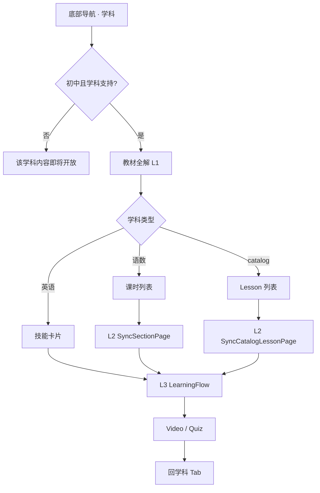

# 00 · 总览与页面层级

> **已过时提示（2026-08-14）**：L1 布局、测练入口、自主测目录请以 [`../学科Tab-初中学段-交互需求文档.md`](../学科Tab-初中学段-交互需求文档.md) **v2.0** 为准。本文仅保留层级概念，避免和现行原型打架。

> 本期只写 **课本同步学**。个性化学习不在本文档范围内。

| 项目 | 说明 |
|------|------|
| 文档版本 | v1.2（归档） |
| 状态 | 部分过时 |
| 更新日期 | 2026-08-14 |
| 代码模式 | `mapMode === 'pro'`，UI 文案「课本同步学」 |

---

## 1. 背景与目标

### 1.1 背景

「学科」Tab 默认进入 **课本同步学**：学生按教材版本 / 册次 / 章单元定位微课与同步练习。

### 1.2 建设目标

1. 学生可按「年级 → 学科 → 教材版本/册次 → 章/单元 → 课时/视频」逐级定位同步内容。
2. 主科与小四门/理科采用统一信息架构，按学科差异呈现列表或卡片。
3. 点击视频 / 课时后进入标准学习流（视频 → 测验），与今日任务、奖励体系打通。

### 1.3 设计原则

| 原则 | 说明 |
|------|------|
| 教材优先 | 内容组织对齐课本章节目录 |
| 一屏可达 | L1 展示当前章/单元下课时列表，减少无效层级 |
| 学科差异内化 | 英语 Unit 直出技能卡；catalog 学科走统一目录；语数走二级详情 |
| 状态可预期 | 切换年级/学科/版本/册次时重置选中态 |
| 非阻断空态 | 无数据展示「即将开放」，不弹错误 |

---

## 2. 入口与壳层

### 2.1 进入方式

| 控件 | 展示文案 | 字段 / 行为 |
|------|----------|-------------|
| BottomNav 学科 Tab | **学科** | `activeTab === 'subject'` → 渲染 `SubjectMap` |
| TopStatusBar | （居中挂载学科切换器） | 仅 subject Tab 显示 `SubjectSwipeSwitcher` |
| ModeSwitchRail 当前模式 | **课本同步学** | `mapMode: 'pro'`（默认） |

左侧栏另有「个性化学习」按钮，**本期不写该模式需求**。

### 2.2 整体布局（课本同步学）

```
┌──────────────────────────────────────────────────────────────┐
│  [七年级 ▼]   语文  数学  英语  道法  历史  生物  地理  科学   │  TopStatusBar
├────┬─────────────────────────────────────────────────────────┤
│课本│  ┌────────┐  ┌───────────────────────────────────────┐ │
│同步│  │名师广告│  │ 教材全解  版本·册次        [单元 ▼]   │ │
│学  │  │(铺满高)│  │ 课时列表 / 技能卡片                    │ │
│    │  └────────┘  └───────────────────────────────────────┘ │
│    │  ┌ 专项提升 / 同步提高（条件展示）──────────────────┐ │
├────┴───────────────────────────────────────────────────────┤
│  首页  |  学科  |  错题  |  伙伴  |  我的                     │  BottomNav
└──────────────────────────────────────────────────────────────┘
```

- 左侧竖栏宽约 56px（内容区 `pl-14`）。
- 内容区顶部留白约 72px，底部留白约 96px。

### 2.3 侧栏隐藏规则

`hideModeRail = true` 时不渲染左侧栏，内容区取消 `pl-14`：

- 同步学二级页打开（课时详情、词汇/口语/语法/提高等）

---

## 3. 页面层级树

```
Dashboard
└─ Tab「学科」 SubjectMap（L1 · 课本同步学）
   ├─ 左侧 ModeSwitchRail（当前：课本同步学）
   ├─ 顶栏 SubjectSwipeSwitcher
   ├─ SyncTeacherAdCard（名师广告，铺满左侧高度）
   ├─ 教材全解
   │   ├─ 教材版本/册次弹层
   │   └─ 章/单元切换弹层
   ├─ 语文/数学：课时行 → L2 SyncSectionPage → L3 LearningFlow
   ├─ 英语沪教七/八：Section 行 → L2 视频列表 → L3；九年级技能格 → L3；无一课一练
   ├─ Catalog 学科：课时行 → L2 SyncCatalogLessonPage → L3
   ├─ 英语专项（七上）：Vocab / Speaking / Grammar 子页 → L3
   └─ 数学提高（七上）：SyncImprovePage → L3
```

### 3.1 层级定义

| 层级 | 定义 | 典型组件 |
|------|------|----------|
| L0 | App 壳层（底栏 / 顶栏） | `App`、`BottomNav`、`TopStatusBar` |
| L1 | 课本同步学首页 | `SubjectMap`（`mapMode=pro`） |
| L2 | 全屏滑入详情 / 专项页（覆盖 L1，可返回） | `SyncSectionPage` 等，z≈550 |
| L3 | 学习流（视频 / 答题） | `LearningFlow`，App `journeyPhase='learning'` |
| Overlay | 居中/锚定弹层（遮罩可关） | 年级筛选、教材切换、章节切换 |

### 3.2 全局浮层清单

| 组件 / 弹层 | 触发 | 层级 | 关闭方式 |
|-------------|------|------|----------|
| 年级筛选 | 顶栏年级按钮 | z-990 | × 图标 / 遮罩 / 选年级 |
| 教材版本·册次 | 教材全解内弱化入口 | z-990 | × 图标 / 遮罩 / 选册次 |
| 章/单元切换 | 右侧章节胶囊 | z-990 | 遮罩 / 选中项（生物左栏切换不关） |
| Sync* 二级页 | 名师课 / 专项入口 | z-550 全屏 | 左上角返回 |
| LearningFlow | 任意开始学习 | App 级 | 流程结束回学科 |

**BottomNav 隐藏**：任一同步学二级页打开时 `onDetailModeChange(true)`。

---

## 4. 导航规则

| 从 | 到 | 触发 |
|----|----|------|
| BottomNav「学科」 | L1 课本同步学 | Tab 切换（默认 `pro`） |
| 课时行「名师课」 | L2 Section / Catalog | 全屏 Portal |
| L2 视频卡 / 单词 / 语法点 | L3 | `onStartLevel` |
| 「一课一练」/「开始答题」 | L3 Quiz | `forceQuizOnly=true` |
| L2 返回 | L1 | 清对应 open state |
| 学科/年级/版本/册次变化 | 重置子页与选中章节 | `useEffect` |

### 4.1 微课 vs 练习判定

| `Task.aiReasoning` | 常量 | LearningFlow 行为 |
|--------------------|------|-------------------|
| 同步课堂微课 | `KG_SCOPE_MICRO_LESSON` | 先视频再测验（观看达标约 45s） |
| 同步课时练习 | `KG_SCOPE_SECTION_PRACTICE` | 直接答题 |

---

## 5. 学段与学科范围

### 5.1 初中判定

| 学制 | 初中年级 |
|------|----------|
| 六三制 | 七、八、九年级 |
| 五四制 | 六、七、八、九年级 |

代码：`isJuniorGrade(grade, schoolSystem)`。

### 5.2 学科列表（随年级变化）

详见 [01-课本同步学](./01-课本同步学-页面与字段.md) §2。配置源：`SubjectSwipeSwitcher` 内 `JUNIOR_SUBJECTS` / `WUSI_SUBJECTS`。

### 5.3 内容开放条件

同时满足才展示同步学主界面，否则 **「该学科内容即将开放」**：

```
( activeSubject ∈ {语文,数学,英语} ∪ catalogSubjects )
AND isJuniorGrade(userGrade, schoolSystem)
```

`catalogSubjects` = 道德与法治、历史、生物、地理、物理、化学、科学。

---

## 6. 空态总表

| 场景 | 文案 | 位置 |
|------|------|------|
| 非初中或学科未支持 | 该学科内容即将开放 | L1 居中 |
| 当前章/单元无小节 | 缺省图 +「该章节下暂无内容」 | 教材全解列表内 |
| catalog 单元无 lesson | 缺省图 +「该章节下暂无内容」 | 列表内 |
| 演示入口 | 章切换末尾「空态演示章节」 | 点确认后必现空态 |
| 视频封面时长 | 伪随机 | 封面角标 |

---

## 7. 核心用户路径



---

## 8. 本期范围 / 暂不包含

| 本期包含 | 暂不包含 |
|----------|----------|
| 初中课本同步学全流程（含 catalog 学科） | **个性化学习整条链路** |
| 教材版本/册次/章节切换 | 小学学段完整内容 |
| 七上英语专项、数学提高演示 | 真实视频 CDN 与进度持久化 |
| 名师广告位演示 | 后端教材授权校验 |
| 微课 → 测验学习闭环 | 知识图谱画布 |
