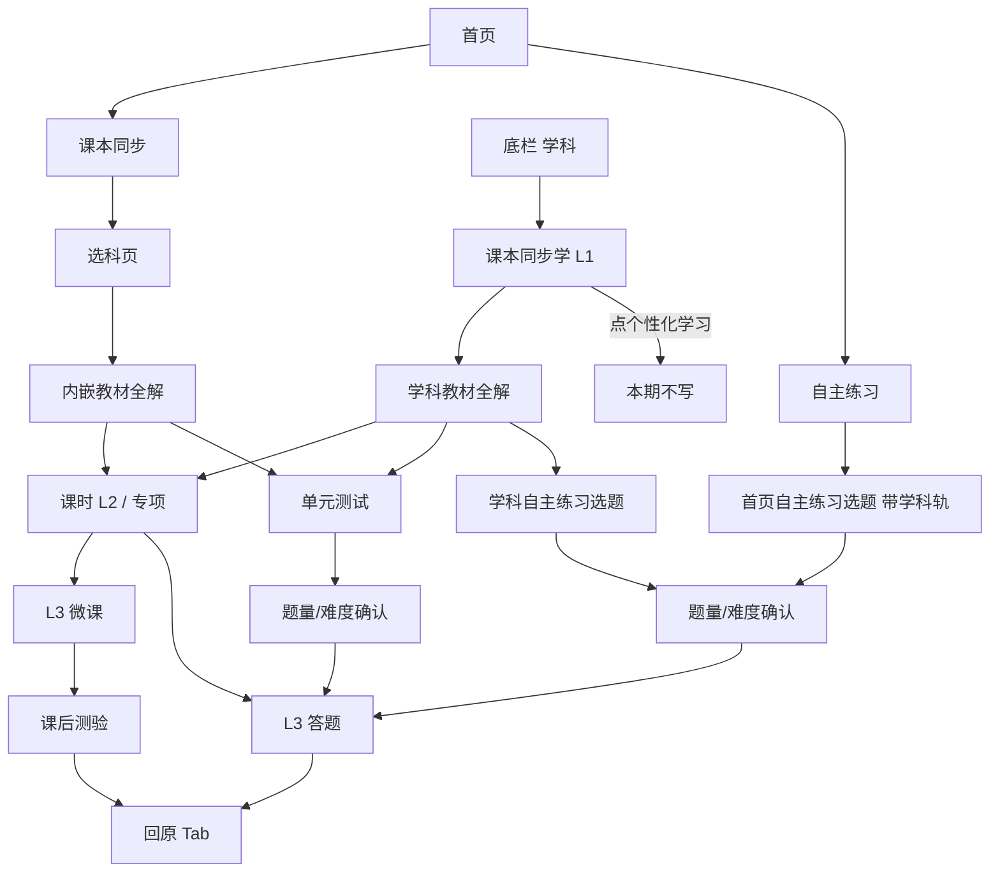

# 课本同步 / 课本同步学 / 自主练习 · 产品需求文档（PRD）

> **已并入** [05-同步课本与自主练习-阅读版.md](./05-同步课本与自主练习-阅读版.md)。本文不再维护。

| 项 | 内容 |
|----|------|
| **产品** | AI 学伴 · 学生端 |
| **模块** | 首页右侧工具栏 + 底栏「学科」Tab |
| **文档类型** | 产品需求文档（定位 + 交互 + 数据 + 规则 + 待确认） |
| **版本** | v1.3 · 2026-08-16 |
| **状态** | A5 退出回跳已定稿。C4 仍待补。 |
| **适用端** | 平板横屏（设计坐标约 `768 × 512`） |
| **关联实现** | `DashboardImmersive.tsx`、`SyncStudyPickerPage.tsx`、`SyncStudySubjectPage.tsx`、`SelfPracticePage.tsx`、`ModeSwitchRail.tsx`、`SubjectMap.tsx`、`SyncSelfTestPage.tsx`、`PracticeSetupDialog.tsx` |
| **关联数据** | `subjectCatalog.ts`、`juniorDemoCatalog.ts`、`jyeooSelfTest.ts`、`jyeooJuniorBooks.json`、`juniorSyncAssessment.ts`、语数英 / catalog 同步视频库 |
| **关联文档** | [`学科Tab-初中学段-交互需求文档.md`](../学科Tab-初中学段-交互需求文档.md)（学科 L1 细交互）、本目录 `00` / `01` / `03`（字段与模型附录，部分过时） |

---

## 0. 先读：三个入口，其实是两件事

用户点到的三个控件，**不是三个独立功能**，而是同一套「按课本学 / 按课本练」能力的三个入口：

| 入口位置 | 控件文案 | React 组件 | 学生要完成的事 |
|----------|----------|------------|----------------|
| 首页右侧竖卡 | **同步课本** | `DashboardImmersive` → `SyncStudyPickerPage` → `SyncStudySubjectPage`（内嵌 `SubjectMap`） | 先选科，再按教材目录看微课、做一课一练、做单元测试 |
| 学科 Tab 左侧栏 | **课本同步学** | `ModeSwitchRail`（`mapMode='pro'`）+ `SubjectMap` | 同上，但是学科主场：可切科、切版本、旁边还能进自主练习 |
| 首页右侧竖卡 | **自主练习** | `DashboardImmersive` → `SelfPracticePage`（即 `SyncSelfTestPage`） | 按**整册书**自选课文 / 课时 / 知识点组卷练习 |

一句话定位：

> **同步课本 / 课本同步学 = 跟着课本进度学（文案不统一，见 A2）。**  
> **自主练习 = 自己勾目录出卷练。**  
> 首页给「少步直达」；学科 Tab 给「沉浸主场」。两条链路共用教材、年级、册次、版本和组卷页。

```
首页「同步课本」 ──选科──► 内嵌学科页（教材全解 / 单元测试 / 专项）
                              ▲
                              │ 同一套 SubjectMap（embedded）
底栏「学科」──► 课本同步学 L1 ─┴──► 右侧「自主练习」竖卡
首页「自主练习」 ──────────────────► 同一套 SyncSelfTestPage
```

### 0.1 已定稿决策（2026-08-16 第一轮）

| 编号 | 决策 | 对产品的含义 |
|------|------|----------------|
| **A4 + C12** | 小学首页**不放**「课本同步 / 自主练习」，小学先放空 | 仅初中展示这两张卡；小学首页右侧为空 |
| **A7** | 以用户**最后一次亲手选择**的教材版本为准；每次登录读取并展示 | 首页自主练习、学科教材全解、学科自主练习看同一份版本记忆 |
| **B2** | 菁优未命中时的降级策略 **暂不考虑** | 先不统一「空态 vs 同步学目录凑树」 |
| **B1** | 同步 / 练习进去的目录树 **以菁优网为主** | 自主练习、单元测试组卷范围都认菁优树 |
| **B7 + 题不够** | 当场组卷；题不够时让用户选 **减题量** 或 **降难度**，不能直接失败 | 禁止「组卷失败」死胡同 |
| **B8** | 「单元测试」= **当场组卷**，和自主练习一样先选题量、难度 | 不再是一章一卷固定卷；点入口先出确认弹窗 |
| **C1** | 自主练习、单元测试题量均为 5–20，快捷档 5/10/15/20 | 所有组卷练习最多 20 题 |
| **C2** | 推荐题量暂用 `叶子×2 + (章数-1)×2`，夹在 5–20 | 先按此改；可再按学科加细 |
| **C3** | 默认难度 **中等** | 弹窗打开即中等 |
| **C4** | 单元测试：语文推荐 10 题、英语推荐 12 题；其他 `clamp(小节数×3, 8, 20)` | 所有单元测试可自选 5–20 题，时长为 `max(ceil(题量×1.5), 10)` |
| **C5–C11** | 先按本文原建议落稿 | 不解锁、微课 45s、默认版本表、切科清空等，可再改 |
| **A2** | 文案**不统一**：首页「同步课本」，学科「课本同步学」 | 两处对外名字保持差异 |
| **A3** | 从首页进同步后的科目页 **不放** 自主练习 | 自主练习只留首页卡 + 学科主场 |
| **A6** | 首页选科页 **不能** 改年级 / 册次 / 学制 | 只展示当前值；要改去学科顶栏 |
| **A5-1 / A5-2** | 首页同步课本，学完或中途退出都回 **刚才那科的科目页** | 不回选科页、不回首页默认态 |
| **A5-3 / A5-5** | 自主练习：中途退出回 **选题页**；做完后让学生选 **回科目页 / 回首页** | 首页来的「科目页」= 该科同步课本页；学科来的「科目页」= 学科 L1 |
| **A5-4** | 学科课时学完或退出 → **教材全解 L1**；专项学完（及中途退出）→ **当前专项页** | 课时不回 L2；专项留在专项选择页 |

---

## 1. 背景与目标

### 1.1 背景

学生日常有两类高频动作：

1. **跟课**：老师讲到哪一章，就打开对应微课和配套练。
2. **自练**：想针对某几课 / 某几个知识点加练，不想被「当前小节」绑死。

若只放在学科 Tab，首页启动成本高（先切 Tab，再找入口）。若只放在首页，又缺少「按学科长期驻留、切版本切章节」的主场。因此做成：

- 首页两张卡：降低启动成本
- 学科 Tab 课本同步学：完整主场
- 自主练习两边都能进，但**组卷范围永远是整册**，不跟当前小节走

### 1.2 目标用户

| 角色 | 说明 |
|------|------|
| **主用户** | 初中学生（六三制七～九 / 五四制六～九） |
| **次用户** | 小学学生（本期首页不放同步/练习入口，学科 Tab 仍「即将开放」） |
| **旁观** | 家长演示、教研走查 |

### 1.3 产品目标

| 目标 | 说明 |
|------|------|
| **入口职责清晰** | 学生 3 秒内分清：同步是「跟课文学」，自主是「自己选题练」 |
| **少步直达** | 首页两步内进入学或练，不必先理解学科 Tab 信息架构 |
| **主场完整** | 学科 Tab 承担切年级 / 学科 / 版本 / 章节的完整浏览 |
| **测练口径不混** | 一课一练、单元测试、自主练习三种范围必须分开 |
| **数据同源** | 同一年级 + 学科 + 版本 + 册次，两边看到的目录应对齐 |

### 1.4 成功标准（可观测）

- 从首页点「课本同步」，能选到当前年级应有学科，并进入该科教材全解
- 从首页点「自主练习」，能切科、勾叶子、设题量/难度后进入答题
- 学科 Tab 默认停在「课本同步学」，右侧「自主练习」进同一套选题页
- 首页课本同步的科目页**看不到**自主练习竖卡（避免和首页卡重复）
- 三种测练：一课一练绑课时、单元测试绑当前章/Unit、自主练习绑整册

---

## 2. 范围界定

### 2.1 本期写清（本 PRD 覆盖）

- 三个入口的职责、跳转、返回、状态共享
- 课本同步学 L1 与首页内嵌页的差异
- 自主练习选题、组卷确认、数据匹配
- 年级 / 学制 / 学科 / 版本 / 册次如何取用
- 需要产品补齐的交互、数据、规则清单

### 2.2 本期不展开（另册或后续）

| 项 | 说明 |
|----|------|
| 个性化学习（`mapMode='sync'`） | 左侧栏仍有入口，需求不写 |
| 知识图谱画布 | 课本同步学已去掉图谱主展示 |
| 真实视频 CDN / 进度持久化 | 原型演示 |
| 真实题库组卷 API | 原型按题量/难度构造 Task，未接真题 |
| 小学完整同步内容 | 见待确认 |
| 解锁进度（必须先学完才能测） | 当前明确**不做解锁** |

### 2.3 三种测练口径（已落地，建议锁定）

| 能力 | 范围 | 选题方式 | 入口 | 与当前小节 |
|------|------|----------|------|------------|
| **一课一练** | 当前课时 / 课文 / 课题（**英语不做**） | 固定配套练：5 题 / 中等 / 同步练习；入口三态：未练习 / 练习中 / 已练完；已练完再点换新卷 | L2 学习路径末条 | **强绑定** |
| **单元测试** | 当前章 / 单元 / Unit（菁优树对应范围） | **当场组卷**，先选题量/难度 | 教材全解底栏 | **跟父级走** |
| **自主练习** | **整册书** | 学生勾叶子组卷 | 首页卡 + 学科右侧竖卡 | **无关** |

不做解锁：单元测试、自主练习随时可进。

---

## 3. 信息架构与入口对照

### 3.1 入口总表

| # | 位置 | 文案 | 触发后 | 底栏 | 模式栏 | 自主练习竖卡 |
|---|------|------|--------|------|--------|--------------|
| A | 首页右侧 | 同步课本 | 全屏选科页 `z-650` | 隐藏 | 无 | 无 |
| A2 | 选科后 | `{学科} · 同步课本` | 内嵌 `SubjectMap embedded` `z-540` | 隐藏 | 无 | **不展示** |
| B | 首页右侧 | 自主练习 | `SelfPracticePage` `z-650` | 隐藏 | 无 | —（本页就是选题） |
| C | 底栏「学科」 | — | `SubjectMap` L1 | 显示 | 显示 | 显示（初中） |
| C1 | 学科左侧栏 | 课本同步学 | `mapMode='pro'`（默认） | 显示 | 当前选中 | 显示 |
| C2 | 学科 L1 右侧 | 自主练习 / 进入练习 | 同页 `SyncSelfTestPage` | 隐藏 | 隐藏 | — |

### 3.2 文案差异（A2 已定：不统一）

| 场景 | 对外文案 | 说明 |
|------|----------|------|
| 首页卡 | **同步课本** | 短名，降低首页噪音 |
| 学科模式栏 | **课本同步学** | 强调这是学习主场 |
| 首页卡 | 自主练习 | 与学科竖卡对齐，不要再叫「自主测」 |
| 选题页标题 | 自主练习 | 首页 / 学科共用 |
| 开始按钮 | 开始练习 | 共用 |
| 学科竖卡副文案 | 进入练习 | 保持 |

> 旧文档里的「自主测」已改名为「自主练习」。Task 内部 `aiReasoning` 仍是「同步自主测」（`KG_SCOPE_SELF_TEST`），对学生不可见。

### 3.3 共享全局状态（App 级）

三个入口读写同一套学生上下文，**不是各记各的**：

| 状态 | 字段 | 谁改 | 谁用 |
|------|------|------|------|
| 年级 | `userGrade` | 学科顶栏年级胶囊 | 选科列表、目录、组卷、版本偏好 |
| 学制 | `schoolSystem` | 年级弹层 | 学科表、默认版本、菁优匹配 |
| 册次 | `textbookTerm` | 年级弹层 / 内嵌页回调 | 目录与组卷 |
| 当前学科 | `activeSubject` | 选科、学科 Tab、首页自主练习切科 | 内嵌页、学科页、自主练习初始科 |
| 模式 | `mapMode` | 学科左侧栏；首页进同步时强制 `pro` | 学科 Tab 展示哪套主界面 |
| 教材版本 | `syncTextbookVersion`（按学科记在 SubjectMap 内） | 教材全解版本弹层 | 学科 / 内嵌同步页 |
| 测评资格 | `isAssessed` | 测评流程 | 原型里同步学仍可进，不作为硬门槛 |

---

## 4. 功能一：课本同步 / 课本同步学

### 4.1 设计逻辑

学生心智：**「打开我正在用的那本课本，找到这一章，看完再练。」**

因此主路径必须是教材目录，而不是知识图谱：

```
年级 → 学科 → 版本 → 册次 → 章/单元 → 课时/课文/技能格
                                      ├─ 微课（L3 视频）
                                      ├─ 一课一练（L3 答题）
                                      └─ 单元测试（当前父级整卷）
```

学科差异内化在 L1，不让学生先学「产品分类」：

| 学科类型 | L1 主列表 | 点进去 |
|----------|-----------|--------|
| 语文 | 课文列表（活动·探究按任务分组，标题不可点） | L2 学习路径大卡 → 视频 / 一课一练 |
| 数学 | 小节列表 | L2 三阶段路径 → 视频 / 一课一练 |
| 英语 | Unit 下列 Section（七 / 八年级沪教）；九年级技能格 | Section → L2 视频列表 → L3；**无一课一练** |
| Catalog（道法/历史/生物/地理/物理/化学/科学） | 课 / 节 / 课题 | L2 三阶段路径 |

### 4.2 路径 A：首页「课本同步」

#### 4.2.1 入口

- 位置：首页右侧，探索中心上方，白底圆角卡，紫边。
- 展示条件（**A4 已定**）：仅初中（`isJuniorGrade`）。小学首页不展示，右侧放空。
- 点击：`onOpenHomeTool('sync')` → `isSyncStudyPickerOpen = true`。
- 同时隐藏底栏。

#### 4.2.2 选科页（L1.5）

组件：`SyncStudyPickerPage`

| 区域 | 内容 | 数据 |
|------|------|------|
| 标题 | 同步课本 | 硬编码 |
| 副标题 | `{年级} · {册次} · 选一个学科，去选章节学习` | App `userGrade` / `textbookTerm` |
| 返回 | 回首页，关浮层 | — |
| 学科网格 | 4 列卡片，道法展示为「道法」 | `getGradeSubjects(grade, schoolSystem)` |

点学科：

1. 写入 `activeSubject`
2. 强制 `mapMode = 'pro'`
3. 关选科页，开科目页

**本页不能改年级 / 册次 / 学制。** 要改，必须先回首页或去学科 Tab 顶栏。

#### 4.2.3 科目页（内嵌课本同步学）

组件：`SyncStudySubjectPage` → `SubjectMap embedded`

| 与学科 Tab 的差异 | 内嵌页（首页进来） | 学科 Tab |
|------------------|--------------------|----------|
| 顶栏 | 自带「{学科} · 同步课本」+ 返回 | 全局 `SubjectSwipeSwitcher`（年级·册次 + 多科 Tab） |
| 左侧模式栏 | **无** | 课本同步学 / 个性化学习 |
| 自主练习竖卡 | **不展示** | 展示（初中） |
| 教材全解 / 单元测试 / 专项 | 有 | 有 |
| 切科 | 返回选科页再选 | 顶栏点 / 滑 |
| 切年级册次 | 不在本页（但 `onTextbookTermChange` 已接上，若内嵌 UI 露出则可改） | 顶栏胶囊 |
| 内容区边距 | 无底栏/模式栏预留 | `pl-14` + 顶 72 / 底 96 |

返回：科目页 → **回到选科页**（不是直接回首页）。  
开始学习：关掉选科+科目浮层，进入 L3；`aiReasoning` 缺省为「来自首页课本同步」。

### 4.3 路径 C：学科 Tab「课本同步学」

#### 4.3.1 进入

- 底栏点「学科」→ 渲染 `SubjectMap`。
- 默认 `mapMode = 'pro'`，左侧「课本同步学」选中（indigo 底 + 左缘指示条）。
- 再点一次「课本同步学」：保持 / 从个性化学习切回。
- 点「个性化学习」：切 `sync`，**本期不写**。

#### 4.3.2 L1 布局（学科主场）

```
┌ 顶栏： [七年级 · 上册 ▼]  语文 数学 英语 道法 …  ┐
├ 56px ─┬────────────────────────────────────────┤
│课本   │ 名师广告 │ 教材全解（版本▾ 章/单元▾） │自主│
│同步学 │         │ 子级列表                    │练习│
│       │         │ 单元测试                    │    │
│       │ 专项提升（英 7–9）/ 同步提高（数学）   │    │
└───────┴────────────────────────────────────────┘
  底栏：首页 | 学科 | 错题 | 伙伴 | 我的
```

L2（课时 / 专项 / 自主练习）打开时：隐藏底栏和模式栏。

#### 4.3.3 顶栏规则（学科主场专有）

| 操作 | 行为 |
|------|------|
| 选年级 | 更新 `userGrade`；新年级没有当前科 → 回落语文；关弹层 |
| 选册次 | 更新 `textbookTerm`；弹层保持 |
| 切学制 | 更新 `schoolSystem`；学科不可用 → 回落语文 |
| 点 / 滑学科 | 改 `activeSubject` |
| 任一上述变化 | 章索引归零，关所有 L2，清筛选 |

#### 4.3.4 教材全解（两边共用）

| 控件 | 行为 |
|------|------|
| 版本 | 只切版本，不切册次；选中不自动关弹层 |
| 当前册次在新版本不可用 | 落到该版本第一个可用册次 |
| 点父级（章/单元） | 主列表换成该父级**全部**子级；不自动进 L2；英语点 Unit 关弹层，下列 Section |
| 点子级 | 语文/数学/catalog 进 L2；英语沪教七/八点 Section 进 L2 视频列表（无一课一练） |
| 单元测试 | 测当前父级；文案只写「单元测试」；点击后**先选题量/难度**再当场组卷（规则见 §5.4 / §5.7） |
| 名师广告 | 有配置才展示；点击进约 10 分钟微课 |

版本展示优先级（**A7 已定**）：

1. 该学科用户**最后一次亲手选择**的版本（登录时读取，跨首页 / 学科共用）
2. 该选择已不在当前年级可选列表里 → 才用系统偏好 `preferredVersion`（**不覆盖**历史记录，回到原年级仍恢复上次选择）

系统偏好仅用于「从未选过」：

| 学科 | 六三制 | 五四制 |
|------|--------|--------|
| 语文 | 人教版（数据常映射统编版） | 人教版 |
| 数学 | 北师大版 | 人教五四制版 |
| 英语 | 沪教版 | 人教五四制版 |
| 物理 | 人教版 | 鲁科五四制版 |
| 化学 | 人教版 | 人教五四制版 |
| 生物 | 人教版 | 鲁科五四制版 |
| 地理 | 人教版 | 鲁教五四制版 |
| 科学 | 浙教版 | 沪教版 |
| 其他 | 人教版 | 人教版 |

### 4.4 课本同步 · 数据来源

#### 4.4.1 学科列表

| 用途 | 函数 | 文件 |
|------|------|------|
| 首页选科、首页自主练习左侧轨 | `getGradeSubjects(grade, system)` | `data/subjectCatalog.ts` |
| 学科 Tab 顶栏 | `JUNIOR_SUBJECTS` / `WUSI_SUBJECTS` | `SubjectSwipeSwitcher.tsx` |

**口径应对齐。** 当前两处都按年级裁剪（与错题 Tab「初中 10 科全展示」不同）。

六三制：

| 年级 | 学科 |
|------|------|
| 七年级 | 语数英 + 道法历史生物地理科学 |
| 八年级 | 上列 + 物理 |
| 九年级 | 语数英物化 + 道法历史科学（无生物/地理） |

五四制：六/七年级同七上八科；八年级含物化；九年级无生物/地理/科学。

小学：`getGradeSubjects` 回落 `ELEMENTARY_SUBJECTS` = 语数英 + 道法 + 科学。学科 Tab 非初中展示「该学科内容即将开放」。

#### 4.4.2 是否展示同步学主界面

```
isJuniorGrade(年级, 学制)
AND 学科 ∈ {语文, 数学, 英语} ∪ catalog 七科
```

否则居中：「该学科内容即将开放」。

#### 4.4.3 教材目录与视频（优先级）

```
精编视频书 existingBook()
        > 目录自动生成 generatedBook()
```

冲突时：**以现有原型精编为准**；缺视频可用演示生成。

| 数据 | 文件 | 用途 |
|------|------|------|
| Catalog 工厂（版本/册次/书） | `juniorDemoCatalog.ts` | 统一取书、默认版本、册次归一 |
| 章节全量 | `juniorTextbookChapters.ts` | docx 导入目录 |
| 人教节次兜底 | `juniorPepSectionBank.ts` | lesson 名 |
| 语文视频 | `juniorChineseSyncVideos.ts` | 单元 / 课文 / 视频 tag |
| 数学视频 | `juniorMathSyncVideos.ts` | 章 / 小节 / 视频 |
| 英语视频 | `juniorEnglishSyncVideos.ts` | Unit / Section / 技能格 |
| 物理等精编 | `junior*Sync*.ts` | 部分年级学期 |
| 英语专项 | `juniorEnglishSpecial.ts` + Vocab/Speaking/Grammar | 七～九入口，精编偏七上 |
| 数学提高 | `juniorMathImproveG7A.ts` | 入口全年，数据偏七上 |
| 名师广告 | `getTeacherAd(subject)` | 无配置则不展示 |

册次归一 `resolveCatalogTerm`：当前册次该书没有 → 上/下册回退全一册，全一册回退上册，再没有取第一本。

#### 4.4.4 进入学习时的 Task

| 入口 | `aiReasoning` | 时长 |
|------|----------------|------|
| 技能格 / 路径视频 / 名师广告 | 同步课堂微课 | 8 / 10 分钟 |
| 一课一练 | 同步课时练习 | 10 分钟 |
| 单元测试 | 同步单元测试 | `max(ceil(题量×1.5), 10)`（与自主练习一致；C4 未定前暂用） |
| 首页同步缺省 | 来自首页课本同步 | 15 分钟（仅缺省） |

微课：`VideoLesson` → `QuizPage`，观看达标 **45 秒**。  
练习 / 测验：直接 `QuizPage`（`forceQuizOnly`）。

单元测试推荐题量（**C4 未定稿**，仅作弹窗默认值）：

| 学科 | 推荐题量（暂用） |
|------|------------------|
| 语文 | 10 |
| 英语 | 12 |
| 数学 / catalog | `clamp(小节数×3, 8, 20)` |

学生可在 5–20 内改；难度默认中等。正式推荐公式等 C4。

---

## 5. 功能二：自主练习

### 5.1 设计逻辑

学生心智：**「这本课本里，我想练哪几课 / 哪几个知识点，自己勾，自己定题量和难度。」**

因此：

- 范围 = **当前匹配到的整册书**，不是当前章
- 不跟 L1 选中的课文/小节走；进入时滚到当前章，**不默认勾选**
- 首页进来要能切科；学科 Tab 进来默认就是当前科
- 未选叶子不能开始；开始前必须确认题量 / 难度

### 5.2 两条进入路径

| | 首页「自主练习」 | 学科 L1 右侧竖卡 |
|--|------------------|------------------|
| 组件壳 | `SelfPracticePage` | `SubjectMap` 内直接开 `SyncSelfTestPage` |
| 选题页 | 同一个 `SyncSelfTestPage` | 同左 |
| 左侧学科轨 | **有**（`getGradeSubjects`） | **无**（学科已在顶栏） |
| 初始学科 | `activeSubject`，若当前年级没有该科则第一科 | 当前 `activeSubject` |
| 版本 | 读该学科**最后一次选择**；没有记录再用偏好 | 同左（教材全解改版本会写入记忆） |
| 册次 | `resolveCatalogTerm` 归一后的册 | 同左，跟学科页 `activeTerm` |
| 「加入当前小节」 | **无** | **无**（用目录树勾选即可） |
| 返回 | 回首页 | 回学科 L1 |
| 开始后 | 关浮层进 L3 | 关选题进 L3，学科 Tab 仍在 |

学科竖卡展示条件：`isSyncAssessmentPilot` = 年级 ∈ 六 / 七 / 八 / 九年级，且**非 embedded**。

### 5.3 选题页交互

| 区域 | 行为 |
|------|------|
| 标题 | 自主练习 |
| 副标题 | `{版本} · {年级}{册次} · {学科}` + 语文/英语「按目录勾选课文/课时组卷」；其余「按章节勾选知识点组卷」 |
| 树 | 任意层可勾；勾父级 = 全选叶子；半选 indeterminate |
| 知识点 | 节下全是知识点时，用胶囊标签，不再继续缩进 |
| 课文 / 课时 | 普通复选行 |
| 底栏 | 未选：「请选择你要练习的课文 / 课时 / 章节或知识点」，开始禁用；已选：已选 N · 覆盖章数 · 推荐题量，可清空 |
| 开始练习 | 未选禁用 → 先弹确认框 → 再进 L3 |

切科（仅首页）：重算版本 / 册次 / 树，选择应重置（原型随 `subject` 重挂载树）。

### 5.4 开始前确认

组件：`PracticeSetupDialog`

| 项 | 原型规则 |
|----|----------|
| 形态 | 居中弹窗，不是整页 |
| 题量 | 自主练习、单元测试：5–20，±1，快捷档 5 / 10 / 15 / 20 |
| 默认题量 | 推荐算法（见 5.6） |
| 难度 | 较易 / 容易 / 中等 / 较难 / 困难，默认**中等**（level=3） |
| 确认 | 按所选组卷进 L3 |

Task：

| 字段 | 赋值 |
|------|------|
| `id` | `{学科}-self-practice-{叶子数}-{时间戳}` |
| `title` | `自主练习 · {题量}题 · {难度}` |
| `durationMinutes` | `max(ceil(题量×1.5), 10)` |
| `questionCount` | 确认后的题量 |
| `practiceDifficulty` | 1–5 |
| `aiReasoning` | 同步自主测 |

### 5.5 自主练习 · 数据来源

#### 5.5.1 主数据：菁优网教材目录

| 层 | 位置 |
|----|------|
| 原始元数据 | `同步章节映射知识点数据-菁优网/jyeoo_metadata/` |
| 构建脚本 | `scripts/build-jyeoo-junior-books.mjs` |
| 构建产物 | `data/jyeooJuniorBooks.json` |
| 匹配 / 转树 | `data/jyeooSelfTest.ts` → `buildJyeooSelfTestTree` |
| 对外 API | `buildSelfTestTree(...)`（`juniorSyncAssessment.ts`） |

匹配键：`学科 + 年级 + 册次 + 版本 + 学制`。

版本别名（节选）：

- 人教版 ↔ 统编版 / 人教版（2024） / 统编版（2024）
- 北师大版 ↔ 北师大版（2024）
- 沪教版 ↔ 沪教牛津 / 牛津上海版
- 五四制各科：人教五四 / 鲁教五四 / 鲁科五四 / 沪教五四

册次回退：上/下册没有 → 试全一册 / 全册。  
学制：五四制优先带「五四」的 edition，六三制排除五四 edition。  
版本对不上：同学科同年级同册次下，按学制过滤后取第一本（弱回退）。

#### 5.5.2 降级树（B2 暂缓）

**本期不考虑**菁优未命中时用同步学目录凑树。产品口径：目录树以菁优为主。  
原型里学科入口仍可能有降级代码，正式规则未拍，先不统一。

#### 5.5.3 叶子定义（组卷只数叶子）

| 学科 | 叶子 | 底栏量词 | 有没有知识点层 |
|------|------|----------|----------------|
| 语文 | 课文 / 篇目 | 篇课文 | 无 |
| 英语 | 课时块（如 1a-1c） | 个课时 | 无 |
| 数学及其他 | 知识点 | 个知识点 | 有（菁优 Points）；无则停在节 |

父级若已有更细子目录，不用父级上重复的 Points 再冒充一层。

目录形态示例：

```
语文：第一单元 → 1 春/朱自清（叶子）
英语：Unit 1 → Section A → 1a-1c（叶子）
数学：第1章 有理数 → 1.1 正数和负数 → [正数和负数]（叶子）
```

### 5.6 题量推荐（C2 已按建议落稿）

```
推荐题量 = clamp( 已选叶子数 × 2 + max(覆盖章数 - 1, 0) × 2 , 5, 20 )
未选 → 0，开始按钮禁用
```

自主练习用此公式。单元测试推荐量等 C4，未定前弹窗先用 §4.4.4 估式。

### 5.7 单元测试组卷（B8 已定）

与自主练习同一套确认弹窗（`PracticeSetupDialog`），差异只在范围：

| 项 | 自主练习 | 单元测试 |
|----|----------|----------|
| 范围 | 学生勾的整册叶子 | **当前章 / 单元 / Unit**（菁优树对应节点） |
| 入口 | 首页卡 / 学科竖卡 | 教材全解底栏「单元测试」 |
| 弹窗 | 先定题量、难度 | 同样先定题量、难度 |
| 默认难度 | 中等 | 中等 |
| 题量区间 | 5–20 | 5–20 |
| 组卷 | 当场组卷 | 当场组卷 |

**题不够时（B7 已定，真题接入后必须实现）：**

1. 不能直接「组卷失败」退出。
2. 告诉学生：当前范围、当前难度下只有 N 题，不够你要的 M 题。
3. 学生二选一（可组合）：**减到 N 题**，或 **降低难度再组**。
4. 降难度后仍不够 → 再让学生减题量；始终留一条能开始的路。

**硬阻断（与「题不够」分开，细则见阅读版 §8.5）：**

1. **当前知识点 / 章节下本来没题** → 弹「抱歉，当前章节下没有题目」，不提供升/降难度；入口仍在。
2. **每人每天组卷练习最多 100 份（不限学科）** → 满额后无法再进入一课一练 / 单元测试 / 自主练习，次日恢复。
3. **每人每天每个学科组卷练习最多 60 份** → 该学科满额后无法再进入该学科练习入口，次日恢复；与总次数同时生效，任一触顶即拦。

原型阶段尚无真实库存，弹窗已先接上；短缺二次选择、空库存与日额度待接题库 / 计数后补界面。

---

## 6. 状态机与空态

### 6.1 页面状态

| 状态 | 含义 |
|------|------|
| 首页默认 | 初中：两张卡可见；小学：右侧放空 |
| 选科打开 | 课本同步选科 |
| 科目打开 | 内嵌同步学 |
| 首页自主练习打开 | 带学科轨的选题页 |
| 学科 L1 | 课本同步学主场 |
| 学科自主练习打开 | 无学科轨选题页 |
| L2 课时 / 专项 | 覆盖 L1 |
| L3 学习 | App `journeyPhase='learning'` |
| 确认弹窗 | 选题页之上 |

### 6.2 空态 / 失败

| 场景 | 展示 | 是否阻断 |
|------|------|----------|
| 非初中进学科 Tab | 该学科内容即将开放 | 非阻断 |
| 章/单元下无小节 | 缺省图 +「该章节下暂无内容」 | 非阻断 |
| 自主练习无树 | 该教材暂无章节目录 | 不能开始 |
| 课时 L2 无视频入口 | 微课区轻提示「本小节/课时/课文暂无同步名师课」（阅读版 §7.8.1）；一课一练仍可保留 | 非阻断 |
| 微课链接失效 / 拉流报错等 | 播放器内「暂时无法播放」（阅读版 §7.8.2） | 非阻断；可重试或返回 |
| 未选叶子 | 开始按钮禁用 | — |
| 当前范围题库本来没题 | 「抱歉，当前章节下没有题目」弹窗（阅读版 §8.5.1） | 不能开始；入口仍在 |
| 当日练习已满 100 份 | 「今日练习次数已经达到上限啦」弹窗（阅读版 §8.5.2，正文不写具体次数） | 不能进入组卷练习；次日恢复 |
| 当日本学科练习已满 60 份 | 「今日本学科练习次数已经达到上限啦」弹窗（阅读版 §8.5.3，正文不写具体次数） | 不能进入该学科组卷练习；次日恢复 |
| 网络 / 真题失败 | 原型无 | 待补 |

### 6.3 返回与中断（A5 已定）

| 从 | 返回到 |
|----|--------|
| 选科页点返回 | 首页 |
| 科目页点返回 | 选科页 |
| 科目页内 L2 点返回 | 科目页 |
| 首页同步课本 · 学完或中途退出 L3 | **刚才那科的科目页**（A5-1 / A5-2） |
| 首页自主练习 · 中途退出 | **自主练习选题页**（A5-3） |
| 首页自主练习 · 做完 | 弹层二选一：**回科目页**（该科同步课本页）或 **回首页** |
| 学科课时 / 一课一练 / 单元测 · 学完或退出 | **学科教材全解 L1**（A5-4） |
| 学科专项 · 学完或中途退出 | **当前专项选择页**（A5-4） |
| 学科自主练习 · 中途退出 | **自主练习选题页**（A5-5，与 A5-3 对齐） |
| 学科自主练习 · 做完 | 弹层二选一：**回科目页**（学科 L1）或 **回首页** |

---

## 7. 主流程



---

## 8. 验收标准（按入口）

### 8.1 首页课本同步

- [ ] 点击打开选科页；副标题年级、册次与全局一致
- [ ] 学科网格与当前年级/学制表一致；道法显示「道法」
- [ ] 点科进入该科教材全解；无模式栏、无自主练习竖卡
- [ ] 仍有单元测试（初中）和英/数专项（条件满足时）
- [ ] 返回先回选科，再回首页
- [ ] 点微课走视频；点一课一练直接答题；点单元测试先选题量/难度再答题
- [ ] 小学学段首页不出现这两张卡

### 8.2 首页自主练习

- [ ] 左侧可切当前年级全部学科
- [ ] 目录按菁优匹配；语文无知识点、英语无知识点、数学有胶囊
- [ ] 未选不能开始；勾父级等于全选叶子
- [ ] 开始先出题量/难度弹窗，默认中等、推荐题量按公式
- [ ] 进答题后浮层关闭；返回键回首页

### 8.3 学科课本同步学

- [ ] 默认选中「课本同步学」
- [ ] 顶栏年级·册次·学制·学科切换后，不残留上一科 L2
- [ ] 点父级只换列表；点子级进 L2（英语除外）
- [ ] 单元测试钉在教材全解底，测当前父级；点击先出题量/难度弹窗
- [ ] 右侧自主练习进整册选题，未选提示去勾选，已选显示数量，无学科轨
- [ ] L2 打开时底栏和模式栏隐藏
- [ ] 一课一练入口三态：未练习 / 练习中 / 已练完

---

## 9. 关键源码

| 路径 | 职责 |
|------|------|
| `components/Dashboard/DashboardImmersive.tsx` | 首页两张卡 |
| `App.tsx` | `handleOpenHomeTool`、浮层开关、Task 构造 |
| `components/Dashboard/SyncStudyPickerPage.tsx` | 首页选科 |
| `components/Dashboard/SyncStudySubjectPage.tsx` | 首页内嵌同步学 |
| `components/Dashboard/SelfPracticePage.tsx` | 首页自主练习壳（读版本记忆 + 学科轨） |
| `services/textbookVersionStore.ts` | 按学科持久化最后一次教材版本 |
| `components/Layout/ModeSwitchRail.tsx` | 课本同步学 / 个性化学习 |
| `components/Layout/SubjectSwipeSwitcher.tsx` | 年级 · 册次 · 学制 · 学科 |
| `components/SubjectMap/SubjectMap.tsx` | L1 状态机；`embedded` 控制差异 |
| `components/SubjectMap/SyncSelfTestPage.tsx` | 选题页 |
| `components/SubjectMap/PracticeSetupDialog.tsx` | 题量 / 难度 |
| `data/subjectCatalog.ts` | 年级学科表 |
| `data/juniorDemoCatalog.ts` | 版本偏好、册次、是否初中 |
| `data/jyeooSelfTest.ts` / `jyeooJuniorBooks.json` | 自主练习主目录 |
| `data/juniorSyncAssessment.ts` | 推荐题量、单元测信息、降级树 |
| `utils/kgMicroLesson.ts` | 微课 / 课时练 / 单元测 / 自主测 scope |

---

## 10. 待确认清单

状态：**已定稿** / **按建议暂定** / **暂缓** / **未拍**。  
已定稿见 §0.1。下面仍保留原文，方便对照。未拍项继续按编号回复即可。

---

### A. 交互逻辑（优先拍）

**A1. 三个入口是否确认为「两能力三入口」？**  
- 原型：是。首页同步 = 学科同步学的精简入口；两边自主练习共用选题页。  
- 建议：锁定。不要做成三套页面、三套目录。  
- 需要你补：有没有「首页同步应比学科少能力 / 多能力」的例外（除已隐藏的自主练习竖卡外）？

**A2. 文案要不要统一？** ✅ **已定稿：不要统一**  
- 首页右侧卡 / 选科页 / 科目页顶栏：**同步课本**  
- 学科左侧栏：**课本同步学**

**A3. 从首页进同步后的科目页，还放不放自主练习？** ✅ **已定稿：不放**  
- `embedded` 时隐藏右侧竖卡。自主练习只留首页卡 + 学科主场。

**A4. 小学学段，首页两张卡还在不在？** ✅ **已定稿：不需要，小学先放空（P1）**  
- 初中才展示；小学首页右侧无此二卡。学科 Tab 小学仍「即将开放」。

**A5. 学完 / 中途退出，回到哪里？** ✅ **已定稿，见 §6.3 / §10.1**

**A6. 首页选科页能不能改年级、册次？** ✅ **已定稿：不要改**  
- 选科页只展示当前年级 · 册次，不提供切换。改年级 / 册次 / 学制只在学科顶栏。

**A7. 首页自主练习要不要切版本？** ✅ **已定稿：以用户最后一次选择为准**  
- 每次登录读取该学科最后修改的版本并展示。  
- 首页自主练习、学科教材全解共用 `textbookVersionStore`。  
- 选题页暂不单独做版本切换（改版本仍在教材全解）。

**A8. 「加入当前小节」是否保留？** ✅ **已定稿：不做**  
- 和底栏「已选」重复。进入时只滚到当前章，不默认勾、不提供一键加入。学生在树上自己勾。

**A9. 学科 Tab 自主练习要不要也能切科？**  
- 原型：不能，跟顶栏当前科。  
- 建议：锁定。切科用顶栏，避免页内两套切科。

**A10. 个性化学习按钮是否继续留在 ModeSwitchRail？**  
- 原型：留着。  
- 建议：本期保留入口但不写需求；若怕误点，可先灰置 / 隐藏。

**A11. 首页进同步后，是否允许在内嵌页改册次？**  
- 原型：`onTextbookTermChange` 已接通，但内嵌页没有年级胶囊，学生改不到。  
- 建议：内嵌页不提供改册次，避免和「只读选科页」冲突。

**A12. 英语沪教七/八改为 Section → L2 视频列表（无一课一练）；九年级技能格直进；语文 L2 仍是大卡（未与数学三阶段统一），是否维持？**  
- 原型：英语直进；语文 path 大卡；数学/catalog 三阶段。  
- 建议：英语维持。语文是否改成三阶段，请单独拍（旧文档遗留）。

---

### B. 数据来源（必须补齐或确认）

**B1. 自主练习目录的权威源？** ✅ **已定稿：菁优网为主**  
- 同步 / 练习进去的目录树认菁优。  
- 未拍：菁优未覆盖的学科/年级是隐藏入口还是空态（与 B2 相关，B2 暂缓）。

**B2. 首页与学科的降级策略是否要统一？** ⏸ **暂缓：第二种情况暂时不考虑**

**B3. 语文 / 英语没有知识点层，是否产品定稿？**  
- 原型：是，叶子停在课文 / 课时块。  
- 建议：锁定（符合菁优真实结构）。  
- 需要你补：若某版语文将来有知识点，是自动出胶囊，还是仍强制停在课文？

**B4. 课本同步视频 / 目录的权威源？**  
- 原型：精编 `junior*Sync*.ts` > 自动生成目录。  
- 需要你补：正式环境是自有课包、第三方视频，还是继续精编 + 占位？缺课包时 L1 是「即将开放」还是仍出目录但灰掉视频？

**B5. 学科列表以哪份表为准？**  
- 原型：`subjectCatalog.getGradeSubjects` 与 `SubjectSwipeSwitcher` 各维护一份，口径目前一致。  
- 建议：产品只认一张「年级 × 学制 × 学科」表，工程改成单源。  
- 需要你补：是否有校本课程 / 地方课程要加（如信息科技）？

**B6. 人教版 vs 统编版，对学生展示哪一个？**  
- 原型：UI 常写「人教版」，语文菁优按「统编版」匹配。  
- 建议：对用户统一展示「人教版（统编）」，避免两套名字。请拍展示名。

**B7. 组卷题目从哪来？** ✅ **部分定稿**  
- 已定：当场组卷；题不够时用户选 **减题量** 或 **降难度**，不能直接失败。  
- 未拍：题库供应商是否就是菁优题、是否排除已做、题型配比。

**B8. 单元测试卷从哪来？** ✅ **已定稿：当场组卷**  
- 与自主练习一样先选题量、难度。  
- 范围仍是当前章/单元。推荐题量公式见 C4（待补）。

**B9. 进度 / 完成态存哪里？**  
- 原型：不持久化。  
- 需要你补：要不要记录「看到哪一课、练过哪一课、单元测分数」？记了之后 L1 要不要打勾 / 进度条？

---

### C. 规则设置（数字和策略）

**C1. 自主练习题量上下限** ✅ **已定稿：5–20**，快捷 5/10/15/20；单元测试同样为 5–20。

**C2. 推荐题量算法** ✅ **按建议暂定**：`叶子×2 + (章数-1)×2`，夹在 5–20。

**C3. 默认难度** ✅ **已定稿：中等**。不按画像浮动。

**C4. 单元测试题量 / 时长** ✅ **已定稿**  
- 语文固定推荐 10 题，英语固定推荐 12 题；学生均可自行选择 5–20 题。  
- 其他科目默认 `clamp(本章小节数×3, 8, 20)`，所有单元测试最多 20 题。  
- 时长按 `max(ceil(题量×1.5), 10)` 分钟估算。  
- 弹窗推荐量暂用旧估式，不作为定稿。

**C5. 不做解锁，是否锁定？** ✅ **按建议暂定：不解锁。**

**C6. 微课达标时长** ✅ **按建议暂定：45 秒。**

**C7. 默认教材版本表（4.3.4）是否就是产品表？** ✅ **按建议暂定。** 仅在该学科从未选过版本时使用；有历史选择以 A7 为准。

**C8. 册次默认** ✅ **按建议暂定：** 跟全局 `textbookTerm`，再 `resolveCatalogTerm`。

**C9. 英语专项 / 数学提高的开放年级** ✅ **按建议暂定：** 英语专项 7–9；数学提高入口全年都在。无精编时进空态（未再拍隐藏）。

**C10. 自主练习时长估算** ✅ **按建议暂定：** `max(题量×1.5 分钟, 10)`。单元测试暂共用。

**C11. 切科 / 切版本后，已勾选是否清空？** ✅ **按建议暂定：切换即清空。**

**C12. 首页两张卡的展示学段** ✅ **已定稿：仅初中。** 与 A4 相同。

**C13. 一课一练组卷** ✅ **已定稿**
- 题量：全学科固定 **5 题**，不按叶子数浮动。
- 难度：中等；场景：同步练习；不弹窗。
- 已练完后再点：换一套新题（从未做里打乱抽），不先看上次结果。入口三态：未作答过任何一题为「未练习」；作答过但中途退出未提交为「练习中」（不保存作答）；提交后为「已练完」。
- 英语：不加一课一练。七 / 八年级沪教有 Section，也不在每个 Section 末尾加。

---

### 10.1 A5 退出回哪（已定稿）

| 编号 | 场景 | 定稿 |
|------|------|------|
| **A5-1** | 首页同步课本 · 看完微课 / 做完一课一练 / 做完单元测 | 回 **刚才那科的科目页** |
| **A5-2** | 同上 · 中途退出 | 回 **刚才那科的科目页** |
| **A5-3** | 首页自主练习 · 中途退出 | 回 **选题页** |
| **A5-3 做完** | 首页自主练习 · 做完 | 学生选 **回科目页**（该科同步课本页）或 **回首页** |
| **A5-4 课时** | 学科 Tab · 课时学完或退出 | 回 **学科教材全解** |
| **A5-4 专项** | 学科 Tab · 专项学完 | 回 **当前专项选择页**（中途退出同样回专项页） |
| **A5-5** | 学科 Tab 自主练习 | 与 A5-3 对齐：中途回选题页；做完后选科目页（学科 L1）或首页 |

---

## 11. 下一轮建议确认

第一轮已拍完入口、版本记忆、菁优树、单元测当场组卷、题量区间和默认难度。建议下一轮拍：

1. **C4** 单元测试推荐题量 / 时长
2. **B7 未拍部分** 题库是不是菁优题、要不要排除已做
3. **A1 / A8–A12、B3–B6、B9** 其余开放项

直接按编号回复即可。

---

## 12. 维护

- 三个入口的职责、跳转、数据匹配、组卷规则变更时，先改本文，再改 [`学科Tab-初中学段-交互需求文档.md`](../学科Tab-初中学段-交互需求文档.md) 的细交互。  
- 个性化学习仍不写入本文。  
- 字段级历史表见 `01`；类型与文件索引见 `03`。冲突时：**以本文 + 学科 Tab 交互文档 v2.0 为准**。
