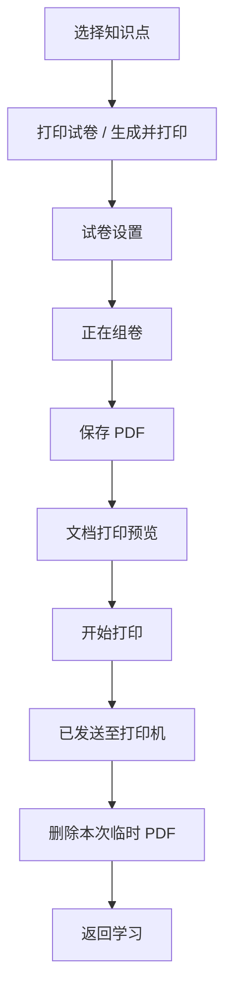
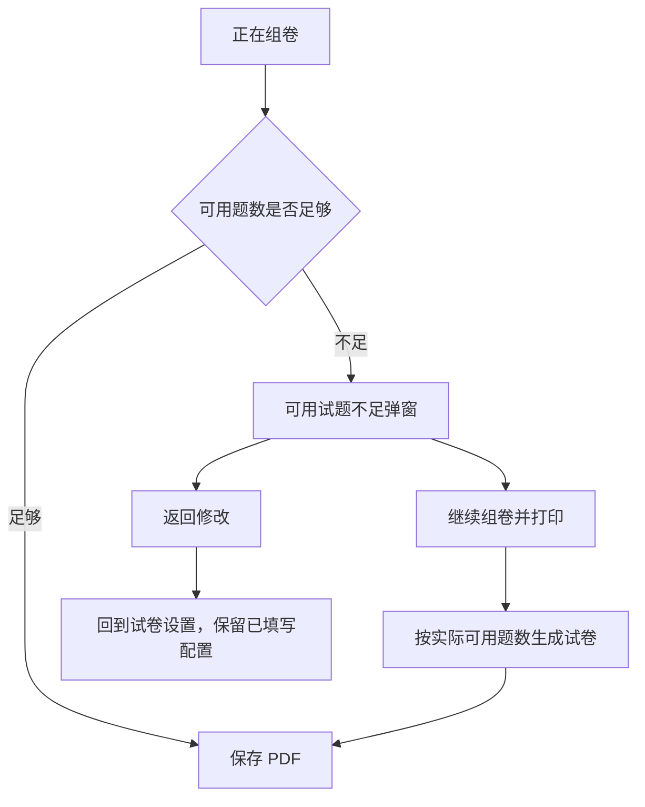
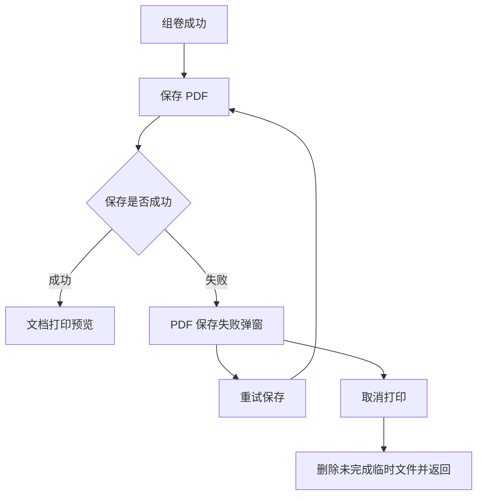

# 组卷与设备打印需求说明

> 适用范围：自主练习页的“打印试卷”流程，以及单元测试中的“生成并打印”入口。  
> 目标：用户可完成“选知识点—设置试卷—组卷—保存 PDF—选择设备—开始打印”的闭环；组卷与保存失败时，用户始终有清晰、可恢复的下一步。

## 1. 入口与前置条件

### 1.1 入口

- 自主练习页：选中至少一个知识点后，点击右上角“打印试卷”。
- 单元测试：在试卷设置中选择“生成并打印”。

### 1.2 前置规则

- 未选知识点时，“打印试卷”不可点击。
- 打印试卷最多 20 题；用户可设置题型、各题型题量、难度、试卷类型及是否包含答案解析。
- 本期打印机演示默认设备为 `EPSON AM-C5000 Series`，状态为“空闲中”。

## 2. 页面与状态

| 状态 | 用户看到的内容 | 可执行动作 |
|---|---|---|
| 试卷设置 | 试卷名称、难度、题型与题量、试卷类型、打印内容 | 生成试卷、返回范围、取消 |
| 正在组卷 | 进度提示“正在为你生成 N 道××试题” | 等待；异常演示会在校验后返回结果 |
| PDF 保存中 | 进度提示“正在生成并保存可打印的 PDF 文件” | 等待 |
| 文档打印预览 | 试卷缩略页、打印机、份数、范围、方向、尺寸、单双面、色彩模式、质量 | 调整参数、管理设备、开始打印 |
| 设备页 | 已选设备、添加设备 | 返回文档打印预览 |
| 可用试题不足 | 实际可用题数与请求题数、原因说明 | 继续组卷并打印、返回修改 |
| PDF 保存失败 | 保存失败原因与说明 | 重试保存、取消打印 |
| 打印完成 | 已发送至打印机、临时文件已清理 | 返回学习 |

## 3. 正常流程

### 3.1 试卷设置

#### 3.1.1 试卷名称

- 默认试卷名称按“教材版本·年级学期·学科·范围·试卷类型”生成；其中版本、年级学期信息缺失时不展示该字段。
- 范围规则：只选一个知识点时显示其名称；多个知识点显示“第一个知识点等 N 个知识点”；范围过长时收敛为“已选 N 个知识点”。
- “不限类型”在标题中转换为“自定义练习卷”；其他类型使用当前卷型名称。
- 自动名称建议控制在 24 个汉字以内，最长不得超过 30 个汉字；超过上限时保留卷型并截断前置描述，以“…”表示省略。
- 用户可直接编辑名称；一旦手动编辑，后续切换试卷类型、题型或题量均不得覆盖用户输入。重新进入试卷设置时，按当前筛选范围重新生成默认名称。
- 设置页不展示“按教材、范围和卷型自动生成；可修改，建议 24 字以内”等静态说明文案；仅保留输入框及当前字数计数。
- 同日导出产生相同名称时，正式服务端应在文件名末尾追加序号（如“（2）”）；原型暂不展示序号。

#### 3.1.2 题型与题量

- 题型不是固定配置。系统应以“当前学科 + 已勾选的章节/知识点”为条件，查询该范围内实际可组卷的题型及每个题型的可用题数后展示。
- 原型阶段使用菁优网各学科题型清单生成模拟数据；同一学科在不同勾选范围下，可展示的题型和“可用 N 题”应随范围变化。接入接口后，只替换题型可用性数据源，不改变页面交互。
- 页面以两列卡片展示候选题型；每张卡片展示：题型名称、当前选题数、可用题数，以及“− / +”操作。
- 首次进入设置时，为每个可用题型预置 `min(3, 可用题数)` 道；总题数随各题型选择实时汇总，并展示为“共 X / 20 题”。
- 点击“+”时，当前题型选题数加 1；当该题型已达到可用题数，或总题数已达到 20 题时，“+”不可用。点击“−”时，当前题型选题数减 1，最低为 0。
- 仅选题数大于 0 的题型会进入组卷请求和后续试卷预览。用户返回修改范围后再次进入设置时，系统应按新的范围重新获取题型与可用题数。
- 若题型数据加载失败或当前范围无可用题型，应在题型区显示明确空态，禁止“生成试卷”，并允许用户返回修改范围；本期原型以模拟数据保证有可展示结果。

#### 3.1.3 其他设置

- 试卷类型显示“单元测试卷、期中测评卷、真题卷、不限类型”，并在该行上方显示标题“试卷类型”。
- 点击“生成试卷”后进入“正在组卷”。

### 3.2 PDF 保存与文档打印预览

- 组卷成功后生成本次临时 PDF，并进入保存状态。
- 保存成功后打开“文档打印”预览：左侧展示试卷页缩略图，右侧展示打印参数。
- 参数默认值：1 份、全部打印、纵向、ISO A4、单面、彩色、中等质量。
- 用户可修改份数、范围、纸张方向、打印方式和色彩模式；纸张尺寸与打印质量在本期为只读展示。
- 点击“打印机”可进入设备页，返回后保留当前打印参数。

### 3.3 打印完成与临时文件清理

- 点击“开始打印”后显示“已发送至打印机”。
- 本次打印任务结束时，必须删除本地临时 PDF 和任务内存引用；不在“我的文件”或后续打印中保留。
- 用户点击“返回学习”后回到打印入口所在页面。

## 4. 异常流程

### 4.1 组卷试题不足

适用场景：用户已提交试卷设置，系统完成组卷校验后，符合当前知识点、难度和题型条件的试题数少于用户请求题数。

弹窗规则：

- 标题：`可用试题不足`。
- 说明必须同时展示“实际可用 X 题”和“当前请求 Y 题”。
- “继续组卷并打印”：按实际可用题数继续，进入 PDF 保存；打印预览页提示“本次按可用题量完成组卷”。
- “返回修改”：回到同一份试卷设置，保留已选知识点、题型、题量、难度、试卷类型和打印内容，供用户重新调整。
- 该弹窗必须在“正在组卷”校验完成后出现，不能在点击打印入口时提前出现，也不能停留在组卷加载页。

### 4.2 PDF 保存失败

适用场景：组卷已成功，但 PDF 在本地保存或下载时失败，例如本地存储空间不足或保存服务暂不可用。

弹窗规则：

- 标题：`PDF 保存失败`。
- 说明：告知用户需要先保存成功，才能继续打印。
- “重试保存”：重新执行保存；保存成功后才允许进入文档打印预览。
- “取消打印”：关闭本次流程并清理未完成的临时文件。
- 保存失败时不得显示“开始打印”或允许进入设备选择。

## 5. 异常演示章节

为产品评审和联调提供可重复触发的演示数据：

- 每本教材的目录最后一章固定为“异常数据章节”。
- 该章节包含现有题库异常项，以及以下打印异常项：
  - `组卷试题不足`
  - `PDF 保存失败`
- 选中“组卷试题不足”并提交生成后，先展示“正在组卷”，校验完成后进入“可用试题不足”弹窗。
- 选中“PDF 保存失败”并提交生成后，先完成组卷，再在保存 PDF 阶段进入“PDF 保存失败”弹窗。
- 异常章节必须始终位于“空态演示章节”和播放异常演示章节之后，即每本书目录末尾。

## 6. 验收清单

| 编号 | 验收点 |
|---|---|
| P-01 | 未选知识点时不可发起打印；选中后可进入试卷设置。 |
| P-02 | 正常试卷依次经过组卷、PDF 保存、文档打印预览和打印完成。 |
| P-03 | 文档打印预览可调整份数、范围、方向、单双面和色彩模式；进入设备页并返回后配置保留。 |
| P-04 | 试题不足在组卷校验完成后弹出，显示实际与请求题量。 |
| P-05 | 选择继续后按实际可用题量进入保存与打印；选择返回修改后恢复原配置。 |
| P-06 | PDF 保存失败只能重试保存或取消，不能直接打印。 |
| P-07 | 打印完成或取消后，本次临时 PDF 和任务状态被清理。 |
| P-08 | 每本教材最后均存在“异常数据章节”，且含“组卷试题不足”和“PDF 保存失败”。 |

## 7. 本期边界

- 本期为原型演示，打印机状态、PDF 保存和文件删除可使用本地模拟状态。
- 不包含真实系统打印 API、真实文件系统授权、打印队列查询、失败重试次数限制和跨设备同步。
- 接入真实能力时，需补充文件权限、网络失败、打印机离线、队列取消和可观测性要求。
