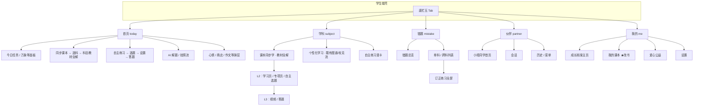
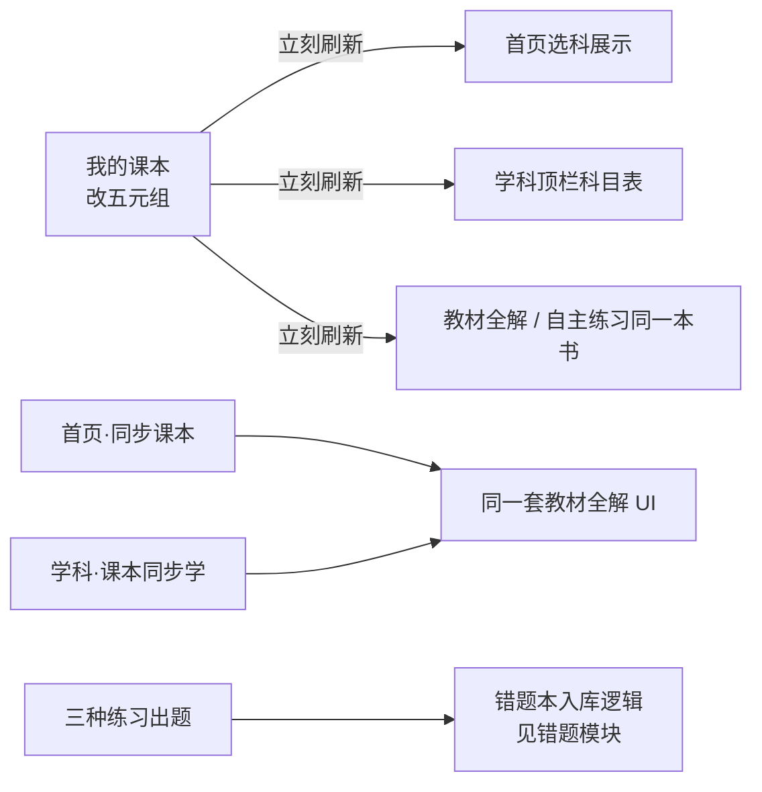

# 全站页面地图

| 项 | 说明 |
|----|------|
| 产品 | AI 学伴 · 学生平板 |
| 版本 | v2.0 地图稿 · 2026-08-18 |
| 读者 | 产品 / 设计 / 研发 |
| 范围 | 底栏五 Tab + 与学科强相关的跨 Tab 页 |
| 本期重点 | 初中；小学部分入口隐藏或「即将开放」 |

---

## 1. 一句话结构

学生日常落在五栏：

| 底栏 | 学生在这里干什么 |
|------|------------------|
| **首页** | 今日任务、同步课本入口、自主练习入口、拍照讲题等工具 |
| **学科** | 课本同步学主场（教材全解）；可切到个性化学习 |
| **错题** | 看待办、按科订正 |
| **伙伴** | 小晤同学陪伴聊天 |
| **我的** | 成长档案；**唯一改书入口「我的课本」** |

学制 / 年级 / 册次 / 各科版本：**只在「我的 · 我的课本」改**。学科顶栏与首页选科只读展示。

---

## 2. 全站信息架构（Mermaid）

---

## 3. 页面清单（按 Tab）

### 3.1 首页

| ID | 页面 / 层 | 说明 | 藏底栏？ |
|----|-----------|------|----------|
| H-00 | 首页主屏 | 沉浸首页；初中右侧竖轨「同步课本」「自主练习」 | 否 |
| H-01 | 同步课本 · 选科 | 展示当前年级·册次（只读）；点科进科目页 | 是 |
| H-02 | 同步课本 · 科目教材全解 | 与学科教材全解同构；**无**模式栏、**无**自主练习竖卡 | 是* |
| H-03 | 自主练习 · 选题 | 整册勾目录；可切科 | 是 |
| H-04 | 练习设置弹窗 | 题量 / 难度 / 场景 | 弹层 |
| H-05 | 答题 / 结果 | 通用答题流 | 是 |
| H-06 | 练习回流选择 | 自主练习做完：回同步课本页或首页 | 弹层 |
| H-07 | AI 解题拍照 / 处理 / 讲题层 | 工具流 | 是 |
| H-08 | 心情 / 商店 / 作文室等 | 弹层或全屏 | 视具体 |

\*进入课时学习页、专项、答题时同样藏底栏。

### 3.2 学科

| ID | 页面 / 层 | 说明 | 藏底栏？ |
|----|-----------|------|----------|
| S-00 | 课本同步学主场 | 默认模式；顶栏年级·册次只读 + 学科 Tab | 否 |
| S-01 | 教材全解 | 章/单元筛选、课文列表、单元测试、专项入口、名师广告 | 否 |
| S-02 | 学习页（一课） | 同步微课列表 + 一课一练（英语无此页） | 是 |
| S-03 | 视频播放 | 达标 45s；播完分支 | 是 |
| S-04 | 专项页 | 英语：词汇/口语/语法；数学：同步提高 | 是 |
| S-05 | 自主练习选题 | 跟当前科；不可切科 | 是 |
| S-06 | 单元测试 / 一课一练 / 自主练习答题 | 见流程图 | 是 |
| S-07 | 个性化学习 | 左侧模式栏切入；本文地图不展开细则 | 否→视子页 |

### 3.3 错题

| ID | 页面 | 说明 | 藏底栏？ |
|----|------|------|----------|
| E-00 | 错题总览 | 今日复习 + 按学科查看 | 否 |
| E-01 | 单科错题列表 | 筛选 / 编辑 / 批量订正 | 是 |
| E-02 | 跨科待办列表 | 待攻克 / 待复习 / 全部待办；无批量订正 | 是 |
| E-03 | 单题 / 批量订正练习 | 结束后回进入前错题页 | 是 |

### 3.4 伙伴

| ID | 页面 | 说明 | 藏底栏？ |
|----|------|------|----------|
| P-00 | 小晤同学首页 | 话题 / 火花 / 随便聊；不直进输入框 | 否* |
| P-01 | 会话 | 文字 / 语音 / 图；返回首页不结束会话 | 视 chrome |
| P-02 | 历史会话 | 查看 / 重命名 / 删除 | — |

\*深度会话时可隐藏部分 chrome（原型 `isLumiChromeHidden`）。

### 3.5 我的

| ID | 页面 | 说明 | 藏底栏？ |
|----|------|------|----------|
| M-00 | 成长档案 | 等级 / 金币 / 报告入口等 | 否 |
| M-01 | **我的课本** | 改学制 / 年级 / 册次 / 分科版本 | 是 |
| M-02 | 爱心公益 | 全屏 | 是 |
| M-03 | 设置 | 弹层 | — |
| M-04 | 学情报告等 | 弹层 / 全屏 | 视具体 |

---

## 4. 跨 Tab 关键耦合（设计研发必看）

| 规则 | 一句话 |
|------|--------|
| 改书唯一入口 | 我的课本；学科/首页不能改年级册次版本 |
| 三入口文案不同 | 首页「同步课本」/ 学科「课本同步学」/ 「自主练习」——产品刻意不统一 |
| 首页科目页 | 不放自主练习；自主练习只在首页卡 + 学科竖卡 |
| 换书副作用 | 关学习/专项/自主选题；章记忆按书；清空自主勾选 |

---

## 5. 旅程层（进 App，非日常五栏）

原型另有登录 / 闪屏 / 学情罗盘 / 测评门闸等 `journeyPhase`，日常产品地图可不画进五栏。评审「新用户第一次」时再单独开 onboarding 流程。

---

## 6. 与代码的大致对应（便于研发找页）

| 地图节点 | 主要代码 |
|----------|----------|
| 底栏 | `components/Layout/BottomNav.tsx` |
| 首页 | `DashboardImmersive.tsx` |
| 同步课本选科 / 科目页 | `SyncStudyPickerPage` / `SyncStudySubjectPage` |
| 学科教材全解 | `SubjectMap` + `Sync*Page` |
| 自主练习 | `SelfPracticePage` |
| 答题 | `QuizPage` / `UniversalQuiz*` |
| 错题 | `MistakeVault` |
| 伙伴 | `LumiSpace` |
| 我的 / 我的课本 | `GrowthProfile` / `MyTextbooksPage` |

---

## 7. 本期边界（地图上标灰的）

- 不做：知识图谱作为课本同步学界面、小学完整同步内容、进度云端同步。
- 小学：首页不放同步课本 / 自主练习；进学科 Tab →「即将开放」。
- 个性化学习：学科左侧入口保留，细则不在本目录展开。
