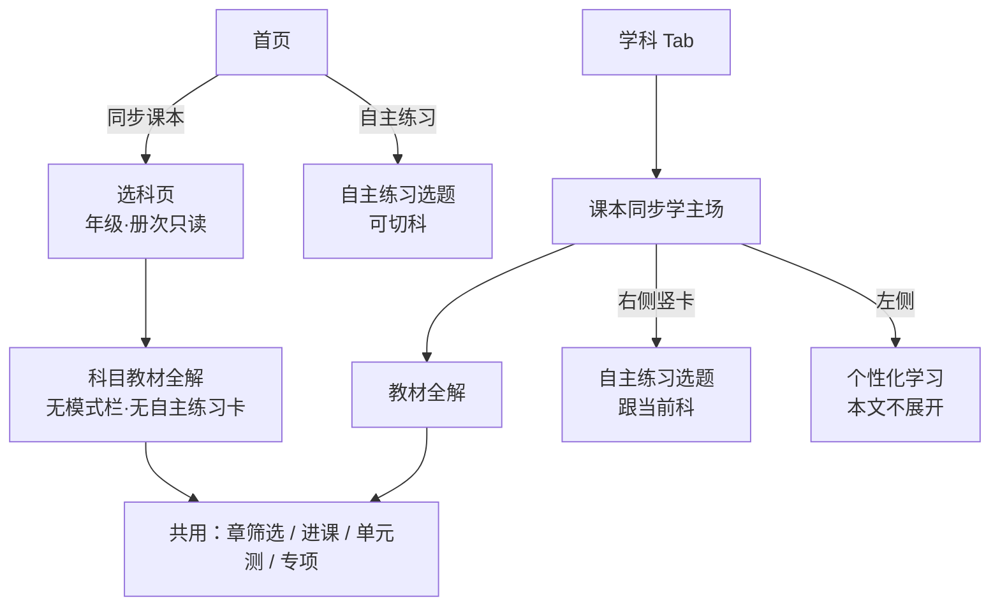
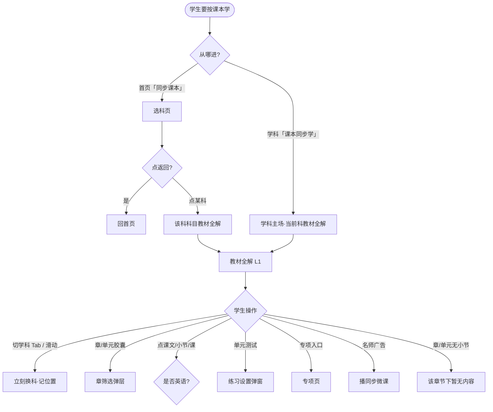
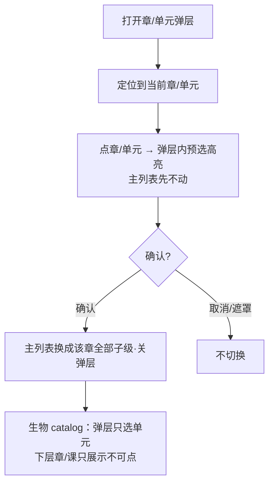
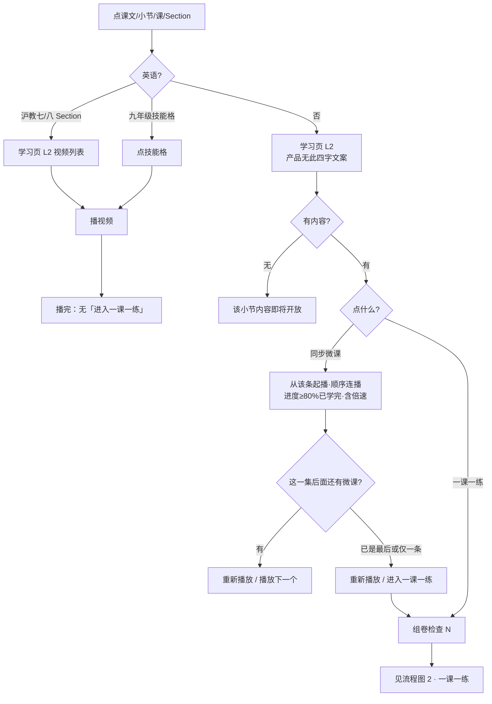
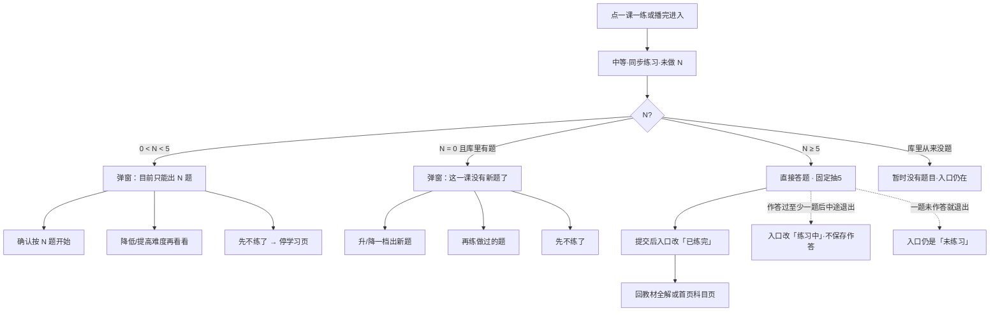
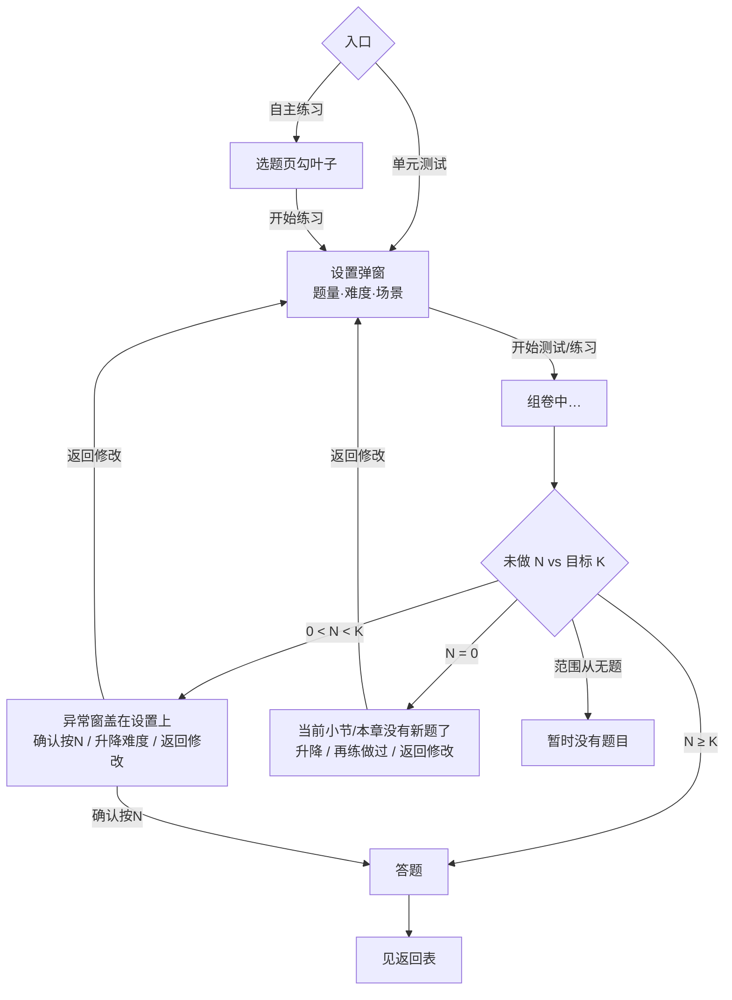
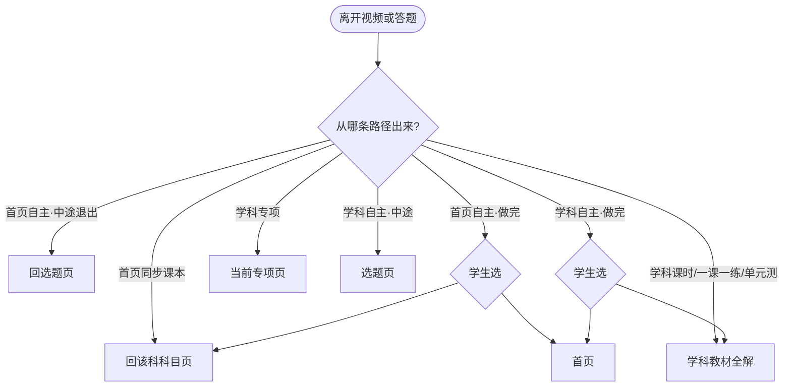
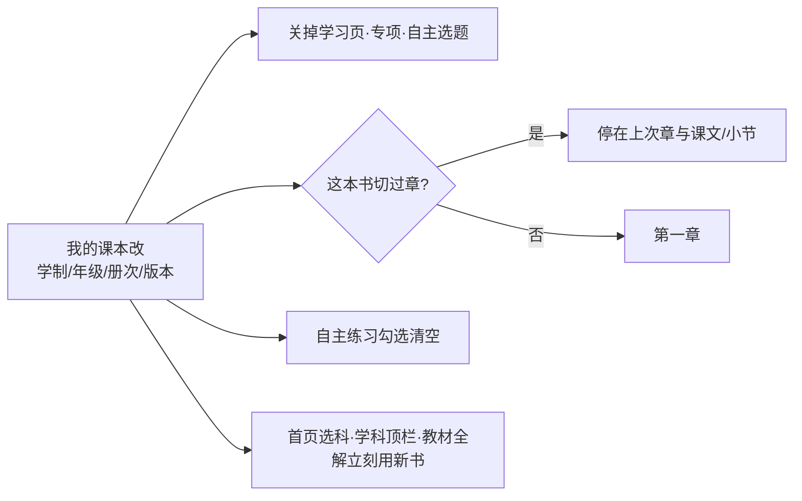
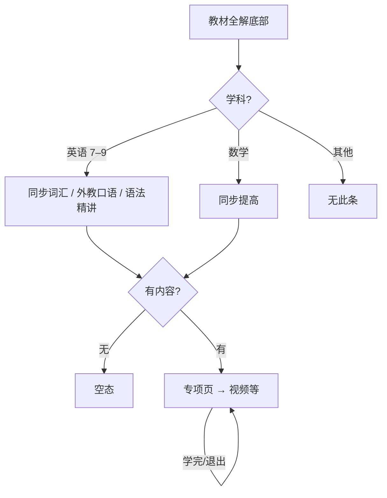

# 学科 · 课本同步学流程图

| 项 | 说明 |
|----|------|
| 模块 | 首页「同步课本」「自主练习」+ 底栏「学科 · 课本同步学」 |
| 版本 | v2.3 流程稿 · 2026-08-18 |
| 权威细则 | [05-同步课本与自主练习-阅读版](../02-学科/课本同步学/05-同步课本与自主练习-阅读版.md) |
| 读者 | 设计 / 研发 / 测试 |

图中节点名与阅读版用语对齐；英语无「学习页 / 一课一练」分支单独标出。

---

## 0. 三条入口总览

---

## 1. 主链路 A：按课本章节学（同步课本 / 课本同步学）

### 1.1 从入口到教材全解

### 1.2 章 / 单元筛选

### 1.3 进一课 → 视频 / 一课一练

**学习页两种排法（非英语）**

| 学科类型 | 学习页形态 |
|----------|------------|
| 语文 | 大卡：环节视频 + 末卡「一课一练」 |
| 数学及其他理科 | 三段列表：名师带你学 / 同步巩固练 / 拓展提升 + 底条「一课一练」 |

---

## 2. 主链路 B：三种练习

### 2.1 练习类型对照

| 练习 | 范围 | 进答题前 | 入口 |
|------|------|----------|------|
| 一课一练 | 当前课叶子 | **无**设置窗；够 5 题直接进 | 学习页末条（英语无） |
| 单元测试 | 当前章 / Unit | 设置窗 → 组卷 | 教材全解底部 |
| 自主练习 | 勾中的整册叶子 | 选题页 → 设置窗 → 组卷 | 首页卡 / 学科竖卡 |

统一库存逻辑：只数「范围 ∩ 难度 ∩ 场景 ∩ 未做过」的 N；不用邻近难度凑数。

### 2.2 一课一练

### 2.3 单元测试 / 自主练习（设置 + 异常）

**自主练习选题差异**

| | 首页进来 | 学科进来 |
|--|----------|----------|
| 切科 | 左侧可切 | 不能切 |
| 默认章位置 | 该书上次学到的章 | 教材全解正在看的章 |
| 未勾不能开始 | 是 | 是 |

---

## 3. 主链路 C：返回与回流

页面「返回」键：

| 当前页 | 返回到 |
|--------|--------|
| 选科页 | 首页 |
| 科目页（首页路径） | 选科页 |
| 学习页 | 科目页或学科教材全解 |

---

## 4. 换书（跨模块）对流程的打断

---

## 5. 专项（旁支）

---

## 6. 建议联调走查脚本（10 步）

1. 初中账号进学科 → 确认顶栏只读年级·册次、可切科。  
2. 打开章筛选 → 预选不立刻换列表 → 确认后换列表。  
3. 数学点小节 → 学习页三段 + 一课一练 → 播视频 → 末集进练习。  
4. 英语沪教七/八点 Section → 视频列表（无一课一练）→ 播视频；九年级点技能格直接播。  
5. 单元测试：开设置 → 开始 → 看正常进答或异常窗。  
6. 学科右侧进自主练习 → 不可切科 → 勾选 → 设置 → 答题。  
7. 首页同步课本 → 选科 → 科目页无自主练习卡 → 返回两级回首页。  
8. 首页自主练习做完 → 回流二选一。  
9. 我的课本改年级/版本 → 回学科看顶栏与目录是否刷新、深层页是否被关。  
10. 小学账号：首页无两卡；学科「即将开放」。

更细的弹窗文案与按钮文案，直接对照阅读版第 8 节。
